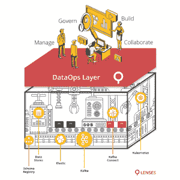
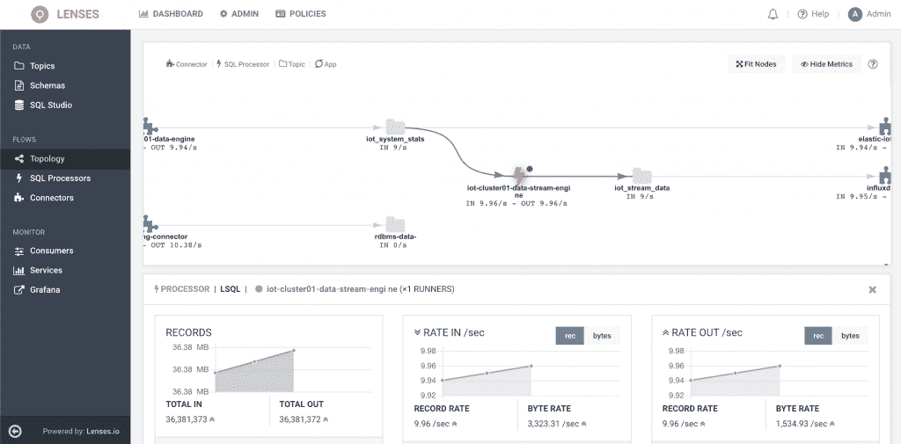

# Data ops:lens . io 用 SQL，Kafka 驱动数据

> 原文：<https://thenewstack.io/dataops-lenses-io-drives-data-with-sql-kafka/>

鉴于数据项目的高失败率，[lens . io](https://lenses.io/company/about-us/)创始人 [Antonios Chalkiopoulos](https://twitter.com/chalkiopoulos?lang=en) 认为数据管理应该更像是驾驶汽车。

你只要跳进车里，从 A 点开到 b 点，你不必知道你的发动机是汽油驱动的、柴油驱动的还是电动的。你不必了解发动机的所有内部工作原理。你只要走进一个安全的环境就行了。

太多时候是技术在推动业务，这是这家总部位于伦敦的公司想要逆转的。数据项目往往是昂贵的，需要高度专业化的技能。他列举了 Gartner 估计的高达 85%的数据项目失败的背后原因之一是缺乏熟练劳动力。

“我们如何才能让你真正像操作汽车一样操作数据？简单点，这样你就可以马上开始了。你不需要所有那些很难获得的高科技技能。你也是不可知论者，而且是面向未来的技术？”他问。

## 顶层的 SQL

Lenses 的答案是在开源技术之上提供一个 SQL 层，然后使用 API 连接到其他系统。它旨在为架构师、数据工程师、数据官员和业务分析师提供一种更简单的方法来构建数据基础设施，同时该系统负责监控、日志记录、身份验证和安全性。

“通常，在现代类型的项目中，我们看到的是涉及多个供应商和技术。我们希望让我们的客户能够从使用他们已经选择的所有不同技术中获益，并为他们提供一个安全的环境来实时移动和使用这些数据。这意味着像 Kafka 或 Kubernetes 或 Elasticsearch 这样的技术，并且不会用特定的技术锁定这些客户，”他说。

[流数据管理平台](https://github.com/lenses)在 Apache Kafka 之上运行，具有用于创建和查询实时数据以及创建和监控 Kafka 拓扑的 web 界面和功能。

该公司认为，要完全掌握 Kafka Streams API，通常需要 Java、Scala、Kotlin 或其他基于 Java 虚拟机的语言等开发人员技能，以及陡峭的学习曲线，以提供数据流的连接、过滤和聚合，从而从数据流中提供价值。

一个名为 Lenses Box 的免费版本在一个 Docker 命令中提供了整个 Apache Kafka 生态系统。它有 Python、Go、JDBC 和 Javascript Redux/React 的客户端。

它在 SQL 层之上使用 REST 或 WebSocket APIs 来集成 Kubernetes 等技术。

## 业务逻辑

Chalkiopoulos 将这种方法描述为更加关注业务逻辑和更简单的实现方式。

“在技术之上的一层，SQL 是一种非常简洁和精确的语言来完成这样的操作，然后你可以跨任何技术移动你的系统，”他说。

该技术采用连续 SQL 处理器来连接、聚合、过滤和丰富流数据，Prometheus 和 Grafana 提供监控和可见性。

像 Apache Spark、Apache Flink、Akka Streams 和 KStreams 这样的流行数据技术都可以显示在一个中央拓扑屏幕上，而不管底层技术和数据格式如何。它已经被写入 AVRO，JSON，XML，CSV，STRING，INT，LONG 和通过扩展谷歌的 Protobuf 以及自定义数据格式。它为几乎所有使用 Kafka 的主要数据系统提供 Kafka Connect 连接器。

[lens SQL 引擎](https://docs.lenses.io/3.0/sql/index.html)支持查询表中的流数据或静态数据。它使用 Kafka Connect 框架将数据移入和移出 Kafka。SQL 流引擎使用户能够快速轻松地构建实时数据管道。

Lenses 还可以从 Kubernetes 内部或外部部署连接器和 SQL 处理器。镜头 Docker 图像可在 [DockerHub](https://hub.docker.com/r/landoop/lenses) 上获得。

## “不同的方法”

Chalkiopoulos 和他的妻子 [Christina Daskalaki](https://www.linkedin.com/in/chdask/?originalSubdomain=uk) 创立了 Lenses，最初命名为 [Landoop](/landoop-lenses-promises-ease-application-development-kafka-streams/) ，并于 2017 年 11 月发布了 1.0 版本。他们之前已经围绕 Kafka 编写了大约 35 个开源工具，并决定将它们整合成一个更大的东西。

该公司于 2017 年 12 月与 Kafka 开源组件的最大贡献者之一 Data Mountaineer 合并。去年 9 月，它在由 83North 牵头的首轮融资中筹集了 750 万美元，总融资额达到 850 万美元。

“我们不断听到组织未能或缓慢地交付其数据项目。这是由于当今数据基础设施技术的复杂性、快速发展的格局和技能短缺，”[83 north 的合伙人劳雷尔·鲍登](https://www.83north.com/team/laurel-bowden)告诉新堆栈。

“我们认为 Lenses.io 在市场上有一种不同的方法:允许组织选择和匹配强大的开源技术，同时使任何人都可以构建实时数据应用程序，而不需要技能或绑定到特定的基础设施。他们是市场上唯一以这种方式将应用程序和数据层从数据基础架构中分离出来的公司。

“尽管非常新，Lenses.io 已经与许多财富 100 强品牌密切合作，我们认为他们最有可能成为数据业务的领导者，”她说。

[https://www.youtube.com/embed/OJ_xaOWVREs?feature=oembed](https://www.youtube.com/embed/OJ_xaOWVREs?feature=oembed)

视频

该公司最近更名为 Lenses.io，并在纽约开设了总部。其客户组合已增长至 100 多家公司，包括巴克莱、戴姆勒和爱立信。

游戏平台 [Playtika](https://www.playtika.com/) 发现，随着公司的发展，各种开源工具的可见性成为一个问题，开发人员和工程师不得不请求访问无数系统。

Playtika 的系统架构师 Ivan Vasyliev[说:“随着我们对 Kafka 的使用越来越多，如果没有适当的可见性，生产事件变得更加难以管理。设计、营销和其他团队也需要访问，这给可见性带来了更大的挑战。](https://ua.linkedin.com/in/vasilievip)

Playtika 使用带有细粒度访问控制和审计的镜头，为多个团队提供可见性和监控，并实现对问题的快速调查。现在，它宣称每天为 600 名开发人员、QA、运营和分析师节省了 300 个工程小时。

## 数据伦理

Chalkiopoulos 预测，随着对敏感信息如何通过不同技术和组织部分的了解，数据伦理在未来几年将变得越来越重要。

他说，Lenses 将数据安全和隐私作为其“核心 DNA”的一部分。

它建立在底层中间件的授权、认证和加密的基础上，提供细粒度的基于角色的访问，管理员可以通过白名单、黑名单和名称空间对其进行控制。

通过以主题为中心的安全模型和名称空间的使用，被授予对某个主题的读取权限的人可以访问使用该数据的所有应用程序，从而更容易理解数据存在的所有位置。

它使用一个互补的以字段为中心的安全模型，收集关于敏感数据所在位置的元数据和其他信息。然后可以应用数据策略，包括根据需要进行修订。

它提供了可追溯性—所有查询都被跟踪和审核，以帮助组织了解谁在何时访问了数据。

通过 Pixabay 的特征图像。

<svg xmlns:xlink="http://www.w3.org/1999/xlink" viewBox="0 0 68 31" version="1.1"><title>Group</title> <desc>Created with Sketch.</desc></svg>