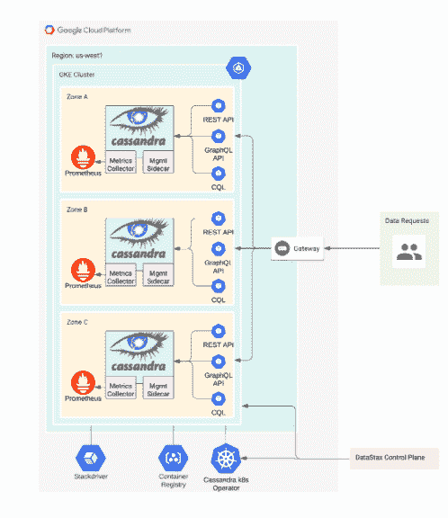

# DataStax 为 Cassandra 管理层制造了一剂止痛药

> 原文：<https://thenewstack.io/datastax-creates-a-pain-reliever-for-cassandra-management/>

Cassandra 已经成为一个可靠而强大的 NoSQL 数据库，用于开发云原生应用程序，尤其是大规模部署。然而，它的复杂性和集合安装、操作和管理所需的人力技能对许多组织来说是困难的。

根据分析公司 [ClearPath Strategies](https://clearpath-strategies.com/) 发布的一项调查结果，36%的受访者(由开发人员和运营团队成员组成)表示，缺乏具有使用 Cassandra 专业知识的员工是采用 Cassandra 的主要障碍。与此同时，调查结果也反映了 Cassandra 的声誉，大多数受访者同意这是一个可行的解决方案，57%的人说它“高度可扩展”

为了帮助开发人员采用 Cassandra，同时减少其运营相关的挑战， [DataStax](https://www.datastax.com/) 发布了面向 [Apache Cassandra](http://cassandra.apache.org/) 的数据库即服务(DBA as)[DataStax Astra](https://www.datastax.com/products/datastax-astra-beta)，将该服务定位为通过 Cassandra 简化云原生部署的应用程序开发和管理。

DataStax 的首席产品官 Ed Anuff 告诉《新堆栈》:“Cassandra 被亲切地称为最后的数据库，因为它非常强大，也因为它很难启动。”。

Anuff 说，Astra 版本帮助 DevOps 团队解决的主要问题是，如何通过减少员工培训和对 Cassandra 的支持，最终帮助提高应用程序开发周期的节奏

“开发运维团队被赋予越来越多的责任来管理应用生命周期，从安全性到 CI/CD，”Anuff 说。“大多数人没有时间学习像 Cassandra 这样强大的数据库的复杂性，因此没有利用它。

据 Anuff 称，DataStax Astra 允许 DevOps 团队“在几分钟内”访问 Cassandra，并尝试各种用例，如 IOT 传感器数据摄取、消息传递和大规模用户配置文件管理。

在与 Cassandra 合作时，DevOps 可能会面临的困难之一是，分布式数据库可能很难“物理布局，然后管理和调试节点，更不用说每次有 Cassandra 新版本时更新软件，” [dbInsight](https://www.dbinsight.io/) 的分析师托尼·贝尔告诉新堆栈。Baer 说:“采用托管 DBaaS 服务，由供应商负责日常管理，可以简化这一切。"通过简化部署和操作，部署新变更的过程减少了很多摩擦."

虽然 DataStax 在其发布中大胆地声明“DBaaS 将部署时间从数周缩短到了几分钟”，但 Anuff 指出，安装 Apache Cassandra 可以相对较快地完成，“尽管也存在一些问题，”Anuff 说。

“然而，规划生产部署可能是一项耗时的操作，工程团队花费数周时间来完成这一过程也不是没有过，”Anuff 说。“由于我们在我们的 Kubernetes 运营商和云服务中完成了自动化和优化数据库实例化的工作，DataStax Astra 作为 DBaaS，这一过程已经缩短到几分钟。这让开发人员可以自由使用 Cassandra，而不必先学习如何管理 Cassandra 或设置物理或虚拟服务器来正确运行它。”

Astra 直接在[谷歌云平台(GCP)](https://cloud.google.com/) 基础设施之上部署和管理由 Cassandra 支持的集群。阿努夫说，通过这种方式，数据与客户的应用程序一起保留在 GCP 全球基础设施中。这种能力源于谷歌云的倡议，将许多开源软件平台引入谷歌云 GCP 控制台，作为“第三方支持的一流集成”，Anuff 说。“我们能够利用租赁单元形式的新结构，赋予我们这些新的能力，”阿努夫说。

理想情况下，这个想法是帮助开发人员在开发周期的最开始就开始设计数据库。因此，这将有助于消除应用程序开发完成并准备好部署在云上时，设置数据库所带来的障碍。然而，“一些功课仍有待完成，”贝尔说。“Astra 主要是简化部署、操作和管理，但它还没有解决开发数据库应用程序的问题，而提出更有利于开发的工具肯定是要做的事情，”Baer 说。

为此，Anuff 表示，DataStax 已经在新冠肺炎疫情开始之前组织了大量的开发人员培训活动，已经培训了“数千名 Astra 开发人员”Anuff 还表示，DataStax 已经将其 Astra Developer Studio 环境的内容预加载到一个教程笔记本中，该笔记本提供了几个如何创建表格和插入数据的示例，并推出了一个 [BetterBotz](https://www.datastax.com/blog/2020/03/introducing-better-botz) 博客系列,“该系列将开发人员直接引入构建零售应用程序，并省略了 Cassandra 课程中经常涉及的一些分布式计算理论，Anuff 表示。

“但是，我们不会就此止步，”阿努夫说。“我们一直在努力让 Cassandra 更容易使用，你可以期待今年晚些时候我们关于这个主题的一些其他消息。”

[DataStax](https://www.datastax.com/) 是新堆栈的赞助商。

通过 Pixabay 的特征图像。

<svg xmlns:xlink="http://www.w3.org/1999/xlink" viewBox="0 0 68 31" version="1.1"><title>Group</title> <desc>Created with Sketch.</desc></svg>