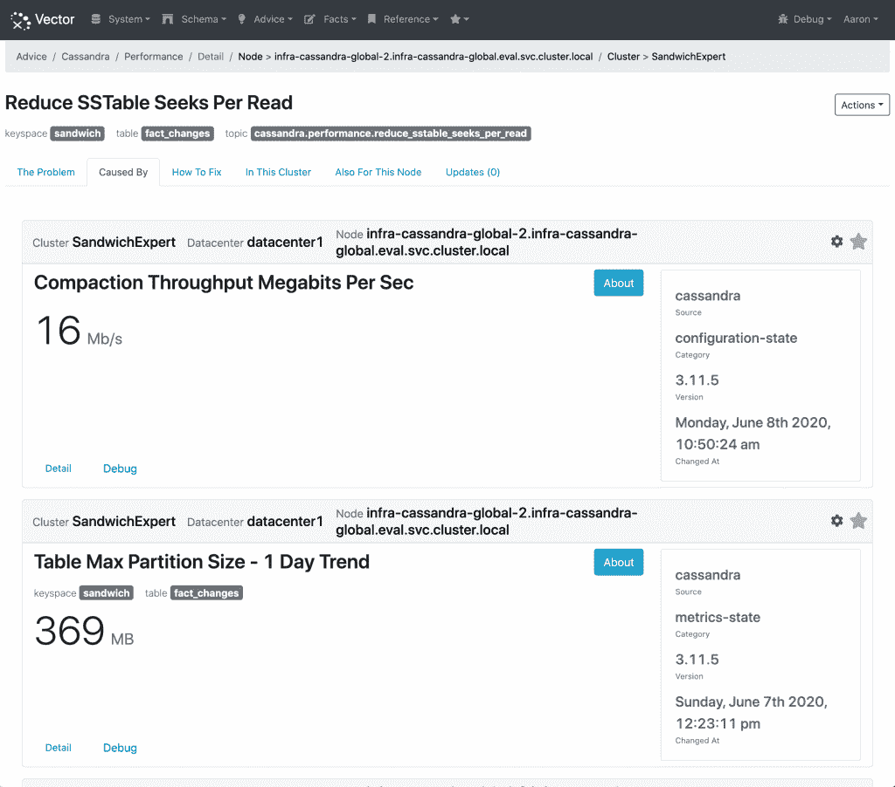
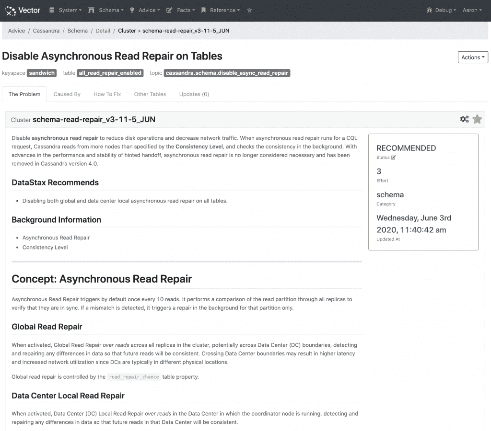

# DataStax Vector 在卡珊德拉灾难可能来袭之前发出警告

> 原文：<https://thenewstack.io/datastax-vector-provides-warnings-before-a-cassandra-disaster-may-strike/>

DataStax 的 Cassandra 开源数据库以缺乏合适的工具而难以建立和运行而闻名。灾难恢复、修复故障和扑灭其他灾难性火灾会增加管理难度。

Cassandra 的实现和管理困难也可能成为其使用的障碍，因为在采用它之前，通常需要某种 DevOps 专业知识。例如，在分析公司 [ClearPath Strategies](https://clearpath-strategies.com/) 发布的一项调查中，36%的受访者(由开发人员和运营团队成员组成)表示，缺乏具备使用 Cassandra 专业知识的员工是采用 Cassandra 的主要障碍。

为了帮助加速 Cassandra 的实现， [DataStax](https://www.datastax.com/) 发布了一个私人测试版的 [Vector](https://www.datastax.com/products/vector) ，它描述为 Apache Cassandra 的 AIOps 服务，在人工智能算法的帮助下提供“自动化建议”。这个想法是让 DevOps 团队在与 Cassandra 相关的问题发生之前很久就收到警告。

DataStax 的首席产品官 Ed Anuff 告诉新的堆栈:“它会给你一个提示，然后提示你，例如，更换一个节点或开始扩展你的集群。”。“但它也能够去识别在你的数据中发现的问题。”

该系统还通过持续监控集群性能，为开发人员和运营商提供有关如何修复 Cassandra 和 DataStax Enterprise (DSE)集群中潜在问题的信息。诊断信息的交流以及在问题发生前解决问题的步骤也是自动化的。

DataStax 表示 Vector 提供的具体功能包括:

*   **自动建议**:识别当前和潜在的问题，并提供具有背景知识的上下文学习。
*   **持续更新**:规则和建议持续更新，部署到 SaaS 和本地应用程序，并自动应用到集群。
*   **放手管理**:可视化的系统使用图表，提供关于表、键空间和节点的信息。开发人员和操作员无需登录 Cassandra 节点就可以观察集群性能及其配置。

除了作为 Cassandra 集群和潜在问题的不断更新的蓝图，Vector 的设计还考虑到了为 DevOps 团队创建教育资源的目标。DataStax 的工程/AIOps 副总裁[亚伦·莫顿](https://nz.linkedin.com/in/aaronmortonnz)告诉新堆栈，其想法是提供更多“保持集群健康的预测方法，无论是在内部、裸机上还是在虚拟化环境中运行”。

“我们希望确保开发人员在早期就知道哪些功能在[某些]情况下效果最好，或者哪些功能作为更好的方式已经被否决，”Morton 说。“Vector 旨在随时检查您的系统，并允许我们用最新的步骤不断更新它。”

当 Vector 标记与特定 Cassandra 集群相关的未来可能发生的问题时，预测管理功能可能会发挥作用。“我们希望将数据堆栈的专业知识放在你的指尖，这样你就可以看到帮助你解释它的小东西，然后给你剪切和粘贴修复，以及不同的方法来解决这个问题，以免它变成适合你的情况的问题，”莫顿说。

一个典型的使用场景可能包括与已删除数据相关的向量或逻辑删除相关问题。这种警告可能适用于 Cassandra 的一般使用，也适用于一个组织网络的具体设计。“如果你正在学习这方面的知识，并在深夜阅读一本书或其他东西，它可能不会留在你的记忆中，这是可能发生的事情，”莫顿说。“但对于 Vector，有一个系统会说:这是一个未来可能会出现的问题。”

DataStax 是新堆栈的赞助商。

通过 Pixabay 的特征图像。

*目前，新堆栈不允许直接在该网站上发表评论。我们邀请所有希望讨论一个故事的读者通过[推特](https://twitter.com/thenewstack)或[脸书](https://www.facebook.com/thenewstack/)访问我们。我们也欢迎您通过电子邮件发送新闻提示和反馈: [feedback@thenewstack.io](mailto:feedback@thenewstack.io) 。*

<svg xmlns:xlink="http://www.w3.org/1999/xlink" viewBox="0 0 68 31" version="1.1"><title>Group</title> <desc>Created with Sketch.</desc></svg>