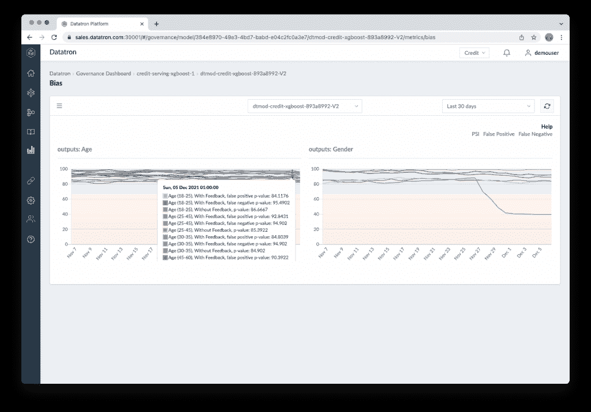

# Datatron 依靠机器学习模型的治理

> 原文：<https://thenewstack.io/datatron-leans-in-on-governance-for-machine-learning-models/>

根据他在 Lyft、Snap 和 Twitter 的工作经验， [Harish Doddi](https://www.linkedin.com/in/harishd/) 看到了创建机器学习模型的人(数据科学团队)和将它们投入生产的人(组织的机器学习工程方面或 DevOps 团队)之间的许多摩擦。

他说，数据科学家倾向于在孤立的环境中处理历史数据，通常是在笔记本电脑的范围内。但是当一个模型投入生产时，模型处理实时[数据](https://thenewstack.io/category/data/)的方式可能会非常不同。

“我开始思考生产环境与开发模型的方式有多么不同，为什么会有更大的问题。如果生产环境出错，那么开发环境也会出错，”他说。

因此，与 Lyft、Box 和 Twitter 的校友[杰里·徐](https://www.linkedin.com/in/jerryxu/)一起，多迪创立了 Datatron，为企业机器学习和人工智能计划提供了一个模型管理和治理平台。

## 管理生产中的模型

数据科学家与业务部门合作，解决模型旨在解决的业务问题。虽然一些数据科学家也处理部署，但在许多情况下，处理运营方面的工作属于一个相对较新的角色，机器学习工程师，正如 EastBanc Technologies 的系统架构师 Levon Paradzhanyan 在之前的一篇文章中指出的。

分析师 Lawrence Hecht 报告称，Algorithmia 的一项调查发现，在大多数企业中，创建一个模型需要一个多月的时间，而将模型投入生产至少还需要一个月。

正如 Doddi 所指出的，有一条古老的公理[说，将近 90%的模型永远无法投入生产，但是即使达到了那个点也仅仅是个开始。还有一系列其他考虑因素，如工作流、缓存、监控、版本控制、安全性等等。](https://venturebeat.com/2019/07/19/why-do-87-of-data-science-projects-never-make-it-into-production/)

“我们坚信，整个生产环境与开发环境是分开的。这就是为什么我们不向数据科学家提供 API 或 SDK。…他们不是我们平台的最终用户，”Doddi 说，并补充说其客户是大型企业。它们包括强生、康卡斯特、福特和达美乐比萨。

例如，达美乐[使用 Datatron](https://datatron.com/dominos-takes-data-to-the-next-level/) 来帮助管理模型，以提供关于商店布局、人员配备和改善客户体验的方法的指导。

“企业有非常大的遗留系统需要处理。因此，我们设计系统的方式与这些类型的系统无缝集成，”多迪说。

它的栈建立在后端的 Kubernetes、Docker 和 Python 技术之上；前端完全基于 React。

“我们有意识地选择了……Kubernetes，因为我们观察到的最大挑战之一是，你必须拥有一款能够很好地融入他们的遗留系统的产品。…这就是企业架构集成、我们如何将模型吸收到我们的系统中、我们如何编排我们的软件、我们如何进行自动扩展，所有这些事情都将浮现在画面中，”他说。

## 语言、框架不可知

这家总部位于旧金山的初创公司将其模型管理平台称为 ModelOps，这是一个帮助组织进行持续集成、开发和大规模交付 AI/ML 模型的框架。

它允许数据科学家使用他们选择的任何语言、库和框架。它提供了一个模型目录，在模型的整个生命周期中为模型提供完全的透明性和沿袭。每个模型都有一个唯一的标识符，它会收集与它相关的每个操作的信息，以及版本号、元数据、标签、模型位置、输入和输出特征等。

它支持使用实时和流式数据进行推理的模型。通过批量评分，用户可以离线处理非常大的数据集，包括从多个来源提取和连接数据，并将输出存储到指定位置。无论是使用批处理还是流数据，它都采用并行处理来加快数据处理速度并优化计算基础架构。

它拥有[的](https://www.prnewswire.com/news-releases/datatron-awarded-us-patent-for-methodology-for-modeling-machine-learning-and-analytics-301386555.html)专利，它称之为发布者/挑战网关，旨在增强开发和运营团队之间的合作，并允许用户在生产中试验不同的模型，用于发布选项，如 canary 和 A/B 测试。影子模式允许测试模型与活动模型并行运行，以确定更新后的模型是否会如预期的那样运行。如果主模型不满足定义的标准，可以使用故障转移模型来接管。

它为集群中的所有机器提供了现成的基础设施监控功能，可以跟踪 CPU 使用情况、内存使用情况、运行状况检查等。

10 月，Datatron 发布了一个新版本，包括在复杂的多租户环境中部署 ML 模型；监控客户定义的 KPIs 新的解释能力；对 Jupyter 笔记本的本机支持，以及一个新的快速设置和部署过程，支持在不到 10 分钟的时间内部署用于实时或批量推理的 API。

## 关注模型治理

Datatron 认为在模型管理中有三人组:数据科学团队、运营团队和风险团队。Datatron 努力成为这三个问题之间的桥梁。

多家初创公司正在应对在生产中调试和管理机器学习模型的挑战，以寻找漂移和其他问题的证据，如[泰克顿](https://thenewstack.io/tecton-helps-data-scientists-own-features-and-the-model-lifecycle/)和 [WhyLabs](https://thenewstack.io/whylabs-adds-data-to-the-observability-equation/) 以及[主要云供应商](https://thenewstack.io/a-close-look-at-cloud-based-machine-learning-platforms-microsoft-azure-ml-google-vertex-ai/)。然而，Datatron 更倾向于模型治理。

“当我们开始时，我们从运营平台开始。但是，在与我们的客户非常、非常密切地合作之后，我们进入了治理阶段，因为运营部门正在生成如此多的数据……这些数据是合规人员所需要的，”Doddi 说。

“在任何大型组织中，这些模型都会做出决策。他们需要有责任感，责任感。

“你需要有一个适当的问责制，带来适当的透明度，对决策过程的可追溯性，甚至像理解与购买者相关的某些标准的道德行为，或者一个异常现象，甚至是该模式给组织带来的风险。你需要有一个地方，在那里你有适当的证据可以提交给审计团队或监管机构。”

为此，它的仪表板提供了一个高层次的人工智能/人工智能项目概述。它允许用户进一步研究模型并做出更好的决策。

根据模型的执行情况计算六种类型的指标:偏差、异常、漂移、性能、操作和业务定制的业务关键性能指标(KPI)。

“我们为您的组织提供全局视图。例如，有多少模型有偏差问题，有多少模型有漂移问题，有多少模型有商业问题，”他说。

然后，它会计算一个总体健康得分，概述该模型在全球范围内给组织带来的风险。如果该分数低于某个阈值，系统会将其标记为红色标记，并触发警报。

客户可以通过电子邮件、Slack、PagerDuty 或其他方法设置警报，并设置当模型偏离预定义的性能阈值时触发的自动关机默认值。

它提供了完整的活动日志和审计跟踪，使用户能够返回并查看模型在过去特定时间的表现。

展望未来，其客户要求他们可以向合规性审计员展示报告。Doddi 说，该公司预计将在明年第一季度发布这一功能。

Datatron 设计为云原生平台，可以部署在任何地方—您自己的内部数据中心、公共云中，甚至是空气间隙中。

<svg xmlns:xlink="http://www.w3.org/1999/xlink" viewBox="0 0 68 31" version="1.1"><title>Group</title> <desc>Created with Sketch.</desc></svg>