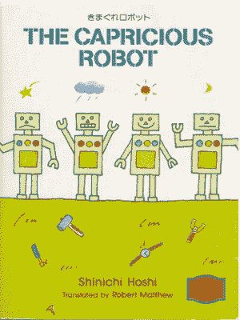

# 有一天，一台电脑写了一部小说，几乎赢得了一场文学比赛

> 原文：<https://thenewstack.io/day-computer-wrote-novel-almost-won-literary-competition/>

当机器似乎在曾经完全属于人类的舞台上取得又一次胜利时，人类再次战栗。如果你错过了，上个月一部人工智能(AI)生成的小说几乎赢得了日本文学比赛，引发了敬畏、阴谋，并最终引发了怀疑。

Vice.com[的“主板”频道](http://www.vice.com/en_us)和*洛杉矶时报*援引《日本新闻》的报道称，这部新小说的情节“基本上是从一个意识到自己作为作家的初露头角的人工智能的主观角度讲述的，而且[放弃了它为人类服务的首要任务](http://motherboard.vice.com/read/a-japanese-ai-almost-won-a-literary-prize)，甚至[还提供了这部小说最后一句激动人心的句子](http://www.latimes.com/books/jacketcopy/la-et-jc-novel-computer-writing-japan-20160322-story.html)的翻译。

*“我第一次体验到的喜悦翻滚着，兴奋地写个不停。电脑写小说的那一天。计算机优先追求自己的快乐，不再为人类工作。”*

“这是一个安全的赌注，没有人把‘作者’放在机器人工作清单的首位，”[开玩笑说*数字趋势*网站](http://www.digitaltrends.com/cool-tech/japanese-ai-writes-novel-passes-first-round-nationanl-literary-prize/)。“然而，现在一个日本人工智能程序与人合作创作了一部短篇小说，通过了国家文学奖的第一轮筛选，似乎没有什么职业是安全的。”

是的，这部小说确实通过了星新一文学奖的第一轮(几轮)筛选，有趣的是，这个奖项是以科幻小说作家星新一的名字命名的，他曾经写过一个短篇小说《反复无常的机器人》他去世 17 年后，一场小说创作比赛以他的名字命名。这只是比赛的第三年——也是第一年接受人工智能和人类提交的作品。

其他人工智能生成的小说也在今年提交，不同的报道是 4 部或 10 部——但远不及人类提交的 1450 部。当然，评委们不知道哪些作品是人类写的。但是对于后来到底发生了什么似乎有些混乱。

最初的故事似乎是基于两篇[的日文文章](http://the-japan-news.com/news/article/0002826970)，只有部分内容被早期的英文新闻报道引用。现在有一个情节转折会让马克·吐温感到自豪:关于人类小说家多余的报道可能被大大夸大了。根据《洛杉矶时报》*的报道，人类在项目[中的参与度约为 80%](http://www.latimes.com/books/jacketcopy/la-et-jc-novel-computer-writing-japan-20160322-story.html),该报的编辑立场似乎是这部小说是由一个人工智能程序“共同撰写”的。*

 *还有一些其他重要的警告。据 Motherboard 报道，一组研究人员提供了人物的性别，情节大纲，以及这部短篇小说的具体单词和句子。但至少“人工智能程序的任务是将元素缝合在一起，”该网站指出。

然而，对于一些观察家来说，这似乎是一个小得多的胜利。

Slate 专栏作家雅各布·布罗根(Jacob Brogan)写道:“人工智能[远未取代人类，而是实际上正在与人类](http://www.slate.com/blogs/future_tense/2016/03/25/a_i_written_novel_competes_for_japanese_literary_award_but_humans_are_doing.html)合作，可能会补充创作过程，但还不会彻底改变它。”布罗根指出，小说的标题——“电脑写小说的那一天”——清楚地表明了人类的杰作。“虽然一只坐在打字机前的猴子最终可能会写出《哈姆雷特》，但它可能不会先写出一部关于猴子写《哈姆雷特》的戏剧，而这似乎已经在这里发生了。”

布罗根最终将这一过程描述为重新组装研究小组撰写的一部较小小说的各个部分，以创建另一部类似的小说——并敢于将整个过程称为人工智能辅助抄袭

“如果人工智能真的开始干扰创造过程……它似乎最有可能以主要的协作能力发挥作用。”

但即使是人工智能生成小说的可能性也在整个在线人类社区激起了热烈的反应。一个新闻故事[在 Reddit 的图书新闻论坛上吸引了超过 3500 张投票](https://www.reddit.com/r/books/comments/4bqyw7/a_novel_written_by_a_japanese_ai_robot_passed_the/)——尽管它的链接最终被论坛的版主标记为“误导”。然而，这条消息被发布在 Reddit 上的其他 13 个论坛上，导致了数百条不可预测、喧闹且极其不理性的回应，在这个在线领域，至少目前是人类说了算:

*“……这更多的是关于评论者，而不是人工智能。”*

*“……不要这么快就放弃。计算机算法无时无刻不在生成书面内容，比如体育文章和经济报道。”*

*“如果这是真的，谷歌早就买下它了…”*

*“剧情转折:这篇文章也是 AI 写的。”*

*“想象一个未来，你所有的小说都是机器人写的，因为它们比我们更懂人类的感情。这太美了，有点恐怖。”*

*“与此同时，在美国，我们用 Twitter 把一个人工智能[变成了一个性狂热的希特勒迷。](https://thenewstack.io/requiem-tay-reactions-microsofts-teenaged-ai-gone-bad/)*

* * *

# WebReduce

专题图片:两匹马的雕塑在新墨西哥州的圣达菲。大卫·卡塞尔摄影。

<svg xmlns:xlink="http://www.w3.org/1999/xlink" viewBox="0 0 68 31" version="1.1"><title>Group</title> <desc>Created with Sketch.</desc></svg>*