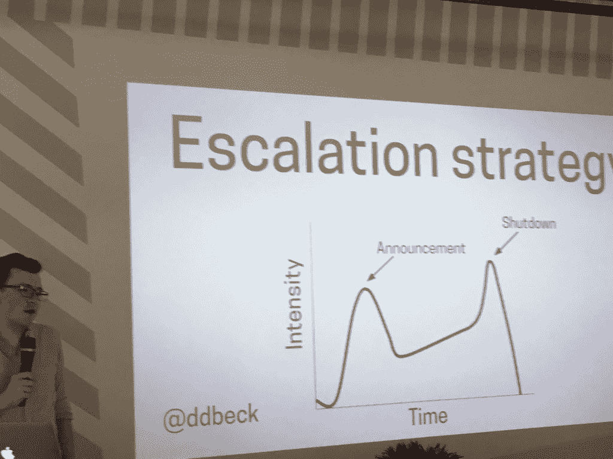

# 你的软件死亡的那一天

> 原文：<https://thenewstack.io/day-software-dies/>

“我们表现得好像我们的软件会永远存在一样，”技术作家丹尼尔·贝克在 T2 的 APItheDocs 伦敦 T3 会议上说。但是当插头最终被拔掉时，我们该怎么办呢？

当我们这一行的人聚在一起谈论文档时，我们喜欢谈论新特性的开始——入职等——甚至成熟的几年。但我们不谈结局。但是几乎每个人都经历过失去他们所依赖的工具。

那么，作为一名技术营销专家，或者一名面向客户的项目经理，你会如何以你希望自己被对待的方式来对待这件事呢？

首先，在用户看来，任何主要的不推荐使用的特性或版本都类似于完全关闭。现在你已经做到了，考虑一下贝克所说的为了给你的团队和客户提供服务，你必须做好的一些事情。

## 对于软件关闭，这完全取决于正确的心态

所以你可能很兴奋你的公司被收购了，你的工资也大幅提高了，但这并不意味着你团队中的每个人都欢迎这种变化，更不用说你的用户了。

在那些被收购的公司不得不关闭一系列软件的情况下，营销团队必须努力“管理你对你的团队和用户的反应——仅仅因为你对此很轻松，并不意味着他们也很轻松。”

首先与您的团队讨论什么是关闭以及这对他们意味着什么。如果他们需要新的工作，他们需要提前知道。如果他们能保住工作，你可以让他们安心，让他们留在你的团队里，如果你早点告诉他们的话。

而且，一旦你和你的团队沟通了，尽一切可能为自己争取更多的时间。无论你的公司是关闭还是出货，作为一个团队领导，你可能会被迫尽快记录和推出关闭或折旧，但不要害怕推后，以获得更多的时间来做正确的事情。

接下来，当需要投入到繁重的工作中时，每一秒都要考虑你的用户。

> “作为一名科技作家，你很少能写出让你当前的每一个用户都能看到和理解的东西。”—丹尼尔·贝克

不要忘记与你的支持团队一起工作，因为他们将是第一线。

最后，Beck 提醒我们与运营部门合作，因为他们将做出技术决策，然后您将向您的用户传达这些决策。

## 你最不想贬低的就是你的沟通

软件或 API 的关闭不是重新来过的地方。你只有一次机会停止你的项目。这就是为什么贝克说你必须好好计划你的沟通。

首先，一旦你知道关闭即将到来，你或你的营销团队需要关闭任何现有的外联。你可能已经安排了关于你的产品和它的特性的持续的推文。您可能有一个电子邮件滴注活动，迫使追加销售，如增加客户支持。你可能在网站、播客或博客上有这样的横幅广告。你需要暂停所有外联活动，不想在试图关闭时吸引新客户或分散现有客户的注意力。

接下来，使用所有这些相同的客户拓展渠道来传达这一变化，提醒人们它即将到来。利用你的支持团队的所有渠道和任何应用内交流。Beck 还指出，销售人员通常与客户有着良好的关系，应该充分利用这种关系来联系个人客户。

他使用了一个不实用的应用程序编程界面的例子，给出了消息的具体例子，比如创造性地在用户界面上放置一个提醒:“这个令牌将在三周内到期”——这不是你的用户可能期望的三年。

您甚至可以在状态消息或错误报告中添加提醒。如果你有一个足够大的社区，一定要在行业活动中提出来。

当然，不要忘记将通知放在文档的顶部。

一旦你计划好如何沟通，就该计划何时沟通了。贝克建议制定一个升级策略。

什么时候不应该交流？如果你的技术支持和你的用户都在中东，那么任何公共假日——包括你自己的——比如斋月都不是个好主意。确保当关键员工请假时，你没有做出任何重大宣布。此外，贝克说，因为这段时间压力很大，所以把每个周五下午都抽出来，直到你完成另一面。

不要忘记在你的日程安排中包括支持，因为他们将是那些必须处理反作用的人。

既然你知道了什么时候不应该交流，那就开始交流你开始做事、移走或取下东西的日期吧。他建议制定“从今天开始”或“不早于”的日期，而不是硬性的截止日期。在这些日子里，你不再保证什么，但是如果不做出更多的承诺，你就无法兑现。

贝克提醒你要“冷静、温和、直接地面对你的读者。”

没人想听你的悲伤故事。没有人想要你的创业陈词滥调“不可思议的旅程”任何变化对你来说可能是积极的，也可能是消极的，但对你的用户来说肯定是破坏性的。

贝克说:“这真的不一定是你的问题，而是他们的问题。”。

这是坚持事实的时候了:

*   发生了什么事？具体来说，比如 API 将停止响应请求，从这一天起不再提供支持，您将在这一天收到最终账单
*   **什么时候发生的？**列出日期和里程碑。
*   **作为用户，我需要做什么？**

如果你真的想成为明星，贝克甚至建议考虑与你以前的竞争对手合作，共同编写向替代服务的迁移。这就是把你的顾客放在首位。

他在结束讲话时说，你会经常被问到为什么。但是不要觉得有义务回答它。这由你和你的团队决定你想分享什么。你只是欠你的用户什么？什么时候？又是怎么做到的？

当然，你必须表达你的感激之情。

毕竟，一旦说了做了，贝克指出，“最糟糕的情况是没人关心。”

也感谢 [Erik Wilde](https://twitter.com/dret) 为[提供了这个伟大的例子](https://tools.ietf.org/html/draft-wilde-sunset-header-02)，通过发布一个机器可读的公告来淘汰你的 API。

<svg xmlns:xlink="http://www.w3.org/1999/xlink" viewBox="0 0 68 31" version="1.1"><title>Group</title> <desc>Created with Sketch.</desc></svg>