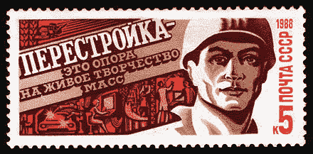

# 往昔时光:关于被遗弃的苏联时代电脑的发现

> 原文：<https://thenewstack.io/days-of-yore-on-the-discovery-of-abandoned-soviet-era-computers/>

在我们这个尖端科技的世界里，在俄罗斯发现了一批 20 世纪 70 年代的苏联时代的电脑，这几乎是一件不可思议的事情。因此，本周，网络上的计算机硬件爱好者花了一点时间，对过去的计算机幽灵进行了一种节日纪念，用他们自己的记忆和思考作出了回应。

RusUE.com[将](https://rusue.com/about/)描述为一个俄罗斯城市探索网站“一个关于在前苏联领土上发现的迷人废弃遗址的博客”

“我真的很喜欢浏览在各种废弃物品上拍摄的照片，”该网站的创建者罗曼解释道，他是一家总部位于俄罗斯的旧设施联盟，并补充道，“我自己也去过这些地方几次。感觉像是时光旅行。”在一名翻译的帮助下，他一直在从其他网站收集俄语文章，并安排在 RusUE.com 用英语重新出版。

“大概没有其他国家能在废弃工厂、城市和军事基地的数量上与俄罗斯抗衡。”

科技博客 [Hackaday](https://hackaday.com/2020/11/30/urban-explorers-reveal-a-treasure-trove-of-soviet-computing-power/) 指出，发现半个世纪前的电脑宝藏一直是许多人的愿望清单。“这可能是我们大多数人的梦想，偶然发现一个布满灰尘的大厅，里面满是迷人的废弃技术，在时间中冻结，好像它的操作者有一天离开了，再也没有回来。”

## 令人敬畏的寂静

在这种情况下，被遗弃的技术是苏联一栋建筑中被遗忘的一层，里面有许多由数字设备公司生产的 PDP“小型机”的复制品。“这座建筑并不突出，”RuSUE.com 解释说。"不起眼的工业建筑，建在数百个苏联城市中."整栋大楼里都亮着灯，里面有活的植物——除了一个光线很差的楼层，那里有神秘的高柜，有些还覆盖着塑料，还有“几十个终端，冻结在装有灭绝屏幕的桌子上。”

在描述这一最罕见的发现时，一种肃然起敬的感觉似乎油然而生。"突然间，人们清楚地看到，摆在他们面前的是传说中的机器‘萨拉托夫-2’。"虽然计算机在上世纪 70 年代在苏联无处不在，但今天你甚至找不到这台机器的高质量照片。爱荷华大学的一个网页由计算机科学副教授维护[记得](http://homepage.divms.uiowa.edu/~jones/pdp8/faqs/)萨拉托夫-2 类似于 20 世纪 70 年代的 PDP-8/M，“但体积更大。”PDP-8 是一台由数字设备公司生产的橱柜大小的“小型机”，而 Saratov-2 复制了它的一般大小和形状，有一个钢架支撑着装满逻辑模块的抽屉。

“读或写程序是通过穿孔带实现的，”RusUE.com 解释说，而计算结果是用电动打字机打印出来的。那是一个先于键盘和显示器的时代，程序是用机器前面板上的开关指示的二进制代码输入的。但即使在那时，“萨拉托夫-2 是野生的，”科幻作家/博客作者科利·多克托罗[在 Twitter](https://twitter.com/doctorow/status/1335636748487966721) 上指出。“它没有微处理器；相反，它被分解成多个组件，每个组件都放在自己的抽屉里:一个 12 位计算单元，I/O，RAM(铁磁立方体)。”

多克托罗辛酸地[将](https://twitter.com/doctorow/status/1335636747217072129)照片的背景描述为“很久以前数据中心大火的灰烬和灭火剂残留物”

同时展出的还有一台电子设备 100/25，该网站将其描述为后来的 PDP-11 的克隆产品，它也可以接收来自磁带甚至键盘的输入。地板上还放着各种版本的电子-60，一种从 8 英寸软盘输入数据的小型计算机。该网站将他们的功能描述为机床等外部设备的“管理者”。

甚至还有一些 20 世纪 80 年代早期的个人电脑的照片，这些照片被鉴定为 DVK-2M 和 DVK-3(或“交互式计算复合体”))该网站将其描述为“庞大”和“外观时尚”(尽管显示器非常小)。

这是苏联最后一位领导人米哈伊尔·戈尔巴乔夫开始实施他的重组改革之前的最后一个时代。很快，1989 年历史性的[革命结束了东欧七个社会主义国家的共产主义统治，到 1991 年，苏联分裂成十二个独立国家。“仅仅几年时间，一个庞大的国家就崩溃了，”罗曼在网站上写道，“随之而来的是数以千计的工厂停工，多个城镇被废弃，军事基地不再需要。”这个幅员辽阔的国家的许多军事基础设施也被废弃了。RuSUE.com 上的其他页面显示了来自一个墓地的照片，那里有废弃的苏联军用车辆、军事基地、军事仓库，甚至还有废弃的核武器仓库。](https://en.wikipedia.org/wiki/Revolutions_of_1989)

罗曼承诺他的网站将向访问者展示“铁幕落下前的苏联是什么样子。”其他帖子记录了一切，从[西伯利亚的秘密基地](https://rusue.com/secret-base-in-the-siberia-with-abandoned-trains/)和[废弃的拖拉机厂](https://rusue.com/abandoned-tractor-factory/)到[废弃的洲际弹道导弹发射井](https://rusue.com/abandoned-intercontinental-ballistic-missile-silo-launcher/)和[非法访问切尔诺贝利](https://rusue.com/an-illegal-visit-to-chernobyl/)

## 2020 年的反应

当得知这个奇怪的时刻也留下了一整层楼的小型机时，网络兴奋不已。

“我只想带他们走。把它们清理干净，看看我能不能让它们不用大修就能工作，”一个[发帖者](https://www.reddit.com/r/VintageComputers/comments/k44ivs/urban_explorers_find_a_cemetery_of_soviet/ge7u56g/?utm_source=reddit&utm_medium=web2x&context=3)说。

这篇文章勾起了科利·多克托罗的一些回忆。“在危机袭来之前，我最后的旅行之一是参观计算机历史博物馆的墓地——一个装满无价的古计算残余物的巨大仓库，”他[在 Twitter 上发布](https://twitter.com/doctorow/status/1335636752975859714)。“虽然地点是保密的，但他们让我拍摄并[上传我的照片](https://www.flickr.com/search/?sort=date-taken-desc&safe_search=1&tags=computerhistorymuseum&user_id=37996580417%40N01&view_all=1)”

多克托罗已故的叔祖父鲍里斯·拉赫曼(Boris Rachman)也曾是圣彼得堡波波夫博物馆的馆长，这一切让他产生了[的灵感](https://twitter.com/doctorow/status/1335636757686013953)苏联计算机历史“以一种难以用语言表达的方式表现出英雄气概:那个时代的限制——政治、经济、物质——需要如此多的创造力。”

JetBrains 驻圣彼得堡的 Kotlin 开发人员伊利亚·雷真科夫(Ilya Ryzhenkov)说，他记得曾在类似的机器上编码。“还记得一些八进制代码，”他[在 Twitter 上写道](https://twitter.com/orangy/status/1335818767939629056)“比如移动和注册操作:)，比如 016767 来 instakill 机器。”

这条线也让芬兰图尔库大学的天体物理学家罗伯托·德·普里斯回忆起更多的事情。“我知道匈牙利天文学家的伟大故事，他们使用走私到奥地利边境的苹果电脑，”他在推特上发布。

但是这个“不合时宜”的发现似乎让人联想到一个科幻故事。在对 Slashdot 的评论中，虚拟现实公司的联合创始人戴夫·布吕克(Dave Brueck)，[开玩笑说](https://slashdot.org/comments.pl?sid=17768516&cid=60800408)“那些照片都让我觉得我在看*半条命*的截图。”在 Twitter 上，UML 的共同开发者 Grady Booch [将这个发现描述为“时间胶囊”软件工程师 Joshua Bloch(曾经是 Sun 的 Java 开发人员之一，现在是卡耐基梅隆大学的教授)](https://twitter.com/Grady_Booch/status/1335651665098145792)[记得](https://twitter.com/joshbloch/status/1335751550740750336)很久以前他曾经自己在 PDP-8 和 PDP-11 上编程，[开玩笑说](https://twitter.com/joshbloch/status/1335679860966998018)那些模模糊糊的赛博朋克俄罗斯克隆体似乎确实属于威廉·吉布森的小说。

这一切引发了对这个曾经横跨 11 个不同时区的帝国命运的一些猜测。“他们倾注了如此多的精力试图复制/克隆/逆向工程西方的计算设备，”黑客新闻的一位评论者惊叹道，“几乎确保了他们总是落后几代人。”

Hackaday 的文章以怀疑这一切可能会走向何方作为结尾。"如果历史不是这样，推测这些机器在 20 世纪 90 年代会如何进一步发展会很有趣。"但即使这条时间线最终消失在一个很久以前的死胡同里，“与此同时，我们都有苏联 PDP/11 微型计算机的有形遗产，即俄罗斯方块，它首先写在 Elektronika 60 上。”

在一个快速变化的时代，想起在我们之前出现的很久以前的工人，并享受那种提醒我们已经走了多远的罕见的长远观点，会令人感到奇怪的安慰。最近，在另一个名为 EnglishRussia.com 的俄罗斯博客上，也有一篇关于 20 世纪 80 年代和 90 年代俄罗斯计算机中心的文章[,该博客分享了自己拍摄的磁带播放柜(和磁带存储架)以及方形软盘和一些令人惊讶的块状键盘的照片。](https://englishrussia.com/2010/10/05/computer-center-of-1980-90s/)

“令人惊讶，想想我们从那以后走了多远……”它的一位评论者写道。“这让你想知道再过 10 年或 15 年我们会在哪里。”

* * *

# WebReduce

来自[RusUE.com](https://rusue.com/cemetery-of-soviet-computers/)的特写图片。

<svg xmlns:xlink="http://www.w3.org/1999/xlink" viewBox="0 0 68 31" version="1.1"><title>Group</title> <desc>Created with Sketch.</desc></svg>