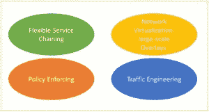
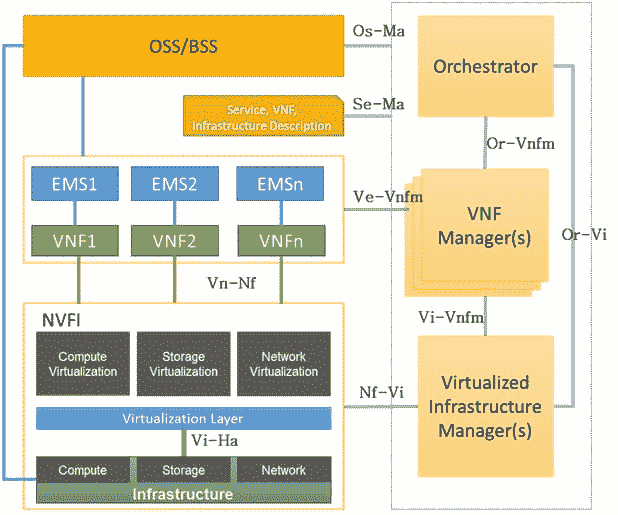

# 什么是网络功能虚拟化？

> 原文：<https://thenewstack.io/de-ossify-the-network-with-function-virtualization/>

**编者按**:本文是探索开源网络虚拟化的系列文章的第一篇。在这第一部分中，斯里达尔·拉奥探索了网络功能虚拟化(NFV)的概念。

就网络设备而言，传统的专有设备变得过于多样化，使得运营商和数据中心运营商增加和升级服务变得越来越困难。网络功能虚拟化(NFV)是 [ETSI 工业规范组织(ISG)](http://www.etsi.org/technologies-clusters/technologies/nfv) 的一项计划，旨在通过虚拟化以前由专有硬件执行的网络功能来简化操作。

NFV 将网络功能整合到行业标准的服务器、交换机和存储硬件上。NFV 在虚拟化下提供优化的数据平面，允许管理员用运行在商用服务器上的软件替换传统的物理网络设备，从而降低成本、功耗和复杂性。

今天的网络很大程度上是由[的中间盒](https://tools.ietf.org/html/rfc3234)运行的，中间盒是支持狭窄的专门网络功能(例如，第 4 层到第 7 层)的有状态系统，并且基于专门构建的硬件(通常是封闭且昂贵的)。中间盒不仅导致"[网络僵化](http://www.scs.stanford.edu/nyu/04sp/notes/l23.pdf)"，而且由于它们需要管理工作，它们代表了网络资本和运营费用的重要部分。

使用 NFV 可以减少甚至消除当前网络中部署的中间盒数量。通过网络功能的多版本和多租户，它允许单个物理平台用于不同的应用、用户和租户[。](http://www.ietf.org/proceedings/87/slides/slides-87-nsc-0.pdf)

NFV 还支持实施弹性、服务保障、测试和诊断以及安全监控的新方法。它[促进了新网络功能和服务的创新](https://portal.etsi.org/Portals/0/TBpages/NFV/Docs/NFV_White_Paper3.pdf),这些功能和服务只在纯软件网络环境中实用。NFV 适用于固定或移动网络的任何数据平面和控制平面功能，并且还适用于实现可扩展性所需的功能的自动化管理和配置。

以下是可以通过 NFV 虚拟化的一些网络功能:

*   开关元件
*   移动网络节点
*   家用路由器操作
*   机顶盒操作
*   隧道网关元素
*   交通分析
*   服务保证
*   SLA 监控
*   测试和诊断
*   NGN 信号
*   融合和网络范围的功能
*   应用级优化
*   安全功能

NFV 的一个潜在的强大用途是服务功能链接，这是将虚拟网络功能(如路由器、防火墙、DPI 和 NAT)动态链接到一个集成部署中的过程。这个过程可能是应用程序配置过程的关键。

作为服务提供商的一个例子，服务链可以由位于用户驻地的边缘路由器组成，在到达提供商边缘路由器之前，接着是防火墙、深度分组检查过程和 NAT 过程。从应用程序的角度来看，电子邮件服务链将包括病毒、垃圾邮件和网络钓鱼检测，并且可以通过不提供延迟或抖动保证的连接进行路由。

在大多数传统网络中，由于每项服务都需要单独的硬件，因此构建服务链来支持新的应用程序需要获取网络设备，并按照所需的顺序将它们布线在一起，这总是被证明是麻烦且容易出错的。

然而，将网络功能转移到运行在商用服务器上的软件中可以克服这些挑战。使用 NFV，可以对资源和网络进行集中管理和自动配置。此外，网络功能的虚拟化还提供了动态服务链、资源分配以及向内或向外扩展的能力。这自然会简化网络结构，缩短服务部署时间。

可以肯定的是，NFV 的使用也带来了一些挑战，其中主要是运营商级的性能要求。运营商通常预计服务的正常运行时间为 99.999%，基础设施(包括网络)的正常运行时间为 99.99999%，比企业软件的 99.9%要求高得多。这正是 NFV 的闪光点，因为它是为运营商级和服务灵活性而设计的。

最终，NFV 的目标是改变网络运营商设计和运营网络的方式。

## NFV 和 SDN

谈到网络虚拟化，大多数人会想到软件定义的网络(SDN)。NFV 与 SDN 是分开的。这两种技术都旨在提高灵活性，降低成本，支持可伸缩性，并加快新服务的推出。但是你可以运行一个而不运行另一个。

SDN 支持 NFV 的方式

然而，NFV 是对 SDN 的补充，而 SDN 通过提高性能、提供灵活性和简化操作，使 NFV 的使用变得更容易、更好。特别是，使用 SDN 支持 NFV 有助于流量导向(卸载、旁路、选择等)。)、动态纵向扩展和横向扩展、多租户和负载平衡。

SDN 还帮助 NFV 解决策略管理转发和动态服务编排等任务。反过来，NFV 对动态虚拟覆盖的使用和多租户的需求也推动了对 SDN 的需求。

## NFV 在行动

NFV 的两个使用案例是构建虚拟客户驻地设备(vCPE)和分组交换 LTE 移动网络。

当虚拟化客户驻地设备时，主要思想是将更高层的功能从客户家中的盒子(即家庭网关)移出到网络，在网络中它们可以由商用服务器处理。在此之后，家庭网关就变成了一个简单的 L2 桥，许多现有的功能都被虚拟化了。

使用 vCPE，可以动态交付任何网络功能，降低初始和维护成本，并提供灵活的系统重新配置。NEC 使用这种方法和自己的[家庭网关设备](http://www.nec.com/en/global/solutions/tcs/vcpe/index.html)来虚拟化 IP 功能，用于用户和服务管理、虚拟化网络地址转换和 DHCP 服务。

NFV 在演进分组核心(EPC)中也扮演着至关重要的角色，EPC 是[3GPP](http://www.3gpp.org/)LTE 无线通信标准核心网络架构的主要组成部分。EPC 包括移动性管理实体、服务网关和分组数据网络网关作为子组件。

市场上有许多 vEPC 解决方案供应商。OpenEPC (Open Evolved Packet Core)由 Core Network Dynamics 提供，是一组用 c 开发的标准 EPC 组件的软件实现。OpenEPC 结合了 3GPP 演进分组核心(第 9 版)的主要功能，可以部署在运行 Linux 的标准商用现成硬件上。OpenEPC 包括核心网络移动性管理、策略和计费控制、客户端移动性管理、订阅管理、与接入网络的互连以及与应用和服务的互连。

## NFV 建筑

NFV 框架的主要组成部分是:

*   由硬件资源和相应的虚拟化组成的基础架构。
*   管理和协调(MANO)，由协调器、虚拟化网络功能管理器(VNFM)和虚拟化基础架构管理器(VIM)组成。
*   虚拟化网络功能和相应的网元管理系统(ems)。
*   运营支持系统和业务支持系统(OSS/BSS)。

ETSI·NFV·ISG 提出的建筑框架。灰色线显示主要参考点，绿色线和蓝色线分别显示执行和其他参考点。

虚拟化网络功能(VNF)是一种能够在 NFV 基础设施(NFVI)上运行并由 NFV 协调器(NFVO)和 VNF 管理器协调的网络功能。除了明确定义的功能行为之外，VNF 还应该支持与其他 NFs、VNF 管理器、其 EMS 和 NFVI 的明确定义的接口。

NFVI 是构建部署 VNFs 的环境的硬件和软件组件的总和。NFVI 提供了一个利用标准 IT 虚拟化技术的多租户基础架构，可以同时支持多个使用案例和应用领域。NFV 通过虚拟化层将网络功能的软件实现与计算、存储和网络资源相分离。这种分离需要一组新的管理和编排功能，并在它们之间产生新的依赖关系，因此需要可互操作的标准化接口、公共信息模型以及此类信息模型到数据模型的映射。

NFVO、VIM 和 VNF 经理的组合通常被称为 MANO。NFVO 负责新网络服务的初始化和设置、网络服务生命周期管理、全局资源管理、NFVI 请求的验证和授权，以及 NS 实例的策略管理。

VNF 经理负责 VNF 实例的生命周期管理以及 NFVI 和 EMSs 之间的整体协调。最后，VIMs(如 OpenStack)的职责在社区中得到很好的理解，即控制、管理和监控 NFVI 计算、存储和网络资源。

在过去几年中，更新的业务模式、不断变化的用户需求以及大数据、个性化和虚拟化等因素对 OSS/BSS 系统产生了巨大影响。在发展这些系统方面已经做了大量的工作。在 NFV 框架中，OSS/BSS 系统将主要与 NFVO 进行网络服务管理交互，随着时间的推移，OSS/BSS 系统可能会随着虚拟化的引入而管理越来越多的实体。

<svg xmlns:xlink="http://www.w3.org/1999/xlink" viewBox="0 0 68 31" version="1.1"><title>Group</title> <desc>Created with Sketch.</desc></svg>