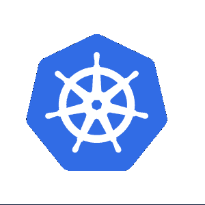

# 降低科技创业的风险

> 原文：<https://thenewstack.io/de-risk-a-technology-startup/>

 [拉姆·艾扬格

拉姆是云铸造基金会的开发者倡导者。他实际上是个工程师，本质上是个教育家。在他作为一名开发人员的旅程中，他被推上了技术福音传道者的位置，从那以后就再也没有回头。他喜欢帮助世界各地的工程团队发现新的和创造性的工作方式。](https://www.linkedin.com/in/ramanujank/) 

创业公司周围的一切都充满了风险。商业模式、团队、运营以及最重要的技术选择。

有很多方法可以帮助初创企业降低甚至消除风险。

有些是战略性的(构建与购买、注入投资)，而有些则更具战术性(从 OPEX 到资本支出、保险、支点)。

书籍、博客和社交媒体充满了关于如何从经济、产品或管理角度预测和减轻风险的想法。

创业公司追求的技术选择的后果是系统性风险，但这一点却没有得到太多的讨论。

许多首席技术官(CTO)和/或首席信息官(CIO)都表达了他们是如何处理初创公司中与技术相关的熵的。

基础设施、语言和框架、中间件、数据库、构建和发布流程、内部应用程序——数字足迹可能是巨大的，即使在小型组织中也是如此。

增加不确定性的是开源工具、外包和迁移到新工具。

在本文中，我们将重点关注这种蔓延的一个方面，即迁移到新技术。

今天特别相关的是向库伯内特斯的迁移。本文讨论了工具和技术的组合，以帮助管理这种迁移，同时减少与之相关的大部分风险。

Kubernetes 是一个开源的容器编排工具。自从六年前推出 Kubernetes 以来，它已经彻底改造了基于云的基础设施的世界。今天，它代表了各种规模的工程团队处理其应用程序托管策略的方式的一种范式转变。上一代人对容器的狂热，以及上一代人对虚拟机的流行，与 Kubernetes 的广泛采用相比都相形见绌。

我们对工程团队的观察使我们将他们分为三大类:那些习惯使用 Kubernetes 的人，那些考虑使用 Kubernetes 的人，以及那些正在使用 Kubernetes 的人。我们对这些有专门的术语:Kubernetes，New-bernetes 和 Noob-ernetes！属于这些类别的软件工程团队都有问题，但是非常不同。

那些还没有采用 Kubernetes 的团队面临着迁移到新的基础设施管理方法的巨大挑战。那些刚刚采用 Kubernetes 的团队面临着要求第 2 天问题的风险。那些已经完全迁移到 Kubernetes 的团队将会发现，他们正在驾驭将它们集成到 CI/CD 管道、管理更新等等的复杂性。这就引出了一个问题:技术真的能解决问题吗？

技术无疑为问题提供了答案。诚然，它们可能是对过去障碍的修补，也可能带来新的障碍。但是应用这些经验并不断发展才是技术前进的方向。在 Kubernetes 的上下文中，可能有一些理由推迟迁移，但是支持迁移的理由远远超过反对的观点。

就其本质而言，初创公司面临着诸多限制。原始工程工时有限。专注于产品特性的带宽很低，而且只能以高价获得。通常，非特性开发带宽为零或接近零。当提交给高层管理人员时，技术迁移的可用预算通常会遭到嘲笑。正是由于这些原因，有助于采用新技术的实用迁移策略可能很难实现。再加上培训和提高 Kubernetes 的技能、寻找和留住人才的成本，尽管这项新技术有令人鼓舞的成功故事，但很快它的采用就变成了一项犹豫不决的冒险。

他们说，成功和失败的最大价值来自经验教训。一组特别有趣的经验来自于 Cloud Foundry 社区在 Kubernetes 上实现更简单的开发者体验所做的工作。这是一个关于不断发展的技术拥抱 Kubernetes 的故事，展示了初创公司如何降低其技术选择的风险。

作为背景，Cloud Foundry 是一个平台，旨在为云原生应用交付提供一个高效的现代模型。Cloud Foundry 源于基于 VM 的架构的历史，这种架构演变为使用容器作为不可变的工件进行部署，使用 orchestrator 有效地大规模管理这些容器。最近，它的开源社区反对为容器编排开发并行标准，而选择了 Kubernetes。

作为过渡的一部分，许多定制组件被 Kube 原生组件所取代——用于联网的 Istio、特使服务网格、用于日志记录的 Fluentd 等。这现在可以作为 cf-for-k8s 项目使用，这是在 Kubernetes 基础设施上交付的云铸造的再创造，符合其经证明的大规模运行的谱系。

作为任何创业公司的典范，以下是 Cloud Foundry 开源技术公司必须用 Kubernetes 解决的问题，以及我们学到的经验教训，希望你能应用到你的组织中。

**问题** : Kubernetes 给应用开发者带来了巨大的认知开销。

**经验教训** : Cloud Foundry 完全抽象了 Kubernetes 接口。相反，开发人员与 Cloud Foundry CLI 交互，它有一个小的命令集，可以提供所有必要的功能来处理 Kubernetes 集群。

**问题**:容器使得对现有应用程序进行更新和附加服务变得困难。

**经验教训**:通过使用 sidecar 注入、服务代理和简单的部署接口(Cloud Foundry 和 Kubernetes)，应用程序的更新变得更加容易和方便。

**问题**:由于使用各种语言和框架，需要维护多个部署管道

**经验教训**:统一的 cf 推送流程，以及随后的构建包使用，支持使用任何语言或框架构建的应用/微服务的部署。使用 Cloud Foundry 时的构建和部署过程是与语言无关的。甚至重要的构建也可以用构建包的组合来部署。

总之，初创公司可以从在其生命周期的早期采用 Kubernetes 中受益匪浅。这将极大地有利于他们的团队，因为他们在扩展时消除了大量的辛劳。它是实现快速开发、快速频繁发布和生产中可靠应用的重要垫脚石。这至少会降低你选择技术的风险，让你专注于其他重要的考虑因素，比如创业公司的商业模式、团队和运营。

<svg xmlns:xlink="http://www.w3.org/1999/xlink" viewBox="0 0 68 31" version="1.1"><title>Group</title> <desc>Created with Sketch.</desc></svg>