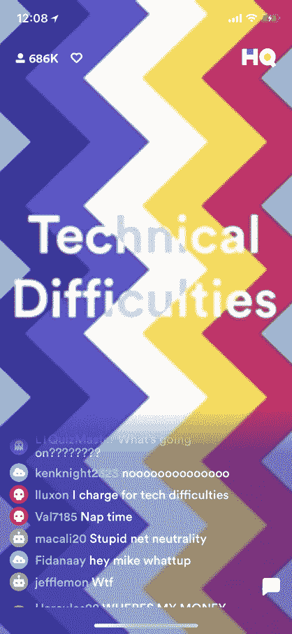

# 亲爱的总部琐事，这里是如何使用边缘计算来防止停机

> 原文：<https://thenewstack.io/dear-hq-trivia-heres-prevent-outages-using-edge-computing/>

 [克里斯·冈

克里斯是 Mesosphere 的产品营销经理，也是 CNCF 大使。他之前在 Gartner 担任分析师，负责公共 IaaS。在此之前，他是一名物理学家，从事量子化学的计算建模。他与妻子贾斯敏和狗熊猫住在密西西比州。](https://d2iq.com/) 

HQ Trivia 在超级碗中场秀期间的中断提醒我们，即使对于经验丰富的专业人士来说，设计能够处理一夜成功带来的洪水的应用程序也是很难的。现在，在科技行业中，人们普遍将公共云近乎无限的容量误认为是架构应用基础架构的替代品，以允许快速扩展来满足不断增长的动态需求。通过学习其他 SaaS 和移动应用的成功经验，可以避免“技术难题”的命运。

如果你还没有玩过 [HQ 琐事](https://itunes.apple.com/us/app/hq-live-trivia-game-show/id1232278996?mt=8)，那你就错过了。这是对传统琐事节目形式的重新想象，以创造一种现场的移动体验——让成千上万你最亲密的朋友在问答游戏中竞争现金奖励。你还不能赚到危险级别的钱或名声，但这很有趣。然而，它乞求一些更新，如倪星烦人的聊天室，并创造方法让玩家在错过一个问题后保持参与。

撇开游戏机制不谈，不幸的是，它现在的致命弱点是由压倒性的用户需求造成的停机时间。就像 Twitter、Pokemon Go 和之前的几十款应用一样，HQ Trivia 也在为自己的受欢迎程度而挣扎。构建一个应用程序来支持平均 600，000 个并发用户并不是一件容易的事——更不用说在超级碗期间达到 170 万的峰值了。这并不奇怪，视频经常冻结，连接经常中断，导致情绪爆发和聊天流中的淫秽内容。

如果 HQ Trivia 想继续扩大其人气，它必须解决目前的技术不足。快速的成功对数字企业来说是福也是祸，HQ 琐事正在与应用基础设施上的一些最困难的要求进行斗争。这是一个很大的问题，但对 It 组织来说却是一个真正的难题。

## 指数增长但需求激增

HQ Trivia 正以极快的速度赢得用户。每个工作日登录两次的数十万普通琐事爱好者只玩很短时间。这导致了几十分钟的严重流量爆发，但在一天的大部分时间里，流量是平稳的。这种流量的急剧增长是零售/电子商务(黑色星期五和网络星期一)和金融服务等行业的常见模式，在这些行业中，处理一天结束时的投资组合分析数据可能需要多几个数量级的计算。

这些行业的经验表明，避免停机需要经过深思熟虑的方法，而不是快速解决方案。通过弹性云资源增加物理计算和内存类似于投入更多硬件来解决问题的传统方法，这不是唯一的甚至不是最好的答案。能够上下扩展后端组件的真正弹性应用程序基础架构对于高可用性和长期可伸缩性至关重要。

早些年，Twitter 面临着类似的问题:被称为“失败的鲸鱼”的全球网站宕机事件屡见不鲜。Twitter 上的用户主页，本质上是一个短消息的消防水管，需要多个松散耦合的数据和其他服务才能呈现。一个开源服务(如 MySQL)的中断或连接中的任何延迟都会像滚雪球一样越滚越大，导致中断。当时增加任何服务容量的唯一方法是添加服务器，并使用配置管理来配置应用程序基础架构。

当用户数量呈指数级增长时，这些流程变得容易出错，需要自动化和标准化。在 Twitter 上，Mesosphere 的创始人 Florian Leibert 和 Ben Hindman 帮助设计了一个解决方案，杀死了失败的鲸鱼，包括基于 Apache Mesos 的新软件基础设施。这使得工程部门能够在应用程序基础架构组件的整个生命周期内轻松调配和管理这些组件，以便在使用量激增时增加容量。如果有东西坏了，梅索斯会确保把它转回来。Mesosphere 的诞生是因为需要让这种技术更容易被更广泛的商业世界使用，而不仅仅是网络规模的初创公司。

## 实时、数据丰富的交付

HQ 琐事流量峰值包括要求高、资源密集、数据丰富的视频，通常需要额外的设计考虑，以确保类似网飞的体验。最重要的是，网络必须支持实时聊天互动。虽然应用基础设施的自动化、管理和标准化对于视频等数据丰富的服务非常重要，但考虑数据本地性也很重要。为了保持引人注目的用户体验，数据需要在地理上靠近用户，以便利用低延迟连接。

有人可能会说，云基础设施和内容交付网络(CDN)消除了对区域计算的需求。云提供商向专业技术人员大肆兜售云基础设施带宽无限、延迟几乎为零的神话。在签约云提供商时，技术人员通常会受到特定服务区域可用硬件的限制。例如，云服务提供商可能只有支持一个数据中心的磁盘或内存需求所需的硬件。一旦您的应用程序受限于特定的区域数据中心，您的整个业务就会受到该站点位置、资源和负载的限制。

然而，内容越动态，CDN 服务就越没用。很少有人支持直播，那些支持直播的也贵得惊人。工程部门不应依赖大型集中式云或“现成的”CDN 向客户分发视频，而应采用混合方法，在边缘部署计算，并采用正确的资源管理和网络来确保应用程序高度可用。这种混合方法，通过边缘计算为用户体验提供动力，对于满足日益增长的消费者期望至关重要。

## 边缘是答案

HQ Trivia 需要的不仅仅是 CDN 或全球云提供商来解决他们的问题。虽然我们不确定他们的基础设施是什么样的，但我们相信他们需要的是一种边缘计算架构，这种架构基于许多区域分布式数据缓存和计算资源的组合，可以快速处理来自聊天的数据流，同时保持数据丰富的视频性能和服务质量(QoS)。

边缘计算正在迅速普及。将数据缓存、处理和分析置于边缘可消除用户设备和基于云的应用程序堆栈之间的往返网络延迟所导致的性能下降。将边缘资源和云资源相结合，可以实现集中控制、分析和洞察的敏捷用户体验。

如果皇家加勒比可以在海上使用边缘计算来应对地理挑战基础设施的指数级、峰值需求，那么总部琐事也可以。任何乘坐过游轮的人都可以证明，游轮的互联网连接既昂贵又脆弱。不久前，如果你想报名参加机上活动或短途旅行，乘客必须排队并与客服人员联系。

通过采用[中间层 DC/操作系统](https://d2iq.com/)，皇家加勒比能够将他们的计算能力一直延伸到边缘(在这种情况下，游轮)以提供可靠的移动应用程序体验，允许客户在船上花费更多。皇家加勒比移动应用套件由 DC 操作系统提供支持，该系统管理数据中心和公共云的资源，即使在需求高峰期也能为游轮上的每个人提供可靠的移动体验。如这个例子所示，正确的架构使得创建可靠的移动体验成为可能——即使是在大海中间。如果皇家加勒比可以克服分布式基础设施面临的挑战，那么 HQ Trivia 也可以。

HQ Trivia 可以利用类似的方法将并发用户连接到他们位置附近的内容。事实上，大多数组织应该开始计划利用这种边缘设计。随着我们设备的连接性增加，它们变得更加智能，提供更深层次的交互，我们的品味从一般的体验演变为定制的个性化体验。反过来，对边缘计算的需求变得越来越突出。说起来容易做起来难，因为琐事 HQ 工程团队可能会说读这篇博客。

在中间层，我们首先承认新的现实是艰难的。构建和运行分布式应用程序和相关服务会导致一些难以解决的问题，这些问题通常是半成品解决方案。这就是为什么我们把管理动态基础设施作为我们的使命，这种基础设施越来越混合和多云，更易于管理。

[中间层](https://d2iq.com/)赞助了这篇文章。

通过 Pixabay 的特征图像。

<svg xmlns:xlink="http://www.w3.org/1999/xlink" viewBox="0 0 68 31" version="1.1"><title>Group</title> <desc>Created with Sketch.</desc></svg>