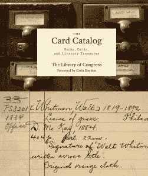
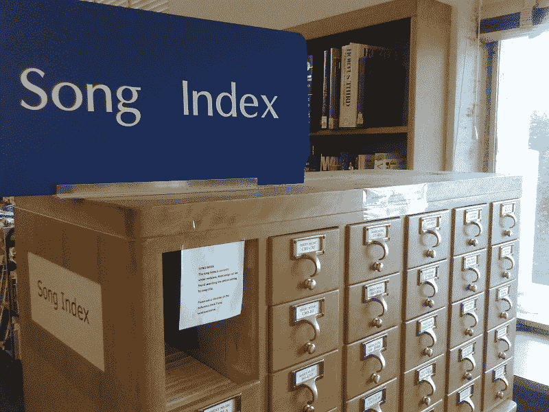

# 关于数据迁移，卡片目录的消亡教会了我们什么

> 原文：<https://thenewstack.io/death-card-catalog-taught-us-data-migration/>

当我们过渡到一项新技术时，我们会丢失有价值的元数据吗？数据从一种介质传输到另一种介质的过程中会产生错误吗？这是一个社会已经不得不面对的问题——当世界上的图书馆从基于纸质卡片的旧系统过渡到数字和在线目录时。

也许通过观察这个从物理形式到数字形式的重要转变点，我们可以学到一些东西。

 今年四月图书纪事发布 [*卡片目录:图书、卡片、文学珍品*](https://www.amazon.com/Card-Catalog-Books-Literary-Treasures/dp/1452145407/) ，回望昔日的存储媒介。《华盛顿邮报》称其为“威胁我们文化的技术狂的解毒剂”，并指出到 1969 年，国会图书馆每年印刷 7900 万张纸质卡片。《纽约客》曾经计算过，到 1968 年，国会图书馆每分钟分发大约一千张卡片，每张大约 5 美分。

但是随着时间的推移，事情发生了变化。

几个世纪以来，卡片目录是图书馆记录他们的书籍和书籍内容的基本方式。每本书都有自己的卡片，上面详细记录了——有时是手写的——作者、出版日期和其他相关信息。然后按照作者、标题、主题和附加索引的字母顺序排列。

1986 年,《纽约客》的另一篇文章回忆了那个“寒冷”的冬日，当时纽约公共图书馆[关闭了卡片目录室](http://www.newyorker.com/magazine/1986/04/21/ii-searching-for-gregorian),以便用一套 32 台电脑终端取代 8000 个橡木卡片目录抽屉。不到两年前，在线计算机图书馆中心(OCLC)印刷了最后一张目录卡，这是一个新的分水岭[。自 1971 年以来，该公司就一直在生产这种卡片，每周出货多达 8 吨，多年来，该公司已经印刷了超过 19 亿张卡片。但是随着图书馆转向在线目录，对印刷纸质卡片的需求已经不够了。](https://www.oclc.org/en/news/releases/2015/201529dublin.html)

但是根据作者[Nicholson Baker](http://www.simonandschuster.com/authors/Nicholson-Baker/46091659)1994 年在《纽约客》上发表的文章[, OCLC 在实现这一转变中也发挥了重要作用，因为该非营利组织也一直在以少量费用将旧的图书馆目录卡转换成“机器可读形式”。贝克发现 60 个人正忙于收集 40 个不同图书馆的卡片目录，包括洛杉矶、旧金山和辛辛那提的公共图书馆。](//www.newyorker.com/magazine/1994/04/04/discards)

> 尼科尔森·贝克哀叹说，图书馆购买“补救软件是为了纠正早期技术对曾经安全存储在纸上的信息所做的修改。”

“图书馆将他们图书馆收藏的历史委托给我们，”OCLC 的莫林·芬恩说，他负责这个项目。到 1994 年，该项目已经从 20 世纪 70 年代开始运行，“在 17 年里，我们从未丢失过一张卡片。”

但是，所有那些旧卡片，以及它们所有的附加注释和“另见”参考资料将顾客引向图书馆收藏的其他部分，都发生了什么呢？芬恩告诉《纽约客》，“我采访的大多数图书馆经理都会说，‘我们保存它们是因为这让员工感觉很好，我们将会淘汰它们。’"

到 1994 年，每年有数百万张卡片被销毁。一些图书馆甚至将它们转换成草稿纸。学科目录已经在达特茅斯、肯特州立大学和波士顿大学消失了。这篇文章还报道说，“一家名为蚯蚓公司的回收公司在 1989 年运走了大部分麻省理工学院的卡片。”历史学家海伦·兰德·帕里什抱怨说，这一切堪比焚烧亚历山大图书馆。

对于向数字化的过渡，显然有一个用例*。在线目录更便宜，可以远程访问，而且,《纽约客》指出，它们不会发霉，不像多伦多大学一个工程图书馆里被水损坏的卡片目录。坐轮椅的人也更容易获得在线目录，也许同样重要的是，政府为转换提供了资金。*

是的，一项研究发现，青春期前的孩子在使用在线目录时有更多的困难。但是贝克看到了更大的问题…

*“不幸的事实是，在实践中，现有的冻结卡片目录……通常被充满新错误的本地数据库所取代，这些数据库更加难以有效浏览，缺乏交叉引用和主题词，缺乏本地特征，不能很好地将相关的标题和作者组合在一起，并且在许多情况下被剥夺了整类特定的历史信息(例如，图书的原始价格、购买日期、原始编目日期、 它的登记号、原始编目员自己的首字母缩写、任何已被撤回的副本的记录，以及它是礼物还是购买的)免费存在，不消耗磁盘空间或计算机房的电力，不需要昂贵的软件更新或每日备份或硬件服务电话……”*

OCLC 是一个非盈利组织，制作了很多这样的数字化目录，它为那些提交了主数据库中没有的新书的图书管理员提供了奖金和特殊折扣。《纽约客》认为这激励了世界各地的图书馆员“在新闻组和邮件列表服务出现之前很久就参与创建一种虚拟社区，为蓬勃发展的数据库提供动力……这是数十万曾经孤立的文献学家之间高度民主、全方位的合作。”

截至 1994 年，OCLC 的数据库拥有 3000 万份记录——约 25%来自国会图书馆，但“大部分是近 7000 个会员图书馆的作品”但是质量并不总是完美的——被多余的不同指示方式的额外列表所困扰，例如，丁尼生或亚历山大大帝。在早期，纠正错误的繁琐过程实际上需要通过邮政服务发送一封贴有邮票的信。

据 OCLC 图书馆资源管理部门主任马丁·狄龙说，OCLC 然后通过他们的“重复检测和解决”软件实施了自动清理。“当数据库变得像我们这样大时，个人的贡献就会受到严重限制。这项任务太大了，没有多少人能够完成。”他们的软件一度发现超过 60 万本重复的图书。

很快，其他公司为数字图书馆目录创建了纠错程序，导致了贝克哀叹的一种状态，即图书馆购买“补救软件，旨在纠正早期技术对曾经安全存储在纸上的信息所做的散列。”

这篇文章认为，世界正遭受着“由于在拆卸每个卡片目录、分类、装箱和贴标签以及将它们全部转换成机器可读形式时犯下的笔误而导致的成千上万本书的随机损失——这是一种没有火焰或人群，最奇怪的是，没有动机的偶然书籍燃烧……我问过的每一位编目员和技术服务人员都承认，由于不可避免的这样或那样的失误，他们图书馆中现在有一些书不在本应帮助你找到它们的在线目录中。”

## 图书馆和制造商

今天读这篇文章令人振奋，但它让我想到，也许这些问题总是在获得更多更容易获得的信息的道路上突然出现。我当地的公共图书馆现在有一个在线目录，它不仅能告诉我一本书的索书号，还能告诉我这本书是否真的在书架上。而如果不是的话，网上的清单也可以告诉我，其他哪些分店可能有副本。我甚至可以请求他们帮我拿着这本书——都是在线的。我可以在自己舒适的家里做这些。

当然，还有一个更大的图景。我记得 2013 年旧金山“书呆子之夜”聚会上，圣拉斐尔公共图书馆馆长的一次演讲。莎拉·霍顿是热门博客“[黑衣图书管理员](//librarianinblack.net/librarianinblack/%E2%80%9D)”的作者，她将自己的演示文稿命名为“卡片目录去哪儿了？今天踢屁股的图书馆和图书管理员。”

霍顿提醒观众，今天的图书馆不仅仅是书籍:“图书馆是第一批真正全心全意拥抱创客运动的机构之一。”他们提供 3D 打印机和视频制作设备，许多还提供电子课程。有些网站让你查看从工具到种子、乐器、玩具甚至艺术品的所有东西。图书馆也为社区举办活动——旧金山公共图书馆实际上举办了一场“文学速配”活动。

“如果这还不够性感，你可以在你当地的图书馆杀猪屠宰，”她说，并贴上了一张在美国各地图书馆举办的屠宰研讨会的照片。“如果你喜欢杀东西，也许你可以让你的图书馆和你一起杀东西。”

也许最终的收获是，在一天结束时，数据只是作为一个更大的任务的工具而存在。

“我们的货币是信息,”霍顿告诉她的听众。“因此，如果有一种技术能让提供信息变得更容易，那就能让我们的工作做得更好。

“你是受益者，因为你更快更容易地获得信息。”

* * *

## WebReduce

<svg xmlns:xlink="http://www.w3.org/1999/xlink" viewBox="0 0 68 31" version="1.1"><title>Group</title> <desc>Created with Sketch.</desc></svg>