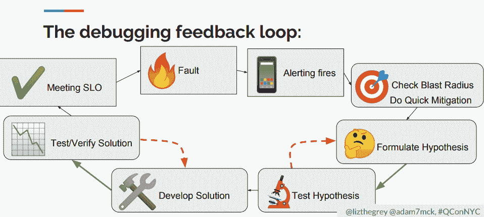

# 调试微服务:来自谷歌、脸书、Lyft 的教训

> 原文：<https://thenewstack.io/debugging-microservices-lessons-from-google-facebook-lyft/>

大约五年前，Lyft 的工程师开始发现其转向微服务的运营问题。服务越来越难以排除故障，因此，开发人员开始完全不信任生产中的微服务。

Lyft 的马特·克莱恩。

Lyft 软件工程师[马特·克莱恩](https://twitter.com/mattklein123)指出，主要问题是缺乏可观察性，他创建了开源[特使](https://www.envoyproxy.io/)服务网格，主要是为了处理这个问题。

“如果网络出现故障，而你又不知道故障出在哪里，那就很难做任何事情，”克莱恩上周在纽约的 QCon 开发者大会上说。

该公司随后转向微服务架构，这将允许开发人员用他们喜欢的框架和语言编写组件，无论是 PHP、JavaScript、Python 还是 Go。

但是当事情出错时，很难找出原因。是互联网吗？负载平衡器？后端数据库。当然，一个开发人员可以滚动错误日志，但是错误日志太多了，格式各不相同，而且它们包含了太多的信息。当问题从一个服务跳到另一个服务时，您如何跟踪它呢？

克莱恩说:“从操作的角度来看，试图将所有这些联系在一起是非常困难的。

Envoy 的出现是为了让他们的工作变得更容易，而不用他们实际上担心网络、认证驱动程序或其他处理网络层的软件。“应用程序开发人员不编写业务逻辑的每一分钟都是在浪费时间，”他说。对于 Envoy，“我们喜欢尽可能地抽象，但当它无法抽象时，因为事情失败了，我们喜欢帮助人们找出失败的根源，这样我们就可以实际修复它。”

> “应用程序开发人员不编写业务逻辑的每一分钟都是浪费时间”——Matt Klein。

一个服务网格，特使共同定位一个边车，每个服务。当一个服务想要与另一个服务对话时，是 sidecar 与另一个服务的 sidecar 建立连接。这样，他们可以共享跟踪、日志和统计数据。每个服务只知道它自己的 sidecar，而让 Envoy 自己去担心诸如服务发现、负载平衡、速率限制、电路中断、重试以及其他以网络为中心的可伸缩性任务等因素。

“所有这些对应用程序开发人员来说都是隐藏的，这是一个非常强大的范例，”Klein 说。

## 遵循请求跟踪

“分布式跟踪是工程师工具箱中处理复杂架构中难以捉摸的难以确定的问题的最佳工具，工程师 [Haozhe Gao](https://www.linkedin.com/in/haozhe-gao-8077b56b/) 在 QCon 的另一次谈话中谈到脸书的内部分布式跟踪工具 [Canopy](https://research.fb.com/publications/canopy-end-to-end-performance-tracing-at-scale/) 时说。

就像 Lyft 一样，脸书了解微服务。仅仅加载主页就会调用成千上万个远程过程调用(RPC)。例如，你如何调试一个只发生在 10%用户身上的问题？“调查多个主机的边缘行为变得非常具有挑战性，”他说。

脸书使用的一种常用技术是测量 RPC 边界的延迟，通常是通过采样或聚合。尽管很有用，但是端点的 RPC 样本只提供了一部分情况。Gao 解释说，分布式跟踪从请求中涉及的每个服务收集少量的性能信息，然后将这些信息存储为“跟踪”，通常表示为 RPC 图。

典型的分布式服务在其测量的每个服务上都有挂钩。每个钩子可以启动一个跟踪，也可以停止一个跟踪。启动服务的钩子必须向后端服务发出信号，表明已经开始跟踪。这通常是在 RPC 调用上附加一个头，或者在请求上附加一个小的元数据字段。“无论你选择什么，选择传输层的东西，因为应用层逻辑会变得混乱，”高说。

然后，链中的每个服务都会收到打开跟踪的消息。为跟踪本身收集的性能数据不会在服务之间传递，而是直接上传到数据存储。“我们宁愿让每个服务收集自己的性能信息，”他说，并指出在服务之间传递这些信息会增加消息的大小。

他说，有了这个完整的 RPC 调用树和相关的延迟信息，“您就可以准确地知道时间是如何在该组请求的子组中分配的”。“您花在关联日志和拼凑材料上的时间越来越少，而花在查看整体性能上的时间越来越多。

目前，每天收集大约 10 亿条轨迹——大约 100TB 的数据，工程师[乔·奥尼尔](https://www.linkedin.com/in/joe-o/)指出，他也参加了高的演讲。这只是可以完成的跟踪的一小部分，但是考虑到带宽和存储，完整的记录是不必要的。

“对我们来说，依靠具有统计学意义的样本量效果很好。大多数 API 都有足够相似的请求负载，当你有离群值时，你实际上可以在你的样本大小内捕获它们，”奥尼尔说。

脸书是如何设定采样率的？理想情况下，采样率应该根据 API 的性能、端点、主机或其他因素动态变化。为此，脸书创建了一个“采样引擎”，工程师可以将它调整到所需的特定粒度水平。

## 禁止盲目点击

随着您的系统变得越来越复杂，您对可能出错的地方的了解也越来越多，您可能会尝试扩展一个仪表板，用更多的指标来表示停机。谷歌网站可靠性工程师(SRE)建议说，这是一个坏主意。过多的仪表板会导致认知超载，而且 SRE 只是盲目地浏览一组可视化查询，寻找模式。她警告说，这是浪费时间。

“没有两次停机是完全相同的，所以找出可以用来对任何停机进行一般性调试的通用模式，以及针对那一次停机的具体情况是什么是很重要的，”Fong-Jones 在 QCon 的一次谈话中说道，他与 SRE 的同事 [Adam Mckaig](https://github.com/adammck) 一起向[提供了一些更好地构建调试过程的技巧](https://qconnewyork.com/system/files/presentation-slides/debugging_microservices_how_google_sres_resolve_outages.pdf)。

他们的谈话更多的是关于技术而不是工具。谷歌本身仍然使用内部构建的监控工具，特别是 Panopticon(内部昵称为“Pcon”)和 Monarch。其中一些功能已经或即将在其面向客户的度量服务 [Stackdriver](https://cloud.google.com/stackdriver/) 中提供。

> “没有两次停机是完全相同的，所以找出可以用来对任何停机进行一般性调试的通用模式，以及针对这一次停机的具体情况是什么，这一点非常重要，”— Liz Fong-Jones

Fong-Jones 说，在快速增长的过程中，谷歌为自己创造了“数据爆炸”。它从运行在数千台服务器上的应用程序中生成和收集指标。谷歌通过预定义的[服务水平目标](https://www.youtube.com/watch?v=tEylFyxbDLE&t=362s) (SLOs)来定义成功和声称成功的失败，该目标衡量用户是否能够使用该服务。

在谷歌，如果没有达到 SLO 指标，就会向 SRE 发出警告。然后，缓解过程开始，在进行任何快速修复以缓解问题后，SRE 应就可能出现的问题形成假设。在复杂的系统中，第一个假设很少是正确的，所以大多数 sre 必须制定多个假设，而且，理想情况下，要尽可能快。

为了解决问题，Google SREs 使用三种技术来简化流程:

*   **层剥离**通过分离出(“一分为二”)一切正常工作的东西(其他可用性区域中的副本、同一区域中的工作副本等)，专注于特定的故障区域。这种方法可以捕捉到明显的问题，比如坏节点。
*   **动态数据连接**从系统中的其他地方引入外部指标当“警报和实际问题之间没有路径”时，这种方法很有帮助，Mckaig 说，并引用了由一些主机运行的特定版本的内核引入延迟的例子。标准服务指标通常不捕获主机的内核版本，但是 SRE 可以加入另一个表来查看相关性。
*   **Exemplars** 是谷歌的一项技术，它使用选择性全轨迹采样，比二分法更快地找到问题区域。当数据在热图上可视化时，可以快速识别问题区域中围绕特定操作的一系列指标，从而使 SRE 能够精确定位糟糕的任务。这种方法被 [Honeycomb](https://www.honeycomb.io/) 、 [Circonus](https://www.circonus.com/) 和 [Grafana](https://grafana.com/) 用户界面(以及很快出现的 Stackdriver)所使用。

谷歌有一套持续的查询(或者用谷歌的话说是“预先计算”)，是一天中汇总的运营数据，这使得过滤无关数据变得很容易。在故障排除中，SRE 可以引入这些查询中的一个来快速查看可能出现的问题，然后调用该查询本身来修改它，使其仅具有所需的属性。Mckaig 指出，这个查询将比预运行的固定查询慢，因为它是实时执行的，但结果将更具体。

Fong-Jones 建议，组织应该建立一个通用指标查询库，以便他们自己的 sre 可以轻松利用。这将允许工程师更快地找到问题区域，而不用发出盲目的查询。

对于追踪，谷歌以高保真度收集运营数据，然后使用一种算法来确定保留哪些数据，删除哪些数据。该算法通过加权平均过滤掉重复的轨迹，或重复的复制品性能。例如，YouTube 使用样本来捕捉性能视频编码性能，从每个延迟时段和时间窗口捕捉特定的任务 ID。

QCon 将在未来几个月内在网上发布这些会谈的视频。

<svg xmlns:xlink="http://www.w3.org/1999/xlink" viewBox="0 0 68 31" version="1.1"><title>Group</title> <desc>Created with Sketch.</desc></svg>