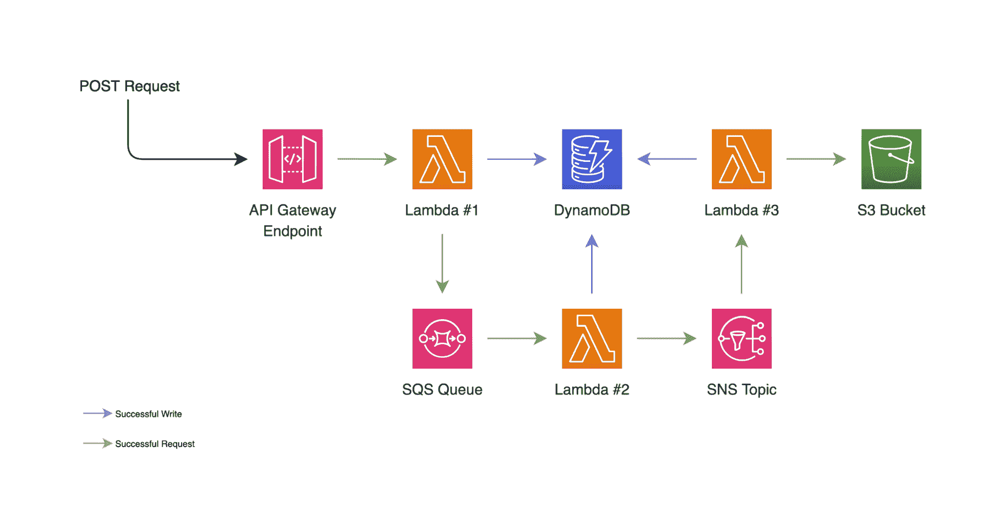
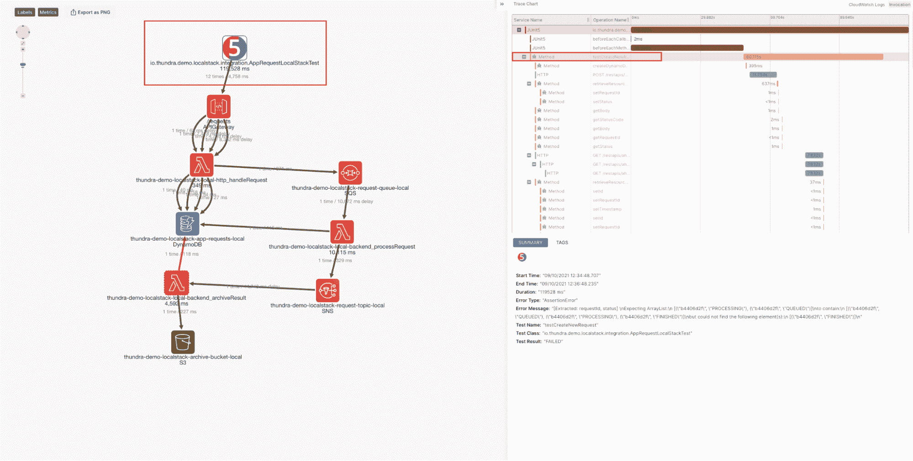

# 使用分布式跟踪为 LocalStack 应用程序调试测试

> 原文：<https://thenewstack.io/debugging-tests-with-distributed-tracing-for-localstack-apps/>

[](https://www.linkedin.com/in/aoguzhanozdemir/)

 [奥古詹奥兹德米尔

奥古詹是桑德拉的一名解决方案工程师。](https://www.linkedin.com/in/aoguzhanozdemir/) [](https://www.linkedin.com/in/aoguzhanozdemir/)

LocalStack 有一个很棒的社区，每个人都喜欢这个产品。它不仅为组织节省了资金，还为开发云应用程序提供了高效的本地开发和测试循环。

由于本地测试框架由 LocalStack 提供，因此不再需要在云上设置多个测试环境，分布式微服务应用程序可以通过绿色测试轻松开发、测试和部署。

不过，不是一直都这样！测试失败是事实。一些错误的测试让开发人员绞尽脑汁在日志堆中寻找根本原因。

这就是桑德拉来拯救那些在持续集成(CI)管道中使用 LocalStack 的人的时候了。预见有助于开发人员轻松快速地理解失败和长时间运行测试的根本原因。它给出了关于测试套件的通过、失败和中止的测试的丰富见解。

## 示例应用程序

我们已经开发了一个小应用程序，它将使用 LocalStack 在您的本地机器上生成多个 AWS 服务，并使用桑德拉前瞻监控您的分布式架构及其测试。



一个 AWS Lambda 函数，让我们称之为 Lambda #1，它具有一个 HTTP 端点，该端点接收一个请求，然后写入一个简单队列服务(SQS)队列以供进一步处理。然后，Lambda #1 将相同的请求写入 DynamoDB 数据库，以便记账。SQS 队列将传入的消息传递给处理器 Lambda，我们的 Lambda #2。

一旦处理成功，Lambda #2 通知一个简单的通知服务(SNS)主题，这将触发我们的归档 Lambda，Lambda #3。当 Lambda #3 被触发时，它将更新 DynamoDB 上的请求记录。它还会将整个请求的结果写入一个文件，并将其放入一个 S3 桶中。

这可能看起来很多，但它所做的只是在不同的服务之间传递 HTTP 请求体，并在此过程中操纵它。这个项目是由桑德拉的软件工程师[托尔加·塔克洛](https://twitter.com/tolgatakir)开发的，源代码可以在[我们的 GitHub 库](https://github.com/thundra-io/thundra-demo-localstack-java/)中找到。在那里，你会找到关于如何在你的机器上运行这个项目的文档。

在我们的计算机上设置好所有需求之后，我们可以简单地运行`make start`来用 LocalStack 启动我们的应用程序。这将需要几分钟的时间，但是一旦完成，我们将在 LocalStack 容器中运行我们的 API。

此时，我们可以运行下面的命令来查看我们的 API 是否启动并运行。

```
```bash
$  awslocal  apigateway  get-rest-apis
{
    "items":  [
        {
            "id":  "",
            "name":  "local-thundra-demo-localstack",
            "createdDate":  "2021-09-06T13:54:57+03:00",
            "version":  "V1",
            "binaryMediaTypes":  [],
            "apiKeySource":  "HEADER",
            "endpointConfiguration":  {
                "types":  [
                    "EDGE"
                ]
            },
            "tags":  {},
            "disableExecuteApiEndpoint":  false
        }
    ]
}
```

```

我们已经确认我们的 API 已经启动并运行。让我们看看桑德拉远见现在能做什么。

## 如何将 Foresight 集成到 LocalStack

如果您有最新版本的 LocalStack，那么您需要做的就是将`THUNDRA_APIKEY`设置为环境变量，这样就可以很好地进行应用程序监控了。要启用预见功能，必须设置`THUNDRA_AGENT_TEST_PROJECT_ID`环境变量。

你可以在[https://foresight . thundra . io](https://foresight.thundra.io/)获得你的 API 密匙和项目 ID。

对于这个项目，您可以在`Makefile`中设置它们。如果完成了，让我们用`make test`进行测试。一段时间后，我们应该可以看到结果。

```
```bash
[ERROR]  Tests run:  1,  Failures:  1,  Errors:  0,  Skipped:  0
[INFO]  
[INFO]  ------------------------------------------------------------------------
[INFO]  BUILD FAILURE
[INFO]  ------------------------------------------------------------------------
[INFO]  Total time:  02:00  min
[INFO]  Finished at:  2021-09-06T21:21:01+03:00
[INFO]  ------------------------------------------------------------------------

```

```

看来我们的测试失败了。让我们检查一下 Foresight，然后点击我们的测试，看看我们是否能看到哪里出错了。


当你进入测试详情页面时，你可以点击右上角的`Trace Map`按钮。它将打开一个窗口，并自动将您重定向到您的调用跟踪图。在这里，我们可以看到整个流程，与我们在本文开始时设计的完全相同。我们也将能够知道错误来自哪里。如果我们单击地图上的 JUnit 5 节点，我们将看到测试的整个跟踪图。



在屏幕的右侧，我们看到原始断言错误及其方法在跟踪图上标记为红色。让我们点击第二个红色行。


这再次打开了我们的调试窗口。现在，让我们把它放大，一直播放到最后。


我们可以看到我们的`getResponse`列表没有预期的`FINISHED`状态。

现在，我们对错误源自何处以及在执行测试时存在哪些变量有了一些了解。我们称之为[时间旅行调试](https://foresight.docs.thundra.io/core-concepts/enabling-time-travel-debugging)。通过这种检测方法，桑德拉代理将使您能够保存您的跟踪，并逐行播放它们，以调试您的应用程序和测试。

现在，让我们看看如何解决这个问题。

## 混乱是答案

嗯，通常开发人员编写测试来确保他们的应用程序在开发新功能、修复 bug 或更改代码库时不会中断。通常，这将为您提供对应用程序健壮性的良好评估。然而，并不是所有的错误都来自于我们无法写出无错误的代码。

有目的地注入一个 bug、一个异常或延迟可能看起来违反直觉，但总比意想不到的好。这种在你的分布式系统上做受控实验的实践被称为[混沌工程](https://apm.docs.thundra.io/monitoring/chaos-engineering-with-thundra)。在桑德拉，我们重视混乱，尽最大努力为意外做好准备，我们希望我们的客户是一样的，如果不是更多的话。通过在您的项目中使用桑德拉代理，您将能够为您的应用程序和测试设计您自己的混沌实验。

这就是我们在这里所做的。如果你转到下面的文件，你会看到我们已经实现了一个混沌注入的类，并向我们的 Lambda #3 注入了一个错误。


要修复错误，我们可以简单地注释掉这些行。让我们再次运行测试，看看我们的测试是否成功。

```
```bash
[INFO]  Tests run:  1,  Failures:  0,  Errors:  0,  Skipped:  0
[INFO]  
[INFO]  ------------------------------------------------------------------------
[INFO]  BUILD SUCCESS
[INFO]  ------------------------------------------------------------------------
[INFO]  Total time:  02:04  min
[INFO]  Finished at:  2021-09-07T18:01:22+03:00
[INFO]  ------------------------------------------------------------------------
```

```

除了用桑德拉实现应用级的混沌工程，我们还可以用 LocalStack 在基础架构层面注入错误，比如通过配置`KINESIS_ERROR_PROBABILITY=0.8`注入 Kinesis 流错误。我们不要在这里谈论太多的细节。我们将在另一篇博文中讨论这个问题。

总结:LocalStack 用户现在可以通过使用演示的步骤插入桑德拉前瞻来获得他们测试的粒度视图。

*你可以[注册桑德拉](https://start.thundra.io/?utm_source=newstack&utm_medium=paid&utm_campaign=Thundra%20Blog)并集成你的开源项目，以实现“永远免费和全功能”*

<svg xmlns:xlink="http://www.w3.org/1999/xlink" viewBox="0 0 68 31" version="1.1"><title>Group</title> <desc>Created with Sketch.</desc></svg>