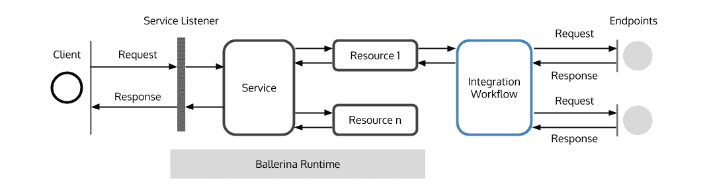
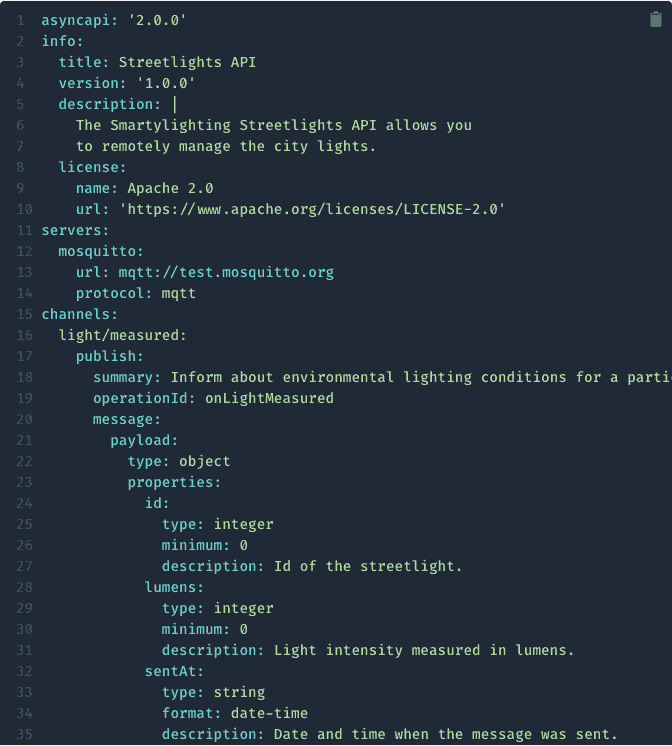
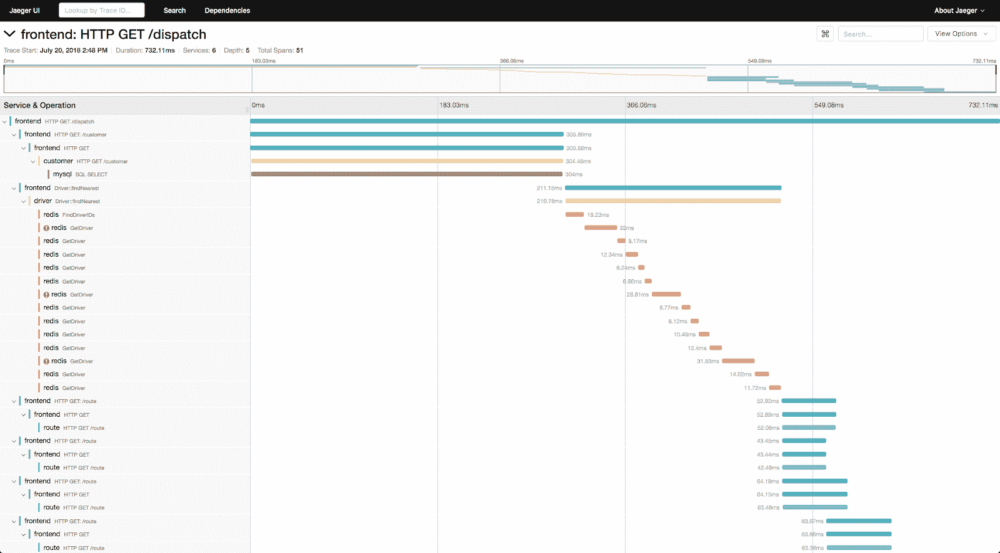

# 揭穿关于事件驱动架构的三个神话

> 原文：<https://thenewstack.io/debunking-three-myths-about-event-driven-architecture/>

事件驱动架构支持构建高度可用和可靠的应用程序，这些应用程序可以扩展以处理流量高峰。然而，围绕它的使用有一些误解。本文讨论了其中的一些误解，并通过一些实际例子来揭穿它们。

## **误区 1:难以管理**

 [杜尼斯·达努什卡

Dunith (@dunithd)是 WSO2 解决方案架构团队的成员。他是事件驱动架构和反应系统的狂热爱好者，在大规模设计、构建和咨询此类系统方面拥有超过 10 年的经验。](https://www.linkedin.com/in/dunithd/) 

事件驱动的应用程序是围绕连接事件生产者和消费者的事件代理而设计的。然而，必须包含事件代理给人的印象是，它增加了部署的复杂性，并增加了管理和监控开销。

当云计算越来越受欢迎时，IT 团队开始放弃内部事件代理，转而支持云托管的托管消息服务，如 AWS SQS/SNS、Azure Event Grid、Event Hubs 和 Google PubSub。这些服务消除了管理和扩展事件代理的负担。

随着无服务器计算的兴起，这达到了另一个水平。组织将其整个事件驱动的应用程序迁移到云基础架构即服务(IaaS)平台，以节省资金并降低管理复杂性。然后，功能即服务(FaaS)平台，如 AWS Lambda 和 Google Cloud Run，与现有的消息服务无缝集成，以提供改进的开发人员体验。这进一步促使开发人员将他们的事件生产和消费逻辑转移到云平台中。

今天，有许多组织使用云基础设施来构建和部署他们的事件驱动的应用程序。降低管理复杂性、降低总拥有成本(TCO)和改善开发人员体验是促使组织做出转变的关键因素。

因此，我们再也不能说事件驱动的应用程序管理起来很复杂。

图 1:像 Ballerina 这样的云原生编程语言使用无服务器技术来构建事件驱动的应用程序。(来源:[伊梅斯·古纳拉特纳](https://medium.com/ballerinalang/implementing-serverless-functions-with-ballerina-on-aws-lambda-7a325ddf810d))

## **神话 2:难以理解**

当涉及到执行流程时，事件驱动的应用程序经常被批评为难以理解。它们的异步和松散耦合特性使得跟踪应用程序的控制流变得困难。例如，事件生成器不知道它所生成的事件将在哪里结束。同样，事件消费者也不知道是谁产生了事件。没有正确的文档，很难从整体上理解架构。

像 [AsyncAPI](https://www.asyncapi.com/) 和 [CloudEvents](https://cloudevents.io/) 这样的标准有助于记录事件驱动的应用程序，列出公开的异步操作，以及它们产生或消费的消息结构和它们关联的事件代理。AsyncAPI 规范为事件驱动的 API 生成机器可读的文档，就像 Open API 规范为基于 REST 的 API 所做的那样。它记录了应用程序的事件生产者和消费者，以及它们交换的事件。就控制流而言，这为应用程序提供了单一的真实来源。除此之外，规范还可以用来生成实现代码和验证逻辑。

图 2:一个样本 AsyncAPI 规范文档

CloudEvents 是一个规范，它标准化了事件发布者如何描述他们的事件。它引入了一组公共属性来包装在不同的事件驱动系统之间交换的事件。这允许开发人员重用跨多个云平台读写事件所需的逻辑和工具。

像上面这样的标准使得将来构建可移植的和可互操作的事件驱动的应用程序变得更加容易，因此它们将不再难以理解。

## **误解 3:难以测试和调试**

事件驱动的应用程序通常由分布式、松散耦合的组件组成，这些组件使用异步事件通过网络进行通信。由于网络的不可靠性，这些事件可能会在到达目的地之前丢失。在这种情况下，用户通常倾向于指责在跟踪事件路径以找出问题所在时缺乏灵活性。此外，这些系统的异步特性使得很难调试应用程序的控制流。

但是，在丰富的可观察性工具的帮助下，这是可以消除的。像 [Zipkin](https://zipkin.io/) 和 [Jaeger](https://www.jaegertracing.io/) 这样的分布式追踪工具使开发者能够追踪事件从起点到终点的路径。它们还提供了关于哪些组件在事件传播过程中拦截了事件以及它们对事件主体造成了什么样的突变的见解。不仅如此，如果一个事件在传输过程中丢失或者交付了不止一次，这些场景可以很容易地用这些工具来跟踪。

图 3:用 Jaeger 跟踪 HTTP 请求的路径(来源: [Jaeger](https://www.jaegertracing.io/docs/1.22/)

此外，像[事件源](https://martinfowler.com/eaaDev/EventSourcing.html)这样的策略将系统中的状态改变操作作为事件捕获到只附加事件日志中。分布式提交日志，比如 Apache Kafka，就服务于这个目的。稍后，这些事件可以从头开始重放，以得出系统的当前状态。这使得开发人员能够及时回到系统中的任意点，并重放事件以快速再现系统中的错误状态。这甚至可以在不接触生产系统的情况下完成，从而实现快速调试功能。

## **关闭思路**

由于其分布式和松散耦合的本质，事件驱动系统经常被误解为复杂、难以理解和难以测试的架构。然而，随着技术的进步，这些误解已经开始消失。

云计算和无服务器平台吸收了事件驱动系统的管理复杂性。像 AsyncAPI 和 CloudEvents 这样的标准使系统具有互操作性，并有良好的文档记录。分布式跟踪工具和集中式日志记录使得在生产中测试和调试事件驱动系统变得简单。所有这些都有助于组织比过去更好地构建事件驱动的系统。

<svg xmlns:xlink="http://www.w3.org/1999/xlink" viewBox="0 0 68 31" version="1.1"><title>Group</title> <desc>Created with Sketch.</desc></svg>