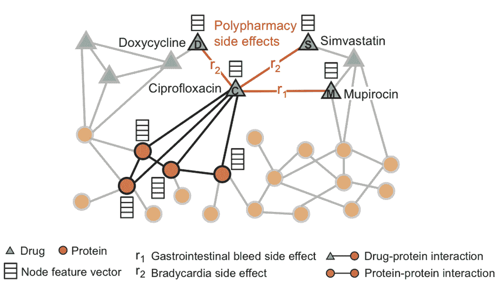
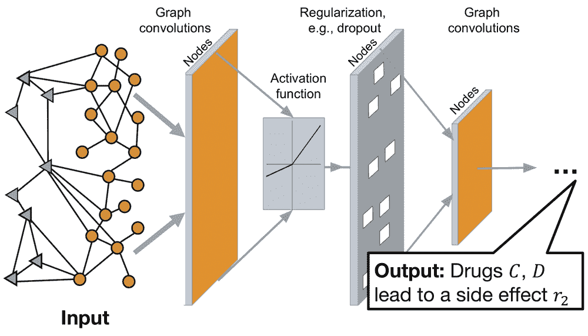

# Decagon AI 预测新的危险药物相互作用

> 原文：<https://thenewstack.io/decagon-ai-predicts-new-and-dangerous-drug-interactions/>

现代医学的奇迹是，有一种药丸或某种定量治疗方法可以帮助管理各种身体疾病:感染、高血压、糖尿病、疼痛和脱发。但这种明显的丰富也有危险的一面:这些强大的药物可能会带来一系列令人讨厌的副作用，有时当药物混合在一起时，可能会出现完全意想不到的副作用。更不令人放心的是，如果医生在患者已经服用的其他药物中添加另一种药物，他们自己往往并不清楚可能发生的潜在不良反应，这使得多种药物组合(或多种药物组合)有时有点像赌博。

为了消除合并处方药的风险，斯坦福大学的研究人员转向使用人工智能来帮助预测(而不仅仅是跟踪)市场上大约 5000 种药物之间复杂相互作用可能产生的 1250 亿种副作用。

参与该项目的计算机科学博士后 Marinka Zitnik 解释说:“实际上不可能将一种新药与所有其他药物结合起来进行测试，因为仅仅是一种药物就要进行 5000 次新的实验。”

该团队的工具被称为 [Decagon](http://snap.stanford.edu/decagon/) ，它将帮助医生在给患者开各种药物时做出更明智的决定，并帮助专家为患有并发疾病的患者开发更好的药物组合。以前试图解决预测药物相互作用问题的尝试包括使用[网络建模](https://en.wikipedia.org/wiki/Network_model)，分子分析，以及统计模型和半监督学习，但这些结果仅提供了细胞水平上药物相互作用的广泛概括，并不能准确预测可能发生的副作用类型。

相比之下，Decagon 的方法使用深度学习来提取模式，这些模式基于体内 19000 种不同的蛋白质如何相互作用，以及不同的药物如何影响这些蛋白质。该团队还整合了大约 400 万种药物和副作用之间的已知关联，并利用深度学习，Decagon 然后能够分析、表征和预测两种药物结合时可能出现的任何意想不到的结果。

“令人惊讶的是，蛋白质相互作用网络揭示了如此多的药物副作用，”该团队论文的合著者、计算机科学副教授 Jure Leskovec 指出。

具体来说，该团队的模型使用卷积图神经网络，该网络采用多关系链接预测，而不是以前模型使用的简单链接预测。这意味着可以考虑更多可能的相互作用，这在团队的实验结果中得到了证实，实验结果表明，Decagon 的表现优于替代方法 69%，同时还显示预测性能平均提高了 20%。迪冈还设法做出了一些新奇和出乎意料的预测，这些预测后来被证明是正确的。

“例如，Decagon 表明使用阿托伐他汀(一种胆固醇药物)和氨氯地平(用于血压控制)会导致肌肉炎症，”研究人员写道。“事实上，最近的报告发现，阿伐他汀和氨氯地平之间的药物相互作用可能会导致肌肉组织损伤。Decagon 还指出了乙胺嘧啶和阿利吉仑之间的潜在联系，乙胺嘧啶是一种抗微生物药物，如果单独服用，可以有效治疗疟疾，阿利吉仑是一种肾素抑制剂，在发现肾脏并发症后，其临床试验被停止，这表明癌症风险增加。这里的分析展示了 Decagon*的预测促进转化科学和发现新的(无效)药物组合的潜力。"*

 *随着人口老龄化，与上一代相比，越来越多的人服用多种药物，像 Decagon 这样的工具对于防止严重的副作用和可能的患者死亡至关重要。目前，Decagon 只能同时预测两种药物的相互作用，但其想法是扩展模型的功能，以便它可以同时分析更多的药物。该团队还计划开发一种医生可以在办公室使用的易用工具，它还可以帮助药物研究人员为更复杂的疾病开发更有效、更无害的多种药物疗法。

图像:raw pixel on[Unsplash](https://unsplash.com/search/photos/drugs?utm_source=unsplash&utm_medium=referral&utm_content=creditCopyText)；斯坦福大学。

<svg xmlns:xlink="http://www.w3.org/1999/xlink" viewBox="0 0 68 31" version="1.1"><title>Group</title> <desc>Created with Sketch.</desc></svg>*