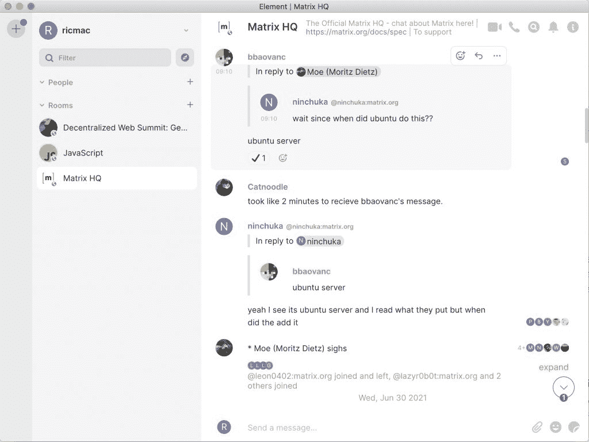

# 分散式聊天:Matrix 向懈怠用户提供红色药丸

> 原文：<https://thenewstack.io/decentralized-chat-matrix-offers-red-pill-to-slack-users/>

2021 年最有趣的互联网趋势之一是分散技术的实验。我们看到开源、去中心化的互联网应用蓬勃发展——其中许多试图为大型科技产品提供替代品。隐私泄露、错误信息、黑盒算法、缺乏用户控制——这些只是脸书、Twitter、苹果、谷歌和其他公司的专有、集中式社交媒体和通信产品固有的一些问题。问题是:去中心化的应用能成为灵丹妙药吗？

 [理查德·麦克马努斯

Richard 是 New Stack 的高级编辑，每周撰写一篇关于 web 和应用程序开发趋势的专栏文章。此前，他在 2003 年创立了读写网，并将其打造为全球最具影响力的科技新闻和分析网站之一。](https://twitter.com/ricmac) 

在今天的专栏中，我着眼于一种新兴的实时通信的去中心化、开放标准: [Matrix](https://matrix.org) 。T2 将 T3 定义为“通过 IP 进行可互操作的、分散的、实时通信的开放标准”基于 Matrix 的产品可以为使用 Slack 或 WhatsApp 等商业即时通讯产品提供替代选择。英国非营利组织 Matrix.org 基金会对这项技术有着崇高的目标。它旨在“提供一个类似于电子邮件的生态系统——在这个生态系统中，你可以与几乎任何人进行交流，而不用关心他们使用的是什么应用程序或服务器。”

Matrix 与我在最近几篇专栏文章中研究的其他分散技术有许多共同之处:

*   [就像《流言蜚语》](https://thenewstack.io/scuttlebutt-decentralize-and-escape-the-social-media-rat-race/),它是一个**开源协议**,其他人可以在其上构建——例如，Manyverse 是一个建立在《流言蜚语》之上的去中心化脸书。
*   [和以太](https://thenewstack.io/aether-a-decentralized-reddit-with-self-moderation-and-privacy/)一样，Matrix 提供了一种**去中心化群体对话**的方式。
*   像 W3C 的[分散标识符](https://www.w3.org/TR/did-core/) (DIDs)，Matrix 是一个**开放标准**。像 Evernym 这样的初创公司正在使用 DIDs 标准构建[去中心化的身份解决方案](https://thenewstack.io/did-you-hear-decentralized-identifiers-are-coming/)(比如[一张带有新冠肺炎疫苗接种数据的旅行通行证](https://www.evernym.com/travelpass/))。Matrix 希望成为即时通讯的默认开放标准。

## 规模

Matrix 的不同之处在于，它不像我上面提到的其他产品，它已经达到了主流规模的水平。自 2014 年推出以来，矩阵网络已经获得了“超过 3550 万可寻址[原文如此]用户。”虽然这个数字不一定是活跃用户，也没有 Slack 或 WhatsApp 那么多，但它肯定是过去七年稳定增长的指标。相比之下，我上周写的 Aether 在三年后只有 2000 名用户。

毫无疑问，由于 Matrix 网络的早期成功，创始人最近接受了一笔 3000 万美元的风险投资，用于他们的初创公司，以利用 Matrix。这家总部位于伦敦的公司名为[元素](https://element.io/)，它提供了一个“基于矩阵的开源消息客户端”Element 的口号是“拥有你的对话”，这是对脸书旗下 WhatsApp 和 Salesforce 旗下 Slack 的毫不隐晦的讽刺。Element 宣称的使命是“面对日益集中化的互联网和日常监控，保护你的隐私权。”

元素应用程序

Element 由[马修·霍奇森](https://twitter.com/ara4n)和[阿曼迪·勒·帕普](https://twitter.com/AmandineLePape)创立，他们在 2014 年 9 月推出了 Matrix [。在宣布最近融资的博客帖子中，霍奇森写道，除了改进 Element 应用程序，它还计划使用这笔钱“完成 P2P Matrix 的构建”，为 Matrix 实施 VoIP/视频会议，并改善其声誉系统。](https://matrix.org/blog/2014/09/03/hello-world)

## 桥接

在 Element 博客上的另一篇文章中，Le Pape 指出，随着 EMS 上 Slack 和 Teams(以及 Telegram 和 Discord)的桥梁的推出，Matrix 已经开始在企业市场中获得真正的牵引力。元素矩阵服务(EMS)是该公司的托管解决方案，因此它类似于在企业中使用 Slack。

Le Pape 提到的[桥接](https://matrix.org/bridges/)技术或许是其未来的关键。桥是一个基于服务器的程序，它连接到外部应用程序，如 Slack，并使 Matrix 应用程序至少在某种程度上与其互操作。有各种各样的方法来实现一个桥，尽管什么内容和特性是可访问的依赖于第三方提供的。

有两种不同的[松弛桥](https://matrix.org/bridges/#slack)，它们都允许你“将矩阵房间和松弛通道连接在一起。”第一个，matrix-appservice-slack，使用 webhooks 或者 [Slack 事件 API](https://api.slack.com/apis/connections/events-api) 。第二个，mx-puppet-slack，“通过(双)puppeting 将 slack 和 matrix 连接在一起。”两种桥接方法都支持从 Slack 到 Matrix 的读写访问，反之亦然。然而，聊天历史不可用，而且还有其他限制——特别是如果你使用 Slack 应用程序从 Matrix 获取数据。根据[寄存器](https://www.theregister.com/2021/01/20/matrix_slack/)，“Matrix 用户在 Slack 中以机器人的形式出现，授权 Slack 用户出现在 Matrix 中。”

松弛桥接是今年年初[推出的](https://element.io/blog/slack-bridging/)，所以还是比较新的。尽管 Element 声称“Slack Bridging 旨在让 Slack 用户留在[Slack]应用中”，但一个 [Slack 迁移向导](https://element.io/blog/slack-migration/)的存在表明，Element 希望将尽可能多的 Slack 用户拉到其应用中。人们可以想象，这将是 3000 万美元风险投资资金的很大一部分。

## 这些以前不都做过吗？

Matrix 并不是实时聊天去中心化、开放标准的第一次尝试。可扩展消息和在线协议( [XMPP](https://en.wikipedia.org/wiki/XMPP) ，最初命名为 Jabber)和互联网中继聊天( [IRC](https://en.wikipedia.org/wiki/Internet_Relay_Chat) )已经存在了几十年，试图为消息传递提供互操作性解决方案。XMPP 从未真正起飞——至少部分是因为它基于 XML，一种相对复杂冗长的 web 语言。虽然 IRC 自 20 世纪 80 年代末就已经存在，但自 2003 年以来，其使用量一直在稳步下降(此外，最著名的 IRC 网络 [Freenode](https://en.wikipedia.org/wiki/Freenode) 在今年早些时候遭遇了一次“[恶意收购](https://www.theregister.com/2021/05/19/freenode_staff_resigns/)”)后陷入困境。

Mozilla 在 2020 年从 IRC 转向 Matrix，这表明在开源消息传递方面势头已经转向 Matrix。然而，这并不意味着偷走 Slack 的客户或挑战微软团队的实力会很容易。

对于 Matrix 来说，要真正扩展到数亿用户，它需要消费者和企业端的新用户激增，最好是在这两种环境下使用该应用的用户。事实上，Slack 本身就是这样迅速扩大规模的，通过在家和在工作场所安装应用程序的最终用户挤入企业。

尽管如此，Element 和它的 Matrix 协议比任何流言应用或其他像 Aether 这样的分散应用更接近主流接受度。在一个对大型科技的支配性力量越来越警惕的世界，也许是时候服用红色药丸并使用 Matrix 了。

<svg xmlns:xlink="http://www.w3.org/1999/xlink" viewBox="0 0 68 31" version="1.1"><title>Group</title> <desc>Created with Sketch.</desc></svg>