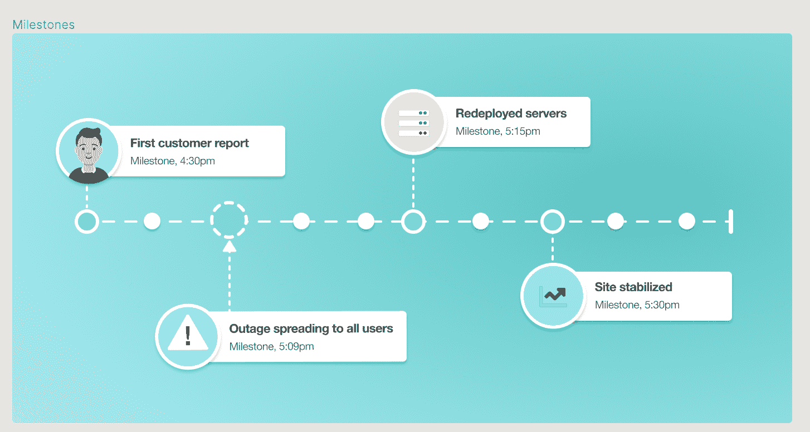

# 声明、响应、缓解、学习:金塔巴如何处理事件响应

> 原文：<https://thenewstack.io/declare-respond-mitigate-learn-how-kintaba-tackles-incident-response/>

警报路由有一个既定的工具:某个东西坏了，它会被引导到一个随叫随到的开发人员或运营人员那里进行修复。然后，您尝试自动化测试，以确保它不会再次发生。

百分之九十九的时间，这就足够了。但是当一切都崩溃时会发生什么呢？组织如何处理其他 1%的重大事故？要知道，那些不可预知的， [黑天鹅事件](https://www.investopedia.com/terms/b/blackswan.asp) 。引人注目的大停电。惊醒整个惊慌失措的团队——不仅仅是开发和运营部门，还有客户支持、法律、公关部门，有时甚至是人力资源部门。

Kintaba 背后的灵感来自日本的艺术和哲学 [Kintsugi](https://en.wikipedia.org/wiki/Kintsugi) ，在这里你可以用金、银或白金填充物重新连接陶器碎片。 [这种做法](https://mymodernmet.com/kintsugi-kintsukuroi/) 并不是寻找强力胶来隐藏裂缝，而是将它们凸显为物体历史甚至美的一部分。

首席执行官兼联合创始人 [约翰·埃根](https://www.linkedin.com/in/john3gan/) 告诉 New Stack，Kintaba 同样将重大事故管理视为可以使公司更强大、更有弹性的东西。或许更有价值——只要不让历史重演。

## 自动化“当事情出错时，我们该怎么办？”

正确的事件管理归结为提出正确的问题，并将其发送给正确的人来回答这些问题。然而，当你在处理不可预见的情况时，你通常没有足够的智慧来快速做出这些决定。

伊根说，通常情况下，当重大事故发生时，“我们会感到恐慌。我们发电子邮件。聊些轻松的话题。我们从未学习或记录流程，一周内又会发生这种情况。”

由于这些重大事件本质上是独一无二的，这就变成了试图理解一个模糊的情况，然后缩小范围以解决问题。

Egan 说“在大停电世界中，你真的是在对一个症状做出反应。你只知道它对每个人都不好，但你不知道为什么。”

Kintaba 将整个事件管理生命周期自动化，依靠最佳实践自动化与人性化的结合，并专注于防止将来再次发生事件。

> “我们曾经接近这个世界，这样我们就可以让它不被打破。到目前为止，我们可以说，市场上最可靠、最有弹性的公司是那些预计事情会出错的公司。”

—约翰·埃根，金塔巴

金塔巴的建造考虑到了独角兽。[faang](https://www.investopedia.com/terms/f/faang-stocks.asp#:~:text=FAANG%20is%20an%20acronym%20referring,(formerly%20known%20as%20Google).)(脸书、亚马逊、苹果、网飞和谷歌)多年来一直努力从这些意外事件中吸取教训，并开发和分享应对不可预测事件的最佳实践。正是那些拥有十亿美元估值的公司——像金塔巴的客户 Gusto 、 [非常好的安全性](https://www.verygoodsecurity.com/) 和[Vercel](https://vercel.com/)——正在快速增长，根本不能让一次重大停电打败他们。

Egan 将 Kintaba 响应方法描述为不可思议的协作，不仅仅是在技术上，而且它有助于整个组织的协调响应。因为当一个网站或服务完全瘫痪时，你不仅需要技术支持，还需要客户支持、营销和法律支持。

[https://www.youtube.com/embed/gaRAMUltMDk?feature=oembed](https://www.youtube.com/embed/gaRAMUltMDk?feature=oembed)

视频

Kintaba 集成了许多主要的 [协作和问题跟踪工具](https://www.kintaba.com/integrations) ，但不仅仅是一个方向。该工具确实会将更新广播到一组指定的 Slack 频道或 Zendesk 中，但它同时会为事后分析记录所有内容，并将任务发送给吉拉进行跟进。

Kintaba 必须集成在堆栈的不同位置。

伊根说，“工具本身就是过程。实现流程的最佳方式是实现工具，因此 Kintaba 提供了开箱即用的最佳实践。”

他说，Kintaba 没有引入事故响应顾问，而是基于以下几个支柱:

*   数据的公开性——在整个组织中，每个人都可以看到发生了什么
*   **角色定义** —例如，如果个人身份信息遭到破坏，法律、合规和工程部门会立即执行预定义的自动化操作
*   **您的响应团队的实时集合** —跟踪谁在响应，他们在做什么和谈论什么，所有这些都带有时间戳
*   **事后分析和回顾**——需要改变的流程，学到了什么——然后确保将其分发给公司

“金塔巴住在整个公司，”伊根说。

## **别担心，你的系统会再次崩溃**

金塔巴团队绝不是说你不会再有重大事故。因为你会的。你只是不应该有重复的，可预测的，因为你已经自动化和更新的过程，以避免下一次特定的灾难。

结果可能从改变地形配置到改变名称空间，再到在入职时教育员工不要撞上破坏系统的绊网。Kintaba 建立定制的知识库，使组织更有弹性。

伊根提到了去年的 [云闪中断](https://thenewstack.io/cloudflares-network-shutdown-shows-why-dns-is-a-devops-problem/) ，那次中断了半个互联网 27 分钟。他说，这次大停电是以一种完全出乎意料的方式发生的，他们在公开的事后分析中详细分享了这一点。

“如果像 CloudFlare 这样的公司会发生这种情况，那么它在任何地方都会发生，”他说。

Egan 说，Kintaba 的全组织方法比以往任何时候都更有必要，因为我们日益增长的分布式系统正以指数级的速度变得更加复杂。

为什么我们不能使用混沌工程和充分的自动化和渗透测试来支撑这些东西呢？伊根说我们可以而且应该——为了那 99%。但是现在的基础设施远比十年前抽象。他认为 [蝴蝶效应](https://en.wikipedia.org/wiki/Butterfly_effect) 比以往更加到位。底层系统中的一次击键就可以触发 Kubernetes 崩溃，这将产生多米诺骨牌效应，不仅破坏一台服务器，而且破坏每一项服务。

执行根本原因分析越来越具有挑战性，因为我们从这些根源中抽象出来。Egan 说，可预测的错误基本上是自动排除的——如果一个 Kubernetes 服务器出现故障，系统会增加另一个。但如果 Kubernetes 本身出现问题，你无法立即知道如何或为什么会出现问题。

伊根引用了拉伸系统定律，它标志着我们不断跳到下一个新技术领域，让我们忘记了考虑后果。当事情不可避免地出错时，这些越来越分布式和抽象化的解决方案意味着它们比以往任何时候都更容易出错。

另一方面，打破东西一点也不新鲜。

## **重大事故不仅仅是技术上的，而是人们在学习如何犯错**

伊根说，科技行业就像其他行业一样，习惯于惩罚犯错的个人。但是解雇某人通常不会触及任何技术事故的根本原因。

他说，到 20 世纪 50 年代，大企业开始意识到解雇犯错的人实际上并没有提高工厂的效率。相反，他们鼓励人们写下他们学到的东西。

> “所有成功的公司都在证明，发生停机时，很少是一个人的错。这通常是一个系统性问题。你需要系统来解决这些问题，而不是把它变成一个人力资源问题。”

—约翰·埃根，金塔巴

同样，导致这些灾难性事件的技术错误很少是人为错误。它们更有可能是上下文相关的和系统的。因此，事故管理的项目管理部分必须是关于识别和解决那些系统问题。

Egan 说，软件文化是一种真正需要发展的文化，它从关注个人的责备转向关注不重复系统性错误。尽管有所谓的“快速失败”硅谷思维，他表示，从文化上来说，我们才刚刚开始适应这个想法。

Kintaba 的设计理念是，重大事故响应不仅仅是呼叫某人，而是将整个团队聚集在一起，减轻伤害，同时让所有利益相关者保持最新状态。最后一个阶段是记录和学习的能力——决定事情在未来如何运作，以防止这种问题再次发生。

## **新功能“里程碑”创建重要事件时间表**

本周，该公司在其平台上推出了一项名为“里程碑”的新服务。虽然 Kintaba 在事后分析中记录了全部细节，但 Milestones 希望突出关键时刻。它充当一种一览式补救时间表，可以在整个公司范围内广泛理解。

你可以通过验尸来重建，但是，他说，“在这一系列的时刻中，这是一个真正重要的时刻。”

他们将这一新功能变得非常灵活，因此公司可以根据自己的意愿指定具体的功能，例如服务器 7 在晚上 7 点关闭，并且可以通过 Kintaba API 从集成的外部系统自动创建一个里程碑。另一方面，它可能是一个非常人性化的里程碑，就像你接到第一个客户投诉电话的那一刻。

伊根说，里程碑在人性和灵活性方面是独一无二的，可以在危机期间实时定义。它们是以自由的形式创建的，无论是文本、图像、图表还是截图。

“你正在建立一个应对未知的过程。重要的是你不要预先定义——你只需要一个系统，”他说。

里程碑只是 Kintaba 旨在为您专注于事件管理的另一种方式，这样您就可以专注于事件并继续前进。

<svg xmlns:xlink="http://www.w3.org/1999/xlink" viewBox="0 0 68 31" version="1.1"><title>Group</title> <desc>Created with Sketch.</desc></svg>