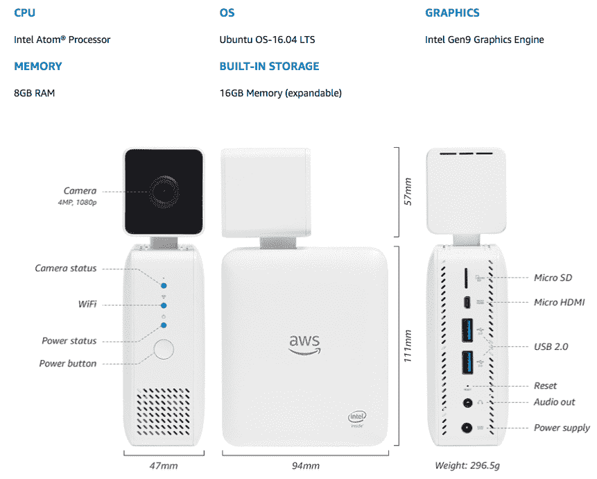
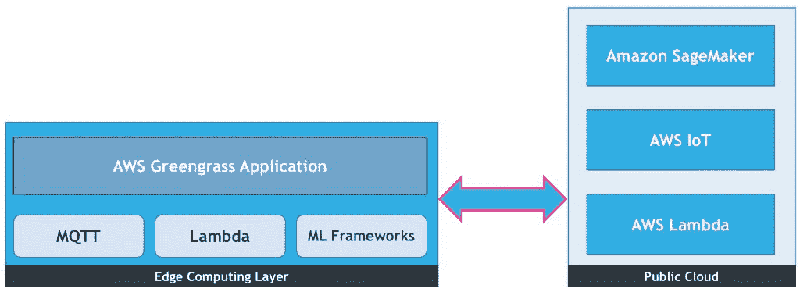
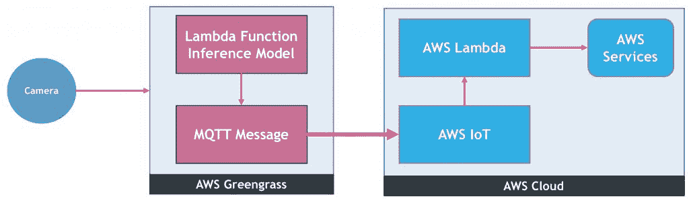

# AWS DeepLens 的深度探索

> 原文：<https://thenewstack.io/deep-dive-amazon-deeplens/>

上周在亚马逊网络服务的 re:Invent 大会上，AWS 和英特尔[推出了一款新的摄像机](https://aws.amazon.com/blogs/aws/deeplens/)、 [AWS DeepLens](https://aws.amazon.com/deeplens/) ，它可以作为一款智能设备，可以实时对捕捉的图像运行深度学习算法。DeepLens 和任何其他人工智能相机的关键区别在于马力，这使得在本地运行机器学习推理模型成为可能，而无需将视频帧发送到云端。

开发人员和非开发人员争相参加 DeepLens 的 AWS 研讨会，带着设备离开。在那里，他们被一只热狗诱惑，进行臭名昭著的“[热狗还是不热狗](https://www.youtube.com/watch?v=ACmydtFDTGs)”实验。我设法参加了一个重复的会议，并小心翼翼地将设备运回家。尽管经过 22 小时的飞行后时差还没倒过来，我还是设法打开了 DeepLens，并对它进行了配置，以计算客厅里坐着的人数。

这款新设备在 AWS re:Invent 上发布的无数公告中获得了关注，我相信 DeepLens 将大张旗鼓地建立一个充满活力的开发者和 ISV 生态系统——就像亚马逊 Alexa 所做的那样。

作为一名物联网、Edge 和 AI 爱好者，我的想象力几乎瞬间就被 DeepLens 捕捉到了。它形成了许多关于边缘计算如何变得智能的假设和理论。DeepLens 成为一个令人惊叹的游乐场，可以测试一些新兴技术，如物联网、边缘计算、机器学习和无服务器计算如何结合起来解决强大的场景。

基于我最初的实验，我试图揭开 DeepLens 架构的神秘面纱。随着我继续探索 DeepLens 的深度，我承诺分享我的发现。

## 配置

DeepLens 与其说是相机，不如说是 PC。它本质上是一台功能强大的计算机，附带一个仅比普通网络摄像头稍好一点的摄像头。这款设备立刻让我想起了英特尔 NUC，一款外形小巧的服务器级电脑，它是我边缘计算实验的基础。

支持 DeepLens 的电脑基于英特尔凌动 X5 处理器，配有四个内核和四个线程。凭借 8GB 内存和 16GB 存储，它提供的能量刚刚够运行机器学习(ML)算法。但 DeepLens 最吸引人的部分是以英特尔 Gen9 图形引擎形式存在的嵌入式 GPU。虽然这肯定不是同类硬件中最好的，但它足以运行本地 ML 推理。

该电脑运行 Ubuntu 16.04 LTS，可以连接到标准键盘、鼠标和 HDMI 显示器。你可以打开一个终端窗口，像对待其他 Linux 机器一样对待这个设备。除了操作系统，还有其他软件组件使 DeepLens 成为智能设备。我们将在后面的章节中探讨它们。

该摄像头只是另一个 400 万像素的网络摄像头，勉强能够提供 1080p 的分辨率。英特尔没有将它连接到可用的 USB 插槽中，而是将其嵌入到同一个 PC 机箱中。

一旦 AWS 公开了软件层，任何人都可以在他们的桌面上模拟 DeepLens，甚至是 Raspberry Pis。关键的一点是，硬件本身并不是 DeepLens 令人兴奋的部分。

## 秘制调味酱

DeepLens 的迷人之处在于 AWS 设法将这些点联系起来的方式。这是一个设计优雅的软件堆栈，跨越了设备和云。亚马逊开发了许多服务，使 DeepLens 成为一个强大的边缘计算平台。

由于开发卷积神经网络(CNN)很难，并且需要访问成千上万的图像来训练模型，AWS 已经提供了一些现成的项目。DeepLens 设备注册到您的 AWS 帐户后，您可以在几分钟内轻松地将这些项目推送到设备上。

要欣赏 DeepLens 的架构，你需要对 [AWS IoT](https://aws.amazon.com/iot/) 、 [AWS Greengrass](https://aws.amazon.com/greengrass/) 、 [AWS Lambda](https://aws.amazon.com/lambda/) 和[亚马逊 SageMaker](https://aws.amazon.com/sagemaker/) 有一个基本的了解。

AWS IoT 是一个管理机器对机器通信(M2M)并支持摄取设备遥测的平台。开发人员可以轻松地将传感器和执行器连接到 AWS 物联网，并基于简单的规则引擎编排工作流程。对于高级场景，遥测数据被发送到 AWS Lambda 进行进一步处理。

AWS Greengrass 是 AWS IoT 的扩展，旨在运行在网关和集线器上，可以在离线模式下聚合遥测数据。可以在部署在本地环境中的 x64 或 ARM 设备上轻松配置该软件。Greengrass 公开了相同的 M2M 功能以及本地 Lambda 引擎以实现可编程性。开发者可以推送 Node.js 或 Python 函数在 Greengrass 内运行。AWS Greengrass 也可以在本地运行 ML 推理模型，而不依赖于云。所以，Greengrass 是 AWS 的边缘计算平台。

Lambda 中对 Python 函数的支持打开了大门，将复杂的机器学习算法带到了边缘。绿草可以运行基于 [MXNet](https://mxnet.incubator.apache.org/) 和 [TensorFlow](https://www.tensorflow.org/) 的 ML 模型。

[Amazon SageMaker](https://thenewstack.io/amazon-sagemaker-automates-artificial-intelligence-development-pipeline/) 是在云中构建、训练和部署 ML 模型的新 ML 平台。开发人员可以使用 [Jupyter 笔记本](https://thenewstack.io/jupyter-notebooks-challenge-reproducibility/)来编写模型，并使用基于 GPU 的 EC2 基础设施来训练这些模型。最终的模型可以作为 web 服务发布，也可以推送到 Greengrass 进行本地推理。

DeepLens 有效地利用了所有这些服务来对图像进行深度学习。本质上，数据科学家使用 SageMaker 在云端构建并训练一个 CNN，然后部署到 DeepLens 进行离线推理。

## 深透镜架构

最终，DeepLens 是一款由 AWS Greengrass 提供支持的边缘计算设备。与之相连的摄像机被视为可以接收遥测数据的任何其他传感器。在这种情况下，摄像机发送的是视频帧，而不是时间序列数据。

每个视频帧都被发送到一个 AWS Lambda 函数，该函数运行用 Python 编写的 ML 推理模型。这个函数利用本地可用的 GPU 在每一帧上运行卷积神经网络。然后，模型发出一个用 JSON 格式化的分数。

Lambda 函数的输出是一个带有分数的 JSON 有效负载，它也有附加的注释。这个 JSON 有效负载像任何其他传感器遥测有效负载一样发布到 AWS IoT MQTT 主题。

一旦有效负载发布到主题，它就可以通过 AWS IoT 规则引擎传递，该引擎可以调用 Lambda 函数来评估每条消息。一旦消息到达 Lambda，开发者就可以决定如何处理它。

## 路标

从技术上讲，你不需要 249 美元的设备来运行离线卷积神经网络模型。如果你是一个渴望从零开始建造东西的制造者，可以考虑购买[谷歌视觉套件](https://aiyprojects.withgoogle.com/vision)。它是 DeepLens 的一个更便宜的 DIY 版本。

亚马逊对像 DeepLens 这样的产品的可视化和设计肯定是值得赞赏的。它是许多边缘计算使用案例的参考架构。DeepLens 与 AWS 管理控制台的整体集成，从导入一个 SageMaker 模型作为项目，到最后一键推送推理模型所涉及的工作流程，使得 DeepLens 成为一个丰富的边缘计算平台。

这个装置在变得精致和复杂之前必须经过多次反复。一旦 DeepLens 平台变得稳定，原始设备制造商将开始将其嵌入他们的相机。亚马逊甚至可能会推出 Android 和 iOS 版本的 DeepLens SDK，让移动开发者能够构建智能计算机视觉应用。

DeepLens 证明了边缘计算的存在，它是真实的。我们确实生活在激动人心的时代。

<svg xmlns:xlink="http://www.w3.org/1999/xlink" viewBox="0 0 68 31" version="1.1"><title>Group</title> <desc>Created with Sketch.</desc></svg>