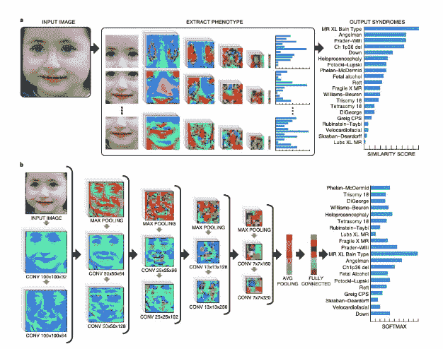

# 深度学习人工智能通过扫描面部检测罕见的遗传疾病

> 原文：<https://thenewstack.io/deep-learning-ai-detects-rare-genetic-disorders-by-scanning-faces/>

毫无疑问，人工智能工具将彻底改变医疗保健——它已经在这样做了，帮助人类医疗保健从业者[更容易地诊断皮肤癌](https://thenewstack.io/deep-learning-algorithm-diagnoses-skin-cancer-better-human-dermatologists/)，[发现新的和意想不到的药物相互作用](https://thenewstack.io/decagon-ai-predicts-new-and-dangerous-drug-interactions/)，以及帮助科学家解开复杂的[蛋白质折叠问题](https://thenewstack.io/deepmind-ai-makes-breakthrough-with-protein-folding-problem/)。

现在，美国公司 [FDNA](https://www.fdna.com/) 最近完成的一项研究表明，在不远的将来，在面部识别算法的帮助下，人工智能也可能有助于诊断罕见的遗传疾病。

根据该团队最近发表在《自然医学》杂志上的[研究论文](https://arxiv.org/pdf/1801.07637.pdf)，该团队的人工智能辅助诊断工具可以帮助早期检测罕见的遗传疾病，并为更个性化的医疗保健形式铺平道路，即所谓的[精确医疗](https://en.wikipedia.org/wiki/Precision_medicine)。

## 泄露秘密的面部特征

这项技术被称为 DeepGestalt，它结合了计算机视觉和深度学习算法，这些算法已经用来自 26，000 多幅患者图像的数据进行了训练，呈现了 200 多种遗传条件。这些数据大多是通过他们的应用程序 [Face2Gene](https://www.face2gene.com/) 收集的，该应用程序使用类似的面部识别和深度学习技术来识别往往与罕见遗传综合征相关的泄露秘密的面部特征。

例如，患有科妮莉亚·德朗综合征的人通常会有长而粗的眉毛，小鼻子，薄上唇和下翻的嘴巴。这些特征可以由人类专家挑选出来，但问题是，人们可能在最初症状出现多年后才最终看到遗传专家，即使这样，找到正确的诊断也不会便宜或迅速。最重要的是，个别人类遗传专家可能不一定对所有罕见和模糊的遗传状况有丰富的经验，因此给出错误的诊断。因此，像 DeepGestalt 这样的面部分析框架将是临床医生在早期准确检测这些疾病的宝贵工具，因为早期诊断有助于防止患者后来出现发育迟缓或潜在的健康问题。

为了提高诊断率，DeepGestalt 使用深度卷积神经网络(DCNNs)进行操作，这有助于解决患者输入照片中面部大小、背景、表情和光照的差异。该软件首先利用以 130 个面部标志为目标的标志检测算法来预处理图像。在预处理之后，图像被裁剪成“面部区域”，每个面部区域被送入 DCNNs 以执行遗传综合征分类任务，然后被汇总并与数据库进行比较，以得出遗传综合征预测的排序列表。

研究人员解释说:“每个区域的特定 DCNN 分别做出预测，然后通过对结果进行平均来组合这些预测，并为多类问题产生一个强大的格式塔模型。”在实际临床使用时，通过所描述的流水线来处理在训练期间未被使用的患者图像。输出向量是相似性得分的排序向量，指示患者的照片与模型中支持的每个综合征的相关性。”

毫不奇怪，在这些分类任务中，DeepGestalt 比它的人类同行做得好得多。在该团队对 502 张显示 92 种不同遗传疾病患者的图像进行测试期间，该软件在确定症状方面的准确率超过 90%，而人类临床医生的准确率为 70%。为了了解该算法在可用训练数据较少的情况下如何表现，该团队进行了单独的测试，以解决更难检测的[努南综合征](https://en.wikipedia.org/wiki/Noonan_syndrome)，并发现它的准确率较低，为 64%，仍优于人类专家。

该团队目前正致力于将 DeepGestalt 框架与基因组测序数据相结合，以提高[分子诊断](https://en.wikipedia.org/wiki/Molecular_diagnostics)的准确性，从而拓展个性化、精准医疗领域。当然，就目前而言，这里的想法不是在过程中取代人类，而是将这样的工具集成到诊断程序中，以提高检测率并改善总体结果。此外，该软件并不能取代实际的基因测试，后者可以提供更多关于这些综合征背后特定基因突变的信息。然而，增加这样的工具无疑会给寻找答案的家庭带来一线希望。

要了解更多，请阅读[的论文](https://arxiv.org/pdf/1801.07637.pdf)。

<svg xmlns:xlink="http://www.w3.org/1999/xlink" viewBox="0 0 68 31" version="1.1"><title>Group</title> <desc>Created with Sketch.</desc></svg>