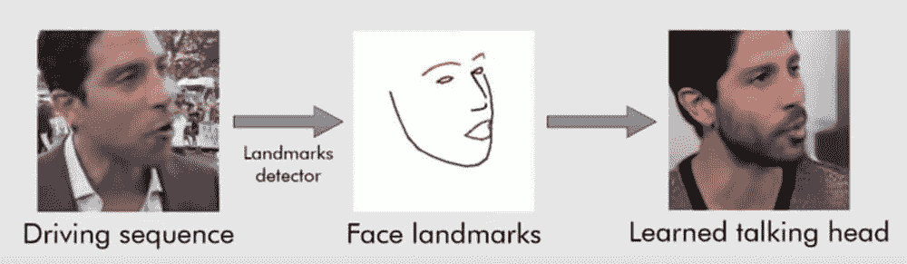
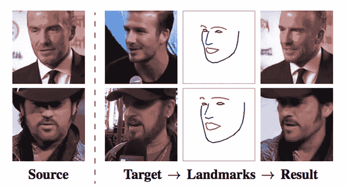
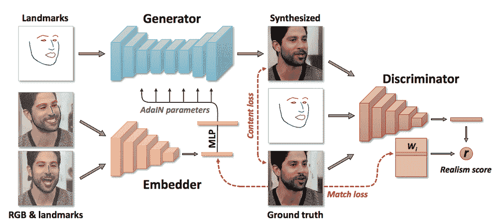

# 深度学习人工智能生成令人信服的蒙娜丽莎深度假视频

> 原文：<https://thenewstack.io/deep-learning-ai-generates-convincing-deepfake-videos-of-mona-lisa/>

更多的时候，人工智能的承诺被描绘成积极和前沿的东西:毕竟，谁不喜欢自动驾驶汽车和能够快速诊断癌症的智能机器呢？

当然，工具的好坏取决于使用它的人的意图，人工智能当然可以用于不那么无私的目的。这方面的一个很好的例子是 [deepfakes](https://en.wikipedia.org/wiki/Deepfake) 现象——使用[深度学习 AI](https://thenewstack.io/deep-learning-broadens-the-reach-of-artificial-intelligence/) 技术，可以将真人的图像和视频合成为假视频。这种令人难以置信的伪造视频已经被用作报复色情片，也可以被用来制作恶作剧甚至政客的“假新闻”视频，这使得 deepfakes 成为坏人手中的潜在危险武器。

幸运的是，这个过程有一些限制。这类应用中使用的深度学习模型通常需要惊人的大量训练数据和大量的 GPU 时间来生成 deepfakes 其中一些可能有数百万个不同的参数需要处理。然而，这种限制可能很快就会消失，因为莫斯科三星人工智能中心的研究人员最近展示了一系列令人瞠目结舌的 deepfake 视频，这些视频仅使用少量图像制作而成，其中一些图像来自著名的历史画。请看:

[https://www.youtube.com/embed/p1b5aiTrGzY?feature=oembed](https://www.youtube.com/embed/p1b5aiTrGzY?feature=oembed)

视频

## 走出恐怖谷

正如研究人员在他们的预印本[论文](https://arxiv.org/pdf/1905.08233v1.pdf)中指出的，合成逼真的模型并不是一件容易的事情，因为人类的头部在几何上是复杂的，尤其是当他们在运动的时候。除此之外，还有一个额外的复杂性，就是在说话的时候给衣服、头发和主体的嘴建模。此外，人眼实际上对人工表现中的任何微小差异都非常敏感，因此，一个糟糕的模型不会产生亲和力，而是会在观众中产生一种怪异的厌恶感，这被称为[恐怖谷效应](https://en.wikipedia.org/wiki/Uncanny_valley)。

为了克服这些问题[，](https://arxiv.org/pdf/1905.08233v1.pdf)团队利用了[卷积神经网络](https://en.wikipedia.org/wiki/Convolutional_neural_network) (CNN 或 conv net)——一种深度学习神经网络，通常用于分析视觉图像。此外，该团队的系统使用从[生成对抗网络](https://en.wikipedia.org/wiki/Generative_adversarial_network) (GANs)中收集的技术进行了改进，这是一种机器学习系统，具有两个相互对抗的神经网络，同时工作以生成看起来越来越接近原始训练图像的图像。毫不奇怪，GANs 已经被用来产生所谓的敌对图像，可以愚弄人类和计算机。

通过以这种方式进行设计，该团队的系统能够实现所谓的“少量拍摄学习”能力，即它能够在继续合成全新的人工生成的图像之前，只对少数图像进行“学习”和训练。事实上，该系统还具有“一次性学习”的能力，它可以仅从一个源图像生成合理的结果，尽管添加更多的图像会提高最终表示的准确性。

该系统首先通过现成的“面部标志跟踪器”算法处理一幅或多幅源图像，该算法跟踪对象的眼睛、眉毛、鼻子、下巴和嘴唇的位置。该系统的少数镜头学习能力然后通过广泛的“元学习”阶段获得，在这个阶段，它被暴露于另一个完全不同的人的视频，在这个视频中，那个人的面部标志被类似地一帧一帧地提取出来。

正如紧密耦合的生成对抗网络可能起作用一样，该系统然后能够产生源主体或“学会说话的头”的全新视频，通过首先使用“嵌入器”网络来翻译从视频中获取的面部标志以创建向量，向量然后由“生成器”网络进行调整以基于原始照片创建运动图像序列。另一个“鉴别器”网络被用作对抗组件，它学习识别由生成器网络创建的视频是真的还是假的。这些结果然后被反馈到系统中，实质上增加了发生器网络的赌注，以继续产生越来越真实的结果，从而“愚弄”鉴别器网络。

显示系统架构的图表。

正如你所看到的，该系统产生了一些非常显著的结果，从玛丽莲·梦露、萨尔瓦多·达利、拉斯普京和爱因斯坦的合成视频，到令人不安的永远微笑的蒙娜丽莎的移动图像。正如人们可能预期的那样，该团队的新系统是对可比系统的巨大改进，当使用 32 幅源图像时，在用户研究中实现了“完美的真实感”。正如该团队解释的那样，这种方法最终可以用于电影中的特殊效果，或者为远程呈现应用程序的用户创建照片般逼真的动画化身——例如在视频会议或多人游戏中——当然，还有更多令人不安的与真实事物难以区分的深度假货。

在[报纸](https://arxiv.org/pdf/1905.08233v1.pdf)上阅读更多信息。

<svg xmlns:xlink="http://www.w3.org/1999/xlink" viewBox="0 0 68 31" version="1.1"><title>Group</title> <desc>Created with Sketch.</desc></svg>