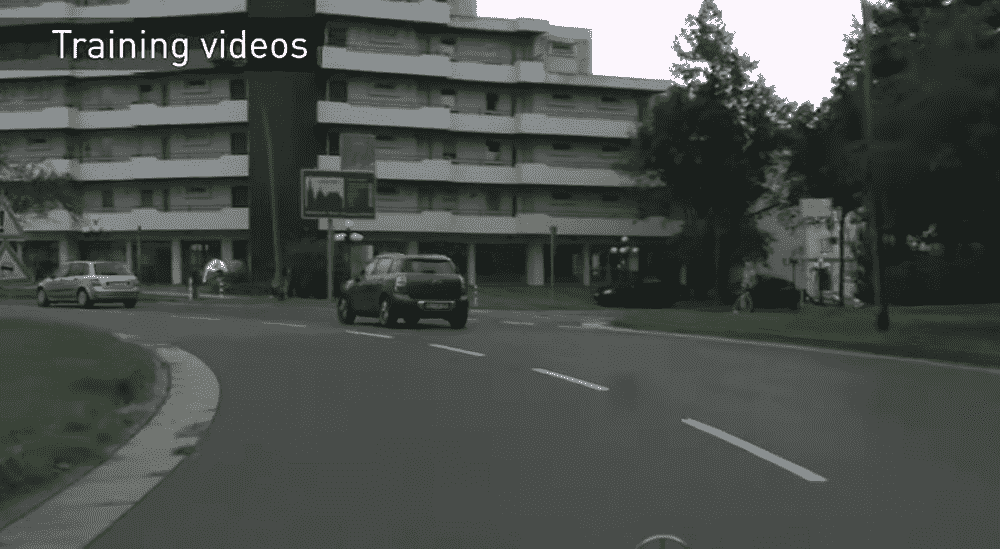
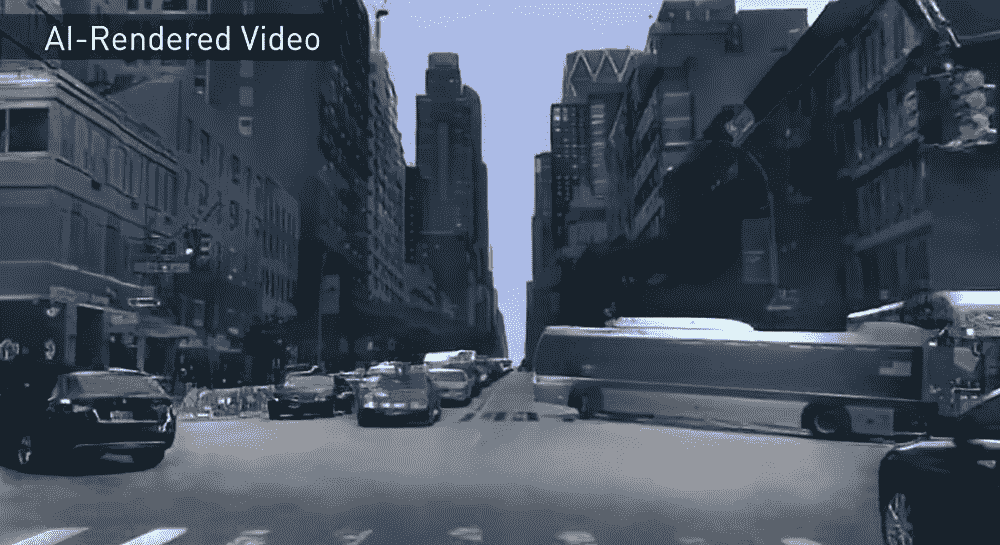
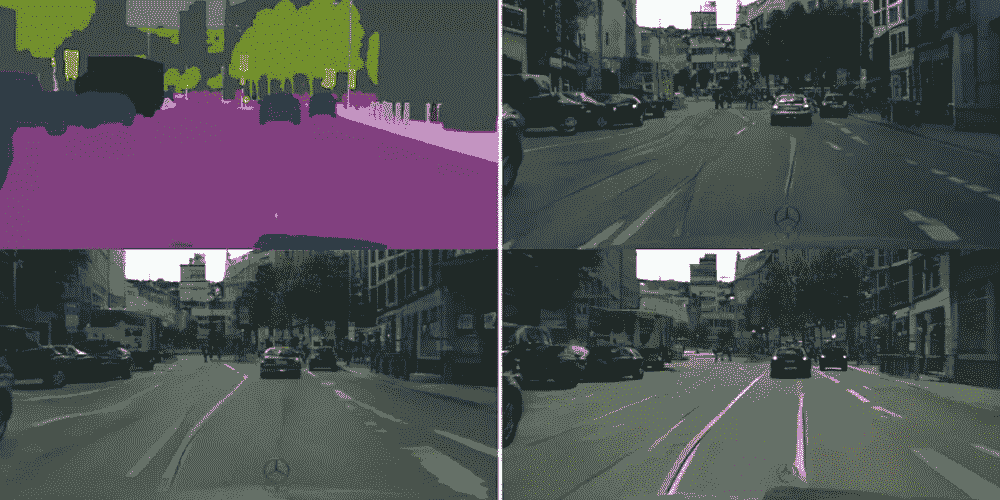
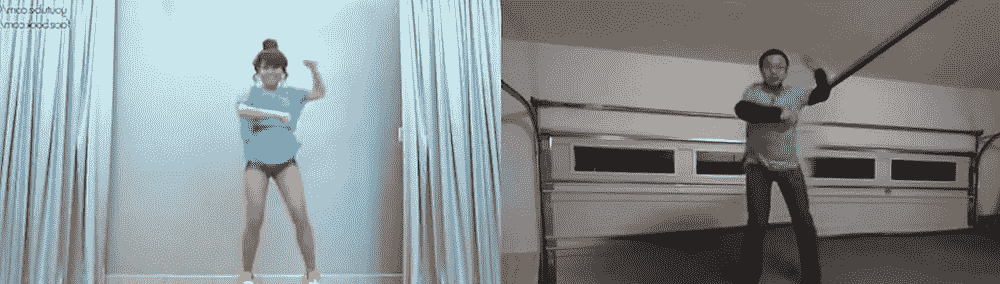

# 深度学习人工智能通过从视频中学习来生成逼真的游戏图形

> 原文：<https://thenewstack.io/deep-learning-ai-generates-realistic-game-graphics-by-learning-from-videos/>

自早期的像素化时代以来，视频游戏设计行业已经发生了巨大的变化:如今，游戏通常以高端图形为特色，支撑着充满非玩家角色的沉浸式世界，人们可以与之互动。毫不奇怪，创建这些引人入胜的游戏环境通常需要大量的人类作家、艺术家和开发人员使用各种软件工具，如[游戏引擎](https://en.wikipedia.org/wiki/Game_engine)来图形化地呈现这些复杂的世界。

但是，如果这些工作中的一部分可以通过人工智能实现自动化，那会怎么样呢？来自[麻省理工学院](https://www.csail.mit.edu/)和[英伟达](https://www.nvidia.com/en-us/)(发明了[图形处理器](https://en.wikipedia.org/wiki/Graphics_processing_unit)或 GPU 的公司)的计算机科学和人工智能实验室的一个团队最近展示了如何使用已经在城市风景的真实视频上训练过的[神经网络](https://thenewstack.io/playtime-neural-network/)来生成合成的 3D 游戏环境。这种技术可能会对游戏和电影产业以及虚拟现实平台的发展产生重大影响。你可以亲眼看看结果是什么样的:

[https://www.youtube.com/embed/ayPqjPekn7g?feature=oembed](https://www.youtube.com/embed/ayPqjPekn7g?feature=oembed)

视频

## 视频到视频合成

正如该团队在他们的研究论文[中指出的那样，他们的混合方法涉及使用深度学习人工智能，以及传统的游戏引擎，来生成从真实事物的视频片段合成的视觉效果。这个过程被称为视频到视频合成，涉及到让 AI 模型“学习”如何最好地将输入源视频转换为看起来像原始视频内容一样逼真的视频输出。](https://arxiv.org/pdf/1808.06601.pdf)

“25 年来，英伟达一直在发明生成交互式图形的新方法，这是我们第一次可以用神经网络做到这一点，”[领导该团队的布莱恩·卡坦扎罗(Bryan Catanzaro)说，他也是英伟达深度学习研究部门的副总裁。“神经网络——特别是生成模型——将改变图形的创建方式。这将使开发人员能够以传统成本的一小部分创建新的场景。”](https://nvidianews.nvidia.com/news/new-nvidia-research-creates-interactive-worlds-with-ai)

为了实现这一点，该团队将他们的方法基于之前的工作，如 [Pix2Pix](https://phillipi.github.io/pix2pix/) ，这是一种使用神经网络的开源图像到图像翻译工具。此外，研究人员利用了一种特殊类型的无监督深度学习算法，称为[生成对抗网络](https://en.wikipedia.org/wiki/Generative_adversarial_network) (GANs)，它将一个神经网络指定为“生成器”，另一个神经网络指定为“鉴别器”这两个网络玩零和游戏——生成器网络旨在产生一个合成视频，鉴别器网络最终无法确定它是假的。

训练数据取自驾驶序列的视频，从各个城市的自动驾驶汽车研究数据中筛选出来，并分割成各种类别，如建筑物、汽车、树木等。然后，将这些数据段馈送给 GAN，以便它可以合成这些对象的各种新鲜和不同的迭代，以消除任何感知到的*似曾相识*的感觉。

然后，该团队使用传统的游戏引擎来产生虚拟的城市环境，使用 GAN 来实时生成和叠加合成图像。此外，为了防止系统产生一个视频，其中事物可能会从一帧到下一帧完全改变外观，该团队必须加入一种短期记忆，使模型能够始终记住物体的属性。

AI 合成视频对比:分割图(左上)；pix2pixHD(左上)；COVST(左下)；英伟达的型号(右下)。

诚然，研究人员承认最终结果的规模并不大——它类似于一个简单的驾驶模拟器，只允许玩家驾驶几个街区，而不可能离开车辆与其他角色互动。生成的视频有一些泄露秘密的污点，暗示了它的人工性，但值得注意的是，整个实验是使用单个 GPU 完成的。

该团队的方法也比以前的研究更加灵活，因为它允许用户轻松地交换对象，例如插入一长排树，而不是原始视频中显示的建筑物——这一功能也可以应用于人物图像。例如，研究人员能够翻译视频中某人的舞蹈动作，并将这些动作转移到一个完全不同的人的人工生成模型上。

当然，这种技术有很多潜在的优点和缺点。研究人员已经使用类似的技术来展示如何使用人工智能来生成看起来非常令人信服的的[伪造视频。然而，该团队的目标是现在进一步改善系统的一致性和性能，以用于其他用途。](https://thenewstack.io/synthesize-fake-obama-video-artificial-neural-networks/)

“模拟和再现我们视觉世界动态的能力对于构建智能代理至关重要，”研究人员说。除了纯粹的科学兴趣，学习综合连续的视觉经验在计算机视觉、机器人学和计算机图形学中有广泛的应用

<svg xmlns:xlink="http://www.w3.org/1999/xlink" viewBox="0 0 68 31" version="1.1"><title>Group</title> <desc>Created with Sketch.</desc></svg>