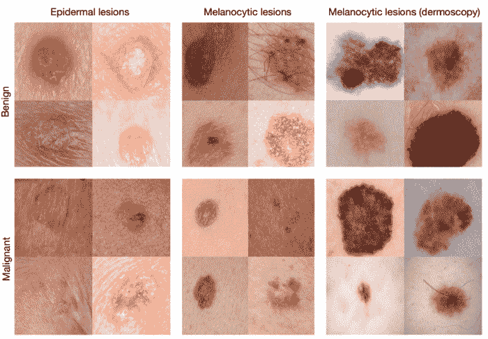
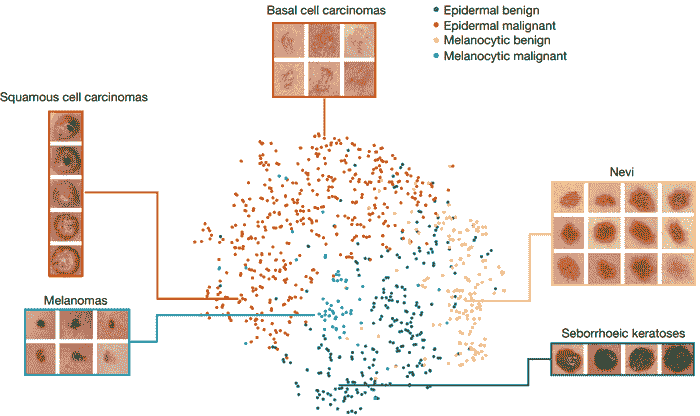

# 深度学习算法比人类皮肤科医生更好地诊断皮肤癌

> 原文：<https://thenewstack.io/deep-learning-algorithm-diagnoses-skin-cancer-better-human-dermatologists/>

依赖人类医生的日子可能很快就会结束，因为卫生行业的未来越来越像人工智能辅助的场景。

研究人员和初创公司正在开发人工智能系统，这些系统能够利用患者的呼吸，甚至是他们声音的 T2 情绪变化来诊断疾病。有一天，你的智能手机可能会帮助你和你的医生确定你皮肤上一个看起来奇怪的病变是否是癌症，这要归功于斯坦福大学的一个科学家团队开发了一种专为这项任务定制的深度学习算法。

在斯坦福人工智能实验室[的兼职教授](http://ai.stanford.edu/)[巴斯蒂安·特龙](http://robots.stanford.edu/)的带领下，这个团队发现他们的诊断工具，建立在谷歌用来区分猫和狗图像的相同分类技术的基础上，表现得和 21 名委员会认证的皮肤科医生一样好或更好。他们的发现在最近发表在《自然》杂志上的一篇论文中有详细介绍。

通常，皮肤癌的诊断始于人类皮肤科医生用肉眼和被称为[皮镜](http://dermlite.com/products/dermlite-hud)的手持式低倍显微镜对患者的皮肤进行视觉检查。如果皮肤科医生怀疑病变是癌性的，将进行活检。该团队的算法旨在帮助皮肤科医生在这一阶段的过程中，更好地确定哪些病变实际上需要活检。

“我们制作了一个非常强大的从数据中学习的机器学习算法，”研究生兼论文的共同主要作者 Andre Esteva 说。"你可以让算法自己算出来，而不是把要找的东西准确地写入计算机代码."

## 成千上万的斑点

特别是，该团队改进了谷歌以前使用的深度卷积神经网络(CNN)算法，该算法已经经过训练，可以对 1000 个不同对象类别的 128 万张图像进行分类。斯坦福大学的团队没有像谷歌的研究人员那样使用它来识别物体，而是使用它来训练从互联网上挑选的 2000 种不同皮肤病的 13 万张图像，以便模型可以使用它们来训练和学习精确定位疾病的标志，即使在光照、相机角度和变焦方面有所变化。

“没有庞大的皮肤癌数据集可供我们训练算法，所以我们必须自己制作，”另一位研究合著者研究生布雷特·库普雷尔解释说。“我们从互联网上收集图像，并与(斯坦福的)医学院合作，从非常杂乱的数据中创建了一个不错的分类法——仅标签就有几种语言，包括德语、阿拉伯语和拉丁语。”

然后，该模型针对 370 幅高质量的癌性皮肤病变图像进行了测试，其准确率达到甚至超过了 21 位经委员会认证的人类皮肤科医生，其中一个明显的优势是，该算法可以根据用户的需求调整灵敏度和特异性。

该团队的目标是将这项技术整合到未来的智能手机中，这将对手机拥有量快速增长的发展中国家特别有帮助。这种工具将意味着更快、更准确地诊断皮肤病:通过早期检测，这也意味着更大的生存机会。

“我主要的发现时刻是当我意识到智能手机将会无处不在的时候，”Esteva 说。“每个人的口袋里都会有一台超级计算机，里面有许多传感器，包括一个摄像头。如果我们可以用它来直观地筛查皮肤癌呢？还是其他小病？”

虽然在这样一个系统被广泛使用之前，可能还需要一些时间和进一步的测试，但这是深度学习的最新进展如何改变我们世界的又一个例证。从文本或图像的自动语言翻译，到图像中的对象分类和语音识别，深度学习正在深入我们的生活。尽管没有什么能比一个活着的、正在呼吸的人类出现在床边更令人放心和更具治愈性，但更快、更准确的疾病诊断是深度学习可以帮助解决的另一个问题，希望在医疗保健系统中，人类医生和治疗师与技术合作，而不是用技术取代他们。

图片:斯坦福大学。

<svg xmlns:xlink="http://www.w3.org/1999/xlink" viewBox="0 0 68 31" version="1.1"><title>Group</title> <desc>Created with Sketch.</desc></svg>