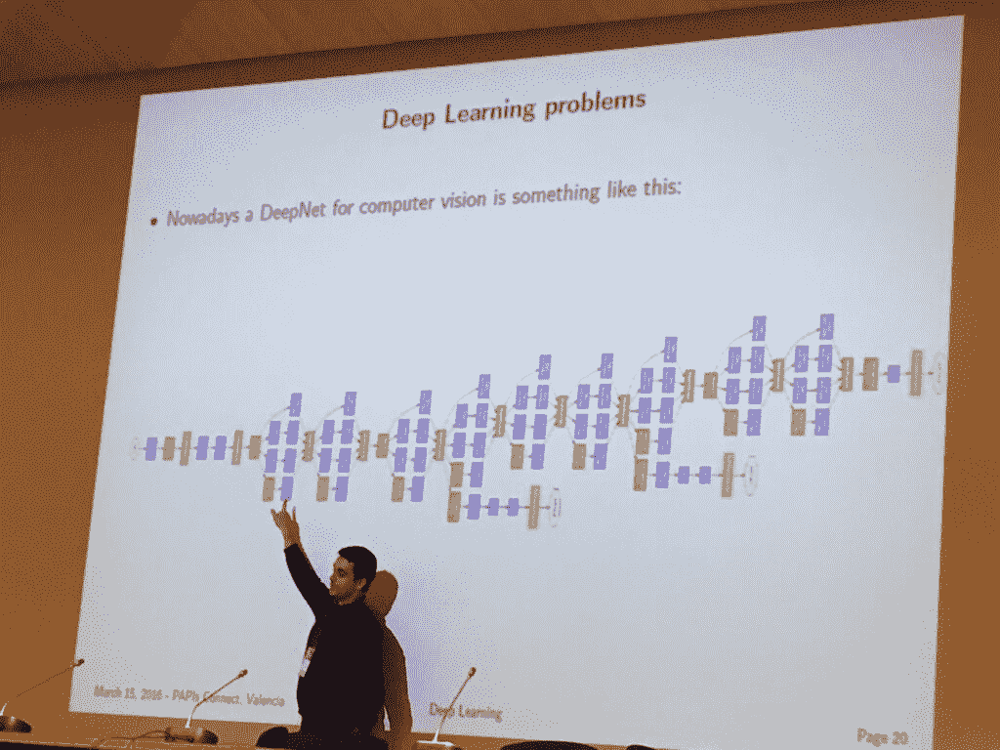
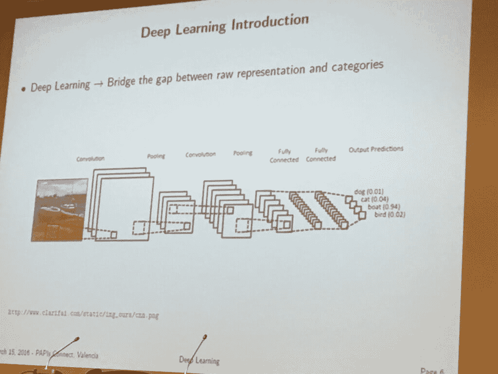

# 深度学习去神秘化

> 原文：<https://thenewstack.io/deep-learning-demystified/>

在这场人机大战中，今年对机器人来说是个好年头。距离第一台计算机击败国际象棋冠军已经过去了几十年，但中国古代的围棋——据说它的可能走法比宇宙中的原子还要多——总是逃脱不了机器人的掌控。

至少在谷歌的 AlphaGo 与卫冕人类世界冠军五局四胜之前是如此。AlphaGo 是怎么做到的？嗯，[基本上它自学了](https://thenewstack.io/alphagos-win-human-go-champion-means-ai/)。谷歌的 DeepMind 人工智能子公司花了两年时间开发了这个由 10 万轮人类下棋组成的数据库，并将其输入 AlphaGo，然后 alpha Go 与自己对弈数百万次，使用机器学习和神经网络进行改进，直到它最终获胜。

听起来有点勾魂？嗯，确实是。但是当你把机器学习和人工智能带到深度学习的下一个级别时，你的神经元会受到打击。至少当我坐下来听 Roberto Paredes Palacios 在 PAPIs Connect 预测 API 和机器学习会议上的演讲时，我是这么想的。瓦伦西亚理工大学教授的谈话试图去神秘化深度学习；今天，我们希望能让你明白一些事情。

那么什么是深度学习呢？它的其他一些名字给人更多的洞察力；它也被称为深度结构化学习、分层学习或深度机器学习。正如这些所表明的，深度学习是从各种来源获取机器学习，然后对其进行重组和重构。

“深度学习意味着我们将堆叠许多层，我们将建立非常深度的模型，”Paredes Palacios 解释道。

正是这种深度机器学习的水平，使得真正基于机器的语音、图像和模式识别最终成为可能。他说，“深度学习弥合了原始像素表示和类别之间的差距。”

当然，正如帕雷德斯·帕拉西奥斯所说，“有很多东西被认为是深度学习，但并没有那么深。”他说，深度学习是指你获取数据的原始表示，并将其解释为 10 到 20 层的类别，这些类别不仅单向流动，还会反向传播以检查错误。

## 什么是深度学习？

深度学习的发展经历了以下几个阶段:

1.  **基于规则的系统:**我们接受输入，手工设计程序来创造输出。
2.  **经典机器学习:**我们通过从手工设计的特征进行映射，构建基于规则的系统。
3.  **代表性机器学习:**输入创建学习的特征，然后映射到结论，然后到达输出。
4.  **深度学习:**最终输入创建学习的特征，然后成为学习的复杂特征，最后从特征映射到某个输出。

哦，当然如果你遵循[比尔·盖茨](https://www.washingtonpost.com/news/the-switch/wp/2015/01/28/bill-gates-on-dangers-of-artificial-intelligence-dont-understand-why-some-people-are-not-concerned/)、[斯蒂芬·霍金](http://www.bbc.com/news/technology-30290540)和[埃隆·马斯克](http://www.inc.com/tess-townsend/elon-musk-open-ai-safe.html)的思维，人工智能可以被最好地定义为可怕。但是让我们跟随艾伦·图灵的领导，看看我们能把深度学习带到哪里去。

## 为什么商业要关心深度学习？

这听起来确实昂贵而复杂，但理解深度学习的价值是无价的。深度学习是让大数据不仅仅是一个流行词的原因。机器学习和它更深层次的表亲会让你对你的客户有竞争洞察力，然后让你把它转化为深入的活动。深度学习有一个计算机学习模式和识别习惯，需要数百万次市场研究才能做出有根据的猜测。

帕雷德斯·帕拉西奥斯给出了深度学习是我们这些更以数据为中心的人的好答案的四个理由:

1.  如果你的表现和你想要预测的目标之间有很大差距，那你就有问题了。让网络学会如何弥合这种差距是一个好主意。
2.  当手工制作的功能不起作用时。
3.  有大量数据用于训练视觉失真。
4.  当您能够负担得起运行它的硬件时，因为它需要大量内存和处理。

他说，总的来说，如果“深度学习是古老的，但现在需要训练的东西”，那么深度学习是有用的这里我们不是在谈论教老狗新把戏，而是改造旧的过程以获得更新、更深刻的见解。

例如，荷兰国际集团的数据平台架构师 Natalie Busa 在会议上表示，荷兰银行目前正在应用经典的机器学习方法 ，以便让个人银行和小企业客户更好地了解他们的财务和消费习惯。金融机构的下一步是 走向代表性机器学习，创建一个描述其他特征的特征层次结构，以创建更深入的学习，从而允许持续更精确的欺诈检测。

Busa 表示，企业数据科学必须开始精益，这是预测性 API 允许你通过让你获得机器学习、人工智能甚至深度学习的复杂见解来实现的，而无需降低创建密集的物理和数字基础设施的成本。

他说数据科学必须有所作为。不仅仅是交付一个模型；而是问:你如何量化这个模型？

*   有什么改进？
*   你能量化你的模型质量吗？
*   你能量化影响吗？
*   对客户旅程有什么影响？
*   能否转化为财务成果？

Paredes Palacios 指出，精益在可负担性方面也越来越容易实现。在谈到具体的表征学习时，他说“好消息是，我们能够使用这些模型进行学习，这要感谢 GPU，这是一种专门从事数学计算的高性能计算计算机芯片。当 GPU 使您能够通过网络应用深度学习图像时，自然语言处理(NLP)和计算机视觉尤其如此。他说，这些神经网络方法中最常见的包括:

*   **深度神经网络**为多层感知器，具有更多层。
*   **Word2vec** 用于 NLP 和自然词嵌入。
*   **自动编码器和去噪自动编码器**用于多层感知器和提取及合成鲁棒特征。

随着像这样的深度学习的进步，Paredes Palacios 说，“现在我们可以解决一个问题，现在我们可以转向其他事情，如使用更少的数据，改革学习，主动学习等等，”允许企业，特别是他们的数据科学家进行一次机器学习，然后专注于改进它。

通过 Pixabay 的特征图像。

<svg xmlns:xlink="http://www.w3.org/1999/xlink" viewBox="0 0 68 31" version="1.1"><title>Group</title> <desc>Created with Sketch.</desc></svg>