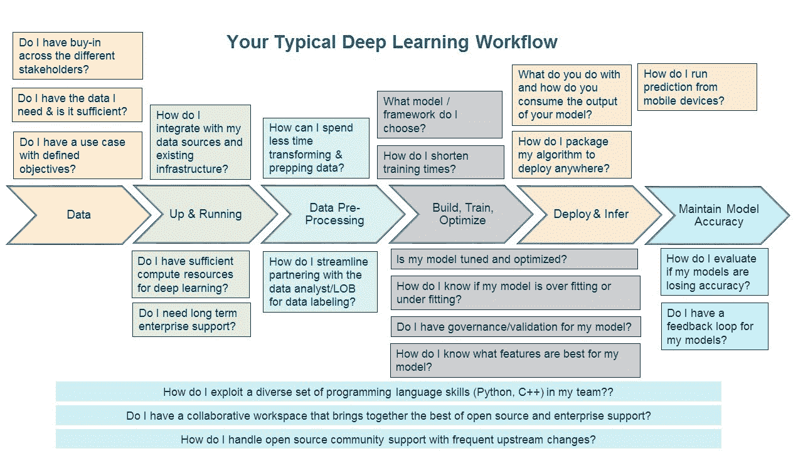
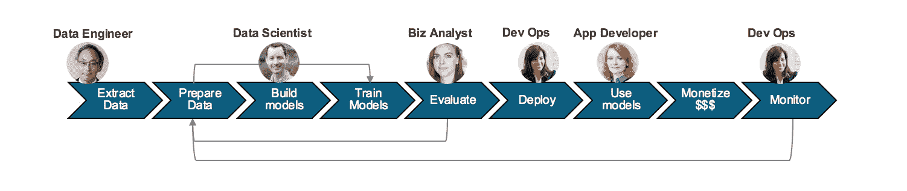

# 深度学习剖析:DevOps 团队和工作流的角色

> 原文：<https://thenewstack.io/deep-learning-dissected-devops-teams-workflows/>

这篇文章是 IBM 撰写的“深度学习剖析”系列文章的一部分，该系列文章探讨了采用基于深度学习的认知系统所面临的挑战。 [Adel El-Hallak 将于下周四在丹佛](http://www.nvidia.com/object/supercomputing2017.html?id=SC1737)举行的【2017 年超级计算大会上就此话题发表演讲。

 [阿德尔·哈拉克

Adel El-Hallak 是 IBM 认知系统部门深度学习产品管理总监。Adel 的使命是将深度学习民主化和可操作化，以便它可以更容易地被消费，从而增强人类的智能。Adel 之前的职位包括高性能计算和高级分析领域的销售和营销领导职位。Adel 拥有加拿大麦吉尔大学的计算机科学学士学位和英国华威商学院的工商管理硕士学位](http://www.ibm.com) 

我在蒙特利尔长大，一年中最喜欢的时光是这座城市举办 F1 大奖赛的时候。从表面上看，这种单座汽车比赛确实像是一项个人运动——车里的男人或女人。但是 F1 不仅仅是车手。

有参赛者赞助商，他们注册汽车和司机，并维护车辆。然后是建造引擎和底盘并拥有设计知识产权的建造者。还有一个性能工程团队，精确调整汽车，以实现最佳性能。当然，还有维修站工作人员:10-15 人，他们在比赛前、赛后和比赛期间准备和维护车辆。

重点是，尽管事实上摄像机主要聚焦在司机身上，但真正的故事是合作:专家们一起工作来决定成功和失败。通常，数据科学家被给予广泛、普遍的指示，将人工智能(AI)引入他们的组织，但就像没有汽车的司机一样，数据科学家如果没有专家团队的支持，就无法取得胜利。

## 组建您的高绩效团队

通过机器和深度学习实现商业价值需要整个组织内相同水平的团队合作。虽然有无数的故事只关注数据科学家、不断增长的需求和他们技能的稀缺以及不断膨胀的薪水，但它们忽略了其余利益相关者的重要性以及他们在帮助实现成功方面的作用，就像我们忘记了更广泛的 F1 车队一样。

在启动任何机器学习项目之前，数据科学家需要与业务部门的分析师密切合作，以定义满足业务需求的用例，并定义预测模型的相应目标。这通常需要数据科学家和业务分析师之间的多次交互，因为数据被审查，限制被发现，模型被改进，直到它最终被业务部门批准。这也需要在整个组织采用的数据治理政策的背景下完成，更重要的是，在各自的行业中完成，这进一步强调了团队合作的重要性。

如果治理策略规定需要将数据保留在本地，数据科学家必须与其 IT 部门合作，以确保部署适当的基础架构来支持这些计算密集型工作负载。考虑到开源框架的频繁使用，数据科学家还需要确保他们喜爱的工具受到基础架构的支持，并符合组织的服务级别协议。

与跨学科团队一起处理数据是深度学习工作流程的第一步

由于深度学习高度依赖于大量数据，因此了解组织可用的数据，数据驻留在哪里，如何访问、清理、转换以及随后标记数据，也是人工智能工作流的先决条件。因此，在用例派生期间，数据科学家还需要与数据工程师合作，同时与业务分析师互动。这里的交互也是迭代的，以确保收集的数据是足够的，并满足预测模型的要求。

## 深度学习的时间试验

一旦满足上述先决条件，构建、培训和优化的迭代过程就开始了。虽然这是[机器学习](/category/machine-learning/)的阶段，呈现出最大的市场技能缺口，但拥有一个伟大的数据科学家并不能转化为组织的成功，无论预测模型有多棒或多准确。一名与 [DevOps](/category/devops/) 紧密合作的应用开发者，需要构建、部署和管理应用，让深度学习算法发挥作用。这项工作的一部分是确保与运营数据的集成，这些模型将根据运营数据进行推断或评分。

即使在这个阶段，数据科学家也没有摆脱困境。随着模型根据运营数据进行评分，需要监控其准确性，以确保它不会失去精度，或者更好的是，利用新数据来提高模型的准确性。这通常需要在将模型重新部署到应用程序中之前，用反馈数据重新训练模型。

## 作为一个团队赢得深度学习竞赛

通过机器学习获得商业价值是一项多学科的团队运动。在用例衍生阶段，预先的团队合作是成功的基本前提。这些利益相关者之间的伙伴关系需要在整个循环和迭代的工作流程中保持，即使模型已经货币化。

因此，尽管数据科学家和 F1 车手备受关注，但事实是，他们只能通过与更广泛的团队合作来取得成功。

## 团队合作，这样你就不会筋疲力尽，崩溃

正如 IDC 最近指出的那样，随着深度学习项目的进展，组织需要计划避免“基础设施墙”。正如我所概述的，他们通过组建跨学科团队来实现这一目标，您可以阅读更多关于 IDC 的发现。

请继续关注我的下一篇专栏文章，它将讨论一旦数据科学家创建了他们的团队并在他们的组织中培养了认同，他们如何为深度学习准备数据，同时避免这个耗时过程中的常见陷阱。

通过 Pixabay 的特征图像。

<svg xmlns:xlink="http://www.w3.org/1999/xlink" viewBox="0 0 68 31" version="1.1"><title>Group</title> <desc>Created with Sketch.</desc></svg>