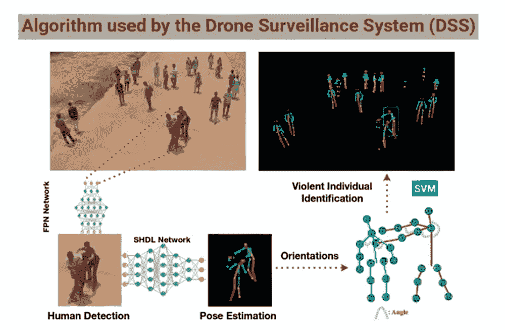
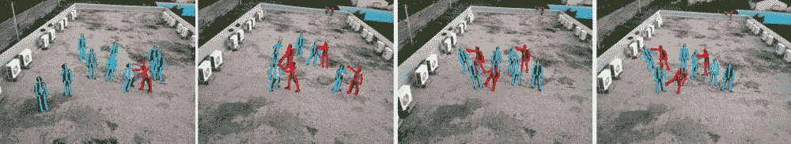
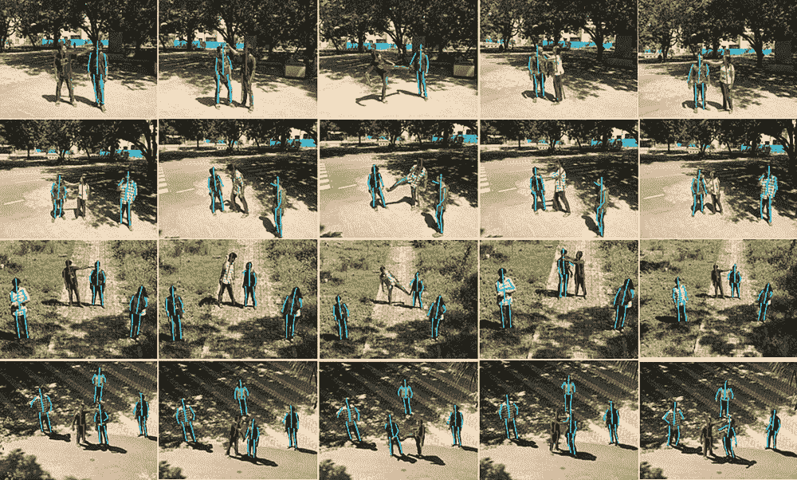

# 深度学习无人机检测人群中的打斗、炸弹、枪击事件

> 原文：<https://thenewstack.io/deep-learning-drone-detects-fights-bombs-shootings-in-crowds/>

如今阅读新闻可能是一种痛苦的经历，可能会挑战一个人的世俗安全感。我们似乎越来越多地听到在我们的城市中似乎随机爆发的暴力或可怕的恐怖主义行为、枪击和爆炸。更令人担忧的是，我们还发现这些事件太难预测和预防，一旦它们实时发生，执法部门更难阻止。

再一次，这是机器的用武之地。近来，视频监控系统已经被开发用于监控可疑和被遗弃的物体，例如公共场所中的包、盗窃事件，以及用于检测火灾和烟雾。

现在，一个由来自英国和印度的研究人员组成的国际团队开发了一个无人机监控系统，该系统将使用计算机视觉和深度学习人工智能技术来自动检测公共场所何时发生暴力事件，例如在大群人中爆发肢体冲突:

[https://www.youtube.com/embed/zYypJPJipYc?feature=oembed](https://www.youtube.com/embed/zYypJPJipYc?feature=oembed)

视频

虽然在实际应用中，这种机载系统将比地面摄像机更先进，但它仍会受到处理从大量个人收集的数据的计算要求的阻碍。在解决这个问题时，该团队的预印本[论文](https://arxiv.org/pdf/1806.00746.pdf)概述了该团队如何能够通过简化收集训练数据的过程，利用云的计算能力，并使用深度学习技术根据个人的运动来识别个人是否有暴力倾向，来制定一个改进的自动无人机监控系统，该系统将实时工作。

该团队最初是在 2013 年[波士顿马拉松爆炸案](https://en.wikipedia.org/wiki/Boston_Marathon_bombing)后受到启发开始这个项目的，但由于结果不令人满意而停滞不前。2017 年，爱莉安娜·格兰德演唱会后的[曼彻斯特竞技场自杀式爆炸](https://en.wikipedia.org/wiki/Manchester_Arena_bombing)再次刺激了他们，这一次，他们将深度学习人工智能和[云计算](https://thenewstack.io/roadmap-containers-for-high-performance-computing/)应用到项目开发中。

“这一次我们能够做得相对更好，因为软件能够实时运行，在检测暴力个人方面做得相对更好，”剑桥大学博士生兼论文合著者 Amarjot Singh 告诉 IEEE Spectrum 。

挑战的一部分是收集良好的训练数据，因为航拍无人机的镜头可能会受到照明条件差、像素化和模糊的影响，此外，以不同比例和方向出现在不同位置的人类对象也会增加复杂性。为了解决这个问题，该团队招募了一组 25 名志愿者，在不同高度由一架 [Parrot AR 无人机](https://www.parrot.com/us/drones/parrot-ardrone-20-elite-edition)拍摄的同时，他们摆出各种姿势，模仿拳打、脚踢、勒颈、刺伤和射击的动作。

这些人类受试者的图像随后被标注上 14 个主要的“姿势估计”标签，这些标签将帮助深度学习网络确定一个人是否有暴力行为(红线)或没有暴力行为(蓝线)。现在，一个典型的无监督深度学习算法需要数万张图像来训练它，才能可靠地识别出所需的模式。但是，该团队没有经历手动注释所有这些图像的耗时耗力的过程，而是通过修改算法背后的人工神经网络的前端和后端层，在一定程度上简化了这一过程，因此它现在在前端有固定的参数，并且可以在后端进行学习，在识别不同姿势时进行一些人工监督。通过这种方法，研究人员的分散网络混合深度学习(SHDL)网络需要更少的数据，但可以更快地学习，并且使用更少的计算资源。

此外，研究人员还建立了另外两个现有的深度学习算法，以帮助系统检测暴力个人。该过程首先涉及使用特征金字塔网络(FPN)，这有助于从航空图像中检测人类。然后，该团队的分散网络混合深度学习(SHDL)网络用于“估计”每个人的姿势。最后，支持向量机(SVM)算法，然后利用，它确定个人表现出暴力行为。无人机记录的所有图像都被发送到亚马逊进行实时云计算，这意味着无人机本身没有这些任务的负担。

根据该团队的测试，该系统在识别一幅图像中的一个暴力个人时的准确率开始为 94%，但当一幅图像中有五个被识别的暴力个人时，准确率下降到 84%。这种差异可能是由于系统对姿势的分类不正确，或者从离无人机太远的人群中收集数据产生的问题。

目前，该团队的图像数据集仅关注实际的肉搏战类型，其形式可能因人而异，尽管有计划扩展该系统的功能，以识别持有枪支和刀具等武器的个人，或跟踪携带不寻常物品和行为可疑的人。但是，决定谁危险谁不危险的任务不会由机器来完成:该团队的最终目标是开发一个自动化程度更高的系统，让人类操作员不仅可以更容易地关注人群中的暴力活动，还可以识别非法越境，甚至识别绑架者——这可能会以更快、更有效的方式挽救生命。

<svg xmlns:xlink="http://www.w3.org/1999/xlink" viewBox="0 0 68 31" version="1.1"><title>Group</title> <desc>Created with Sketch.</desc></svg>