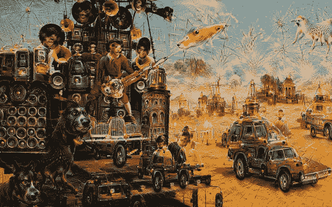
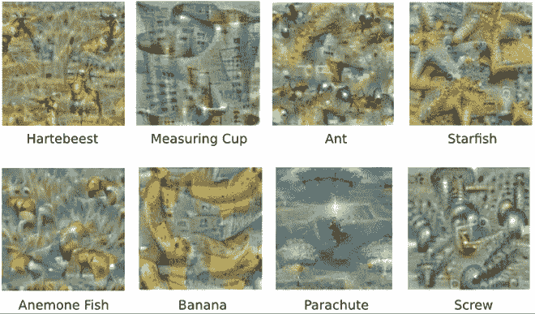
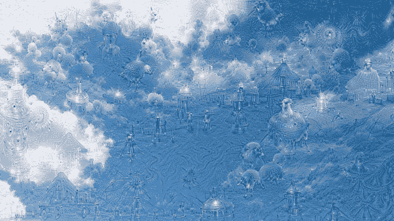
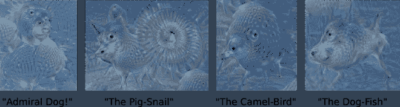
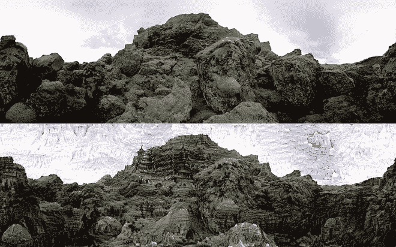
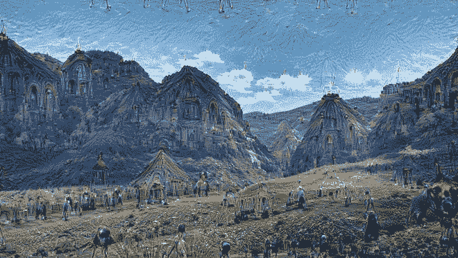
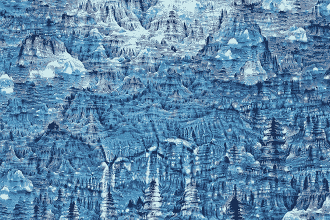

# 这就是深度学习神经网络产生幻觉时的情况

> 原文：<https://thenewstack.io/deep-learning-neural-networks-google-deep-dream/>

机器做梦时会发生什么？这是一个科幻小说作者和人工智能专家都在探索的问题，现在，多亏了谷歌的工程师，我们现在可以洞察计算机大脑的白日梦实际上可能是什么样子的，正如最近在网络上流传的这些迷幻图像所示。谷歌已经开放了 [DeepDream](http://googleresearch.blogspot.ca/2015/07/deepdream-code-example-for-visualizing.html) ，它们产生这些迷幻图像的源代码，人们正在使用它，将平凡的照片变成 [幻觉艺术作品](https://www.theguardian.com/technology/2015/jul/02/google-electric-sheep-image-processing-neural-network-algorithm) ，或恐怖，这取决于一个人的视角。

## 人工神经网络的深层梦想

由谷歌用于图像识别的 [人工神经网络](https://en.wikipedia.org/wiki/Artificial_neural_network) (ANN)生成，这些极具想象力的视觉效果是由一个  神经网络生成的，该网络实际上是一系列统计学习模型，由模仿进化过程的看似简单的[算法](https://en.wikipedia.org/wiki/Artificial_neural_network#Learning_algorithms)驱动。研究人员通过向这些网络输入数百万张图像来“训练”它们，并逐渐调整网络的参数，直到它给出想要的分类。

人们几乎可以将它想象为一个堆叠的信息筛:这些神经网络由 10 到 30 层相互连接的人工神经元组成，其中一些被指定为“输入”、“输出”和中间“隐藏”层(这里，“深度学习神经网络”指的是具有五层或更多层的系统)。较低的输入层解释基本特征，如边缘或角落——类似于婴儿感知熟悉面孔模糊边缘的能力——而中间层则接受这些基本解释并寻找整体形状。然后，输出层将这些组合成最终的解释，即由神经元提供的“答案”，它决定了图像是最好地描绘了一所房子、一种动物还是一种水果。

由于这些框架的非线性，神经网络实际上如何达到这种梦幻般的输出的过程对研究人员来说仍然有点神秘，尽管现在有一些可用的[工具](http://yosinski.com/deepvis)来帮助破译这一点。根据[谷歌研究](http://googleresearch.blogspot.ca/2015/06/inceptionism-going-deeper-into-neural.html)博客:“ 神经网络的挑战之一是理解每一层到底发生了什么。我们知道，在训练之后，每一层都会逐步提取图像越来越高的特征，直到最后一层基本上对图像显示的内容做出决定。”

## 反向幻觉技术

因此，研究人员决定逆转这一过程，“颠倒过来”，以便更好地可视化网络的内部运作。通过让它自由支配，并要求 它解释和  “以某种方式增强输入图像，以引出特定的解释”，他们希望获得更多关于网络理解和不理解的训练特征的洞察力。

接下来发生的事情令人震惊:研究人员发现，这些神经网络不仅可以辨别不同的图像，它们还有大量的信息来生成图像，从而产生了这些令人惊讶的计算表示。例如，在回应团队对蚂蚁、香蕉、海星等普通事物的查询时，网络产生了这些相当非正统的图像。

将图像输入到较低的层产生了柔和的曲线形式的解释，因为这些较低的神经层与识别边缘和角落有关。该团队解释说:“网络的每一层都在不同的抽象层次上处理功能，因此我们生成的功能的复杂性取决于我们选择增强哪一层。”

进一步探索，当图像被送入更高层次的抽象层时，更详细和意想不到的结果出现了，特别是当团队问网络: “无论你在那里看到什么，我都想要更多！”

> 这创造了一个反馈循环:如果一朵云看起来有点像鸟，网络会让它看起来更像鸟。这反过来将使网络在下一次传递中更强烈地识别出这只鸟，如此类推，直到一只非常详细的鸟出现，似乎不知从哪里冒出来的。

这个团队将这种反向幻觉技术称为“概念主义”——一种受电影启发的[参考](http://arxiv.org/pdf/1409.4842.pdf)深度神经网络的高效“计算机视觉架构”——该网络创造了意想不到的结果:树木变成了晶体结构，树叶变成了神奇的鸟和昆虫。本质上，这些“过度解释”是由这个反馈回路产生的先前学习特征的抽象的、碎片化的融合。更引人注目的是，通过对原始图像的连续版本反复应用该算法，可以从最初仅填充随机噪声的图像中生成极其丰富的景观。

这是一种大规模的数据驱动的盲目崇拜，像谷歌这样的公司有独特的优势来领导，因为需要大量的数据来训练大型神经网络，如果有人能访问大量的数据，并获得无与伦比的计算能力，那就是谷歌。虽然它们看起来令人惊叹，但这些令人回味的图片确实引出了更多的问题，而不是答案。首先，它展示了深度神经网络是如何被轻易愚弄的。但另一方面，这些复杂的图像也展示了这些涌现的神经网络中的未知。更深刻的是，他们还指出我们对视觉的认知复杂性以及人类大脑和创造过程本身知之甚少。

下一个问题将是如何开发这些深度神经网络，以更无监督和自动化的方法处理原始数据，建立在人工认知能力的基础上，如视觉识别和自然语言处理。除此之外，我们进入了令人兴奋的领域[量子机器学习](https://en.wikipedia.org/wiki/Quantum_machine_learning)，其中[量子神经网络](https://en.wikipedia.org/wiki/Quantum_machine_learning#Quantum_neural_networks)能够同时处理一个和零个状态，从而允许它们[“看到”大画面](http://arstechnica.com/science/2008/03/quantum-computer-may-be-capable-of-seeing-the-big-picture/)。

研究人员假设，梦是一种无风险的学习方式，是一种有助于推动人类进化到更复杂水平的适应性机制。机器也会这样吗？很难说。但可以肯定的是，这些图像所呈现的现实既令人兴奋又令人不安；当前机器智能的易错性意味着我们对它越来越多的依赖无疑会产生不可预见的后果，也许在战争中，智能杀手机器可能会横行无忌，正如一些专家警告的那样。然而此时此刻，这些图像本身就非常迷人，你可以通过从 [Github](https://github.com/google/deepdream) 下载 DeepDream 代码，或将图像上传到[心理虚拟现实实验室](http://psychic-vr-lab.com/deepdream/)，或者查看 [#deepdream](https://twitter.com/hashtag/deepdream?lang=en) 的 Twitter feed 来制作自己的图像。在[谷歌研究](http://googleresearch.blogspot.ca/2015/06/inceptionism-going-deeper-into-neural.html)阅读更多信息。

<svg xmlns:xlink="http://www.w3.org/1999/xlink" viewBox="0 0 68 31" version="1.1"><title>Group</title> <desc>Created with Sketch.</desc></svg>