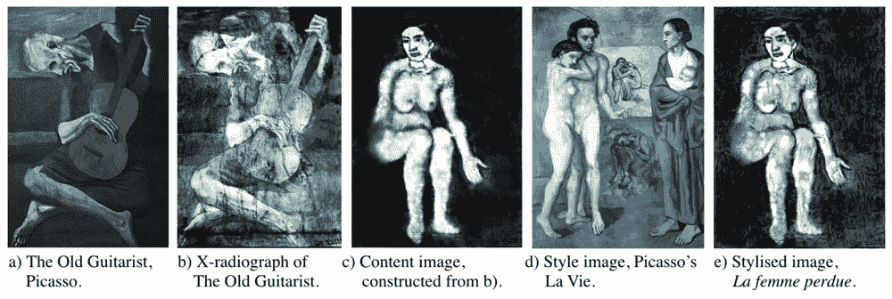

# 深度神经网络 AI 重构隐藏在毕加索画作中的神秘图像

> 原文：<https://thenewstack.io/deep-neural-network-ai-reconstructs-mysterious-image-hidden-in-picasso-painting/>

随着人工智能继续快速发展，很明显，人工智能很有可能在广泛的领域取得巨大进展，从做出[医疗诊断](/deep-learning-ai-detects-rare-genetic-disorders-by-scanning-faces/)和[金融预测](/ai-investors-taking-wall-street/)，到[自动事实核查](/deep-learning-ai-tool-identifies-fake-news-with-automated-fact-checking/)。不太明显的是人工智能将在更具创造性的行业中发挥什么样的作用，正如它最近在产生令人惊讶的引人注目的艺术作品中所做的那样。

尽管许多人可能不同意机器的艺术能力——不管它有多聪明——人工智能仍然可以在这个领域做出重大贡献。一个很好的例子来自伦敦大学学院的一组研究人员，他们最近使用人工智能重建了一幅从未见过的西班牙著名画家巴勃罗·毕加索的裸女画，这幅画显然藏在老吉他手下面。这幅著名的作品来自毕加索在 20 世纪初所谓的“蓝色时期”,那是一个经济匮乏和心理压抑的时期，在此期间，这位大师几乎只用忧郁的蓝色作画。

使用一种被称为神经风格转移(NST)的计算机视觉技术，研究人员能够重建隐藏在下面的一个女人的幽灵般的形象，这个形象后来被毕加索涂掉，创造出了老吉他手 T21(重复使用画布是贫困艺术家省钱的一种方式)。通过采用神经风格转移技术，该团队能够在不损坏艺术品本身的情况下恢复图像，比使用 x 射线成像等传统方法的效果更好。

## 濮培德女人

正如该团队在他们的[论文](https://arxiv.org/pdf/1909.05677.pdf)中概述的那样，神经风格转移指的是一类操纵数字图像和视频的算法，以便最终输出采用参考图像的视觉风格。NST 算法于 2015 年首次开发，使用所谓的[卷积神经网络](https://en.wikipedia.org/wiki/Convolutional_neural_network)，这是一种多层的深度学习人工智能，经常用于图像和视频识别和分类任务，医学图像分析和推荐系统。

神经风格转移的工作原理是让用户提供一个“内容”图像和一个“风格参考”图像(如一个著名艺术家的作品)，加上一个“输入”图像，需要根据“风格参考”图像的视觉审美来设计该图像的风格。这些混合在一起，使得“输入”图像被改变成看起来像“内容”图像，但是风格化成看起来像“样式参考”图像。

在这项研究中，团队已经有了老吉他手下面的女人的模糊的 x 光轮廓，所以下一步是手动编辑掉最上面的画的任何特征，这些特征不太可能在下面的原画中出现。随着*老吉他手*被设定为他们的“内容”形象，该团队随后将毕加索的画作 *La Vie* 作为他们的“风格参考”形象。通过应用神经风格转移，该团队随后能够重建隐藏的画作《濮培德女人》(the lost woman)，用的是毕加索可能自己画的彩色笔触。有趣的是，这些美学属性也可以通过所谓的误差函数和优化算法进行调整，这样一幅图像就可以呈现或多或少的特定风格。

## 人工创造力的出现？

更广泛地说，这种方法可能会改变艺术史学家未来的运作方式，论文的合著者之一、人工智能艺术集体[的联合创始人乔治·坎恩](https://www.oxia-palus.com/)说:“我认为人工智能在艺术中的出现将大大扩展我们的创作视野。我们在创意海岸迈出了第一步。在艺术史领域，人工智能将有助于更容易和更便宜地揭示历史艺术品下面的东西。可能有成千上万的底纹和底纹，每一个都有自己的故事，不为世人所知。这种隐藏的艺术可能包含了艺术在历史上如何发展的重要信息。”

可以理解的是，对于机器是否真的有创造力，仍然有很多怀疑。但是[人工创造力](https://en.wikipedia.org/wiki/Computational_creativity)一定是人类创造力的忠实翻版吗？机器有可能发展出自己独特的创新意识吗？如果不出意外，将人工智能融入人类的创造过程可能会促使更多人改变他们对人工智能和创造力的假设。

“我们认为，人工智能艺术在很大程度上挑战了我们对创造力的认知——许多人认为创造力是一种天生的有感情的财产，”论文合著者安东尼·布拉奇说，他是 Oxia Palus 的另一位创始成员。“我们把这种信念称为‘移情悖论’从更社会学的角度来看，我们也相信有一个非常积极的信息，即人类与人工智能的合作将滩头阵地扩大到创造性领域，而不是缩小它。从长远来看，人工智能不会“取代人”，而是让我们更有成就感，就像一双结实的靴子拓宽了我们可以行进的草地范围一样。"

在这里看论文[。](https://arxiv.org/pdf/1909.05677.pdf)

<svg xmlns:xlink="http://www.w3.org/1999/xlink" viewBox="0 0 68 31" version="1.1"><title>Group</title> <desc>Created with Sketch.</desc></svg>