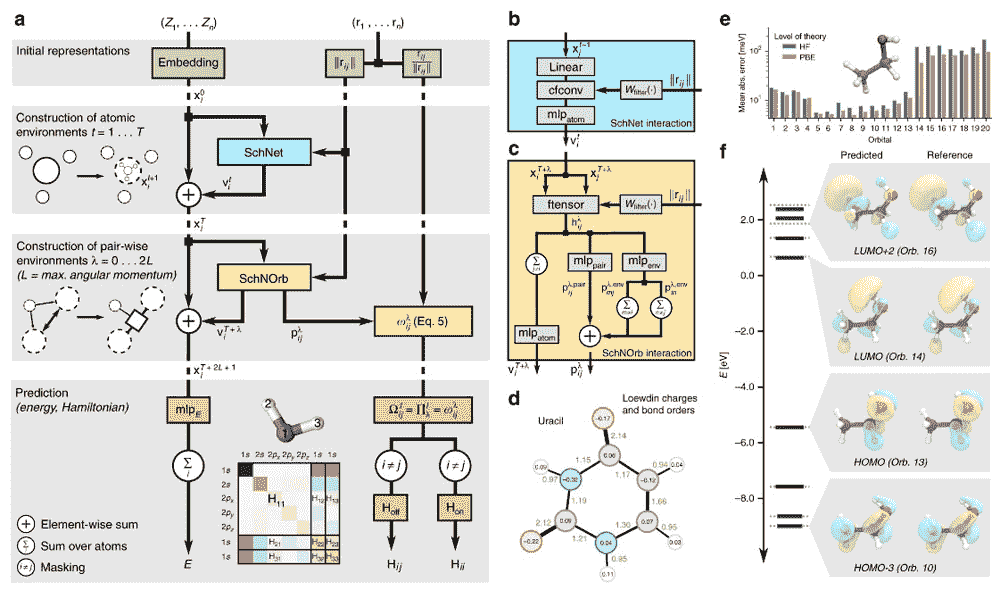

# 深度物理学:人工智能有助于预测量子分子波函数

> 原文：<https://thenewstack.io/deep-physics-ai-helps-predict-quantum-molecular-wave-functions/>

无论是支撑我们智能手机上的应用程序，还是帮助我们在自动驾驶汽车中安全导航，人工智能都在缓慢而稳定地融入我们的日常生活。除了做这些有用的(但不可否认是平凡的)事情，人工智能还帮助专家在广泛的领域拓展研究的边界，甚至深入研究[以前发表的文献](/ai-makes-new-scientific-discoveries-by-analyzing-old-research-papers/)以得出新的发现。

人工智能准备产生巨大影响的另一个领域是量子化学领域，量子力学的原理和方程被用于研究分子。在量子化学中，各种分子的性质和它们之间的化学反应是在基于量子力学方程的计算模型中探索的。正如人们可能想象的那样，这些模拟可能是相当资源密集型的，需要使用不容易获得的超级计算机，还可能需要几个月的计算时间。

为了建立一种更广泛可用的超级计算机替代品，来自华威大学、柏林技术大学和卢森堡大学的一组研究人员开发了一种深度学习人工智能，能够在智能手机上运行时，解决复杂的量子力学方程，以预测分子属性。

## 量子化学的人工智能

该团队的[论文](https://www.nature.com/articles/s41467-019-12875-2)被称为“轨道的 SchNet”(或简称为 SchNOrb)，解释说这种人工智能是深度学习[卷积神经网络](https://en.wikipedia.org/wiki/Convolutional_neural_network)的扩展，称为 [SchNet](https://arxiv.org/abs/1706.08566) ，它模拟分子量子相互作用。在这项最新工作中，SchNOrb 比其前辈有了额外的改进:它可以根据引入的任何量子化学数据预测所谓的[量子力学波函数](https://en.wikipedia.org/wiki/Wave_function)，从而允许它预测分子可能如何发生化学反应。

“我们相信这是在不久的将来可能会改变游戏规则的东西的第一个原理证明，”华威大学计算化学助理教授赖因哈德·莫勒说。“一个可以用很少的计算工作量预测分子和材料波函数的人工智能，将意味着我们可以研究以前无法研究的系统和问题。”

乙醇分子(f)的网络结构(a)和预测(实心黑色)和参考(灰色虚线)轨道能量的图表。

有人可能会问，为什么预测量子波函数很重要？嗯，这很重要，因为根据量子物理学，物质和光在概率上表现为粒子，与描述宇宙由物质粒子组成的“经典”物理学相反。在量子物理学中，波函数是有用的，因为它们是给定波的状态的数学模型(或表示)，从而允许人们计算系统的未来行为，但只是以一定的概率。因此，能够准确而轻松地模拟波的行为可以在广泛的应用中加快研究和开发。

> “这项工作表明，当提供高度复杂的物理方程的计算结果时，合理简单的机器学习模型可以参数化(‘理解’)高度复杂的物理方程，”—赖因哈德·毛雷尔。

例如，AI 可以“模拟现实生理环境中酶和 DNA 的辐射损伤，”Maurer 解释道。“我们可以直接预测太阳能电池材料在阳光照射下的效率，并快速筛选出理想的新材料。人工智能能够[反向传播](https://en.wikipedia.org/wiki/Backpropagation)信息也意味着人工智能可以告诉我们哪些分子最符合某些光学或电子特性。”

该团队的工作代表了不同研究人员之间为期三年的跨学科努力，将计算机科学家的专业知识与化学家和物理学家的知识相结合，创建了一种足够灵活的算法，以掌握波函数的形状和行为，但也足够强大，以可管理的方式处理量子化学数据。

“这项工作表明，当提供这些方程的计算结果时，合理简单的机器学习模型可以参数化(‘理解’)高度复杂的物理方程，”毛雷尔补充道。“人工智能和机器学习方法已经彻底改变了量子化学领域(以及一般的化学)。似乎我们所有的方法、算法和技术都已经，或者将在未来十年中，被改造到我们甚至不再讨论人工智能的程度。它只是我们日常研究工作中的一个组成部分。”

在 [*自然通讯*](https://www.nature.com/articles/s41467-019-12875-2) 上阅读团队论文，在 [GitHub](https://github.com/atomistic-machine-learning/SchNOrb) 上访问代码。

图片:[格雷格·贝克尔](https://unsplash.com/@gregbecker)via Unsplash；华威大学、柏林工业大学和卢森堡大学

<svg xmlns:xlink="http://www.w3.org/1999/xlink" viewBox="0 0 68 31" version="1.1"><title>Group</title> <desc>Created with Sketch.</desc></svg>