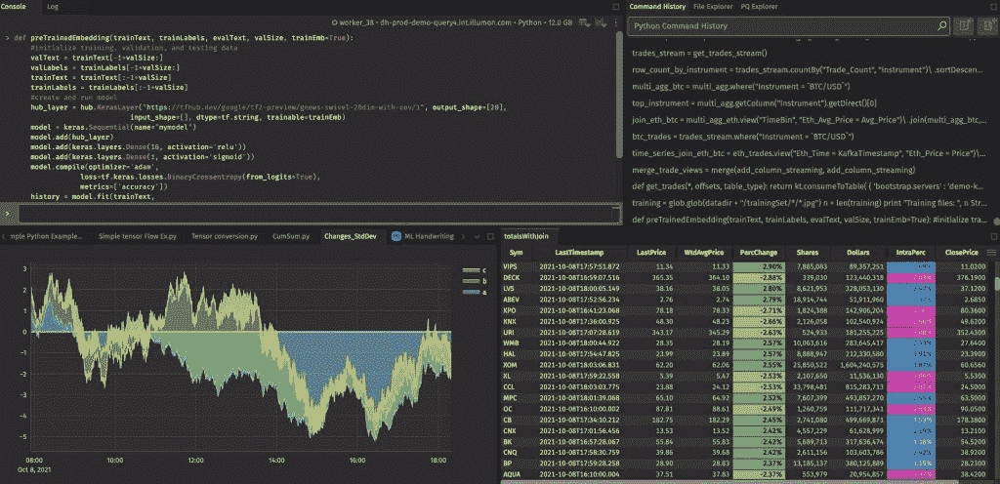

# Deephaven 为数据库技能集提供实时分析

> 原文：<https://thenewstack.io/deephaven-provides-real-time-analytics-for-the-database-skillset/>

大多数流数据技术要求开发人员的思维方式不同于传统的关系数据库。但现在， [Deephaven 数据实验室](https://deephaven.io/)，一家专注于时间序列数据库的初创公司，发布了 [Deephaven 社区核心](https://deephaven.io/community/)，这是一个免费的、源代码可用的企业产品版本，以应对这一挑战。

对于拥有传统数据库技能的开发人员和分析师来说，新版本有助于处理和分析实时数据。我们这样说不是基于新闻稿的内容，而是基于该技术的详细演示和对演示中使用的代码的了解。

## 起源

Deephaven 来自金融服务领域，是为高频交易公司 [Walleye Trading](https://www.walleyecapital.com/) 的内部使用而开发的，该公司最初由 Deephaven 的首席执行官[皮特·戈达德](https://www.linkedin.com/in/petegoddardwindata/)领导。这项技术是专门开发的，因为市场上已经存在的数据库无法满足 Walleye 的高数据量、高频率要求。

Deephaven 是一家 40 人的公司，成立快 5 年了。它的平台作为商业企业产品已经有一段时间了，支持大规模部署它的客户，并增强了高可用性和可靠性特性。免费的社区核心产品，以 Docker 容器映像的形式提供，为那些自己轻松管理基础设施的人，或者那些想在开发中的 Deephaven 上“试一试”的人提供了类似的功能。

## 它是如何工作的

Deephaven Community Core 通过采用增量更新模型，结合了流处理和批处理(即常规数据库操作)的属性。在这种模式下，当新数据进入时，Deephaven 会在后台将其识别为需要修改的内容，并保存更新的复杂地图。像它的企业兄弟一样，Deephaven 社区是实时更新的，可以处理服务器上或进程中的高容量和高频率的数据。

Deephaven IDE(集成开发环境)可以为其用户提供丰富的仪表盘(如下图所示)，以实时查看大数据更新。IDE 是作为控制台体验提供的，它提供了一个 [Python](https://www.python.org/) 代码编辑器和就地执行代码的能力。

深水港 IDE 中的仪表板

深海天堂在引擎盖下使用[阿帕奇卡夫卡](http://kafka.apache.org/)、[阿帕奇箭](http://arrow.apache.org/)和[箭飞行](https://arrow.apache.org/blog/2019/10/13/introducing-arrow-flight/)。针对该平台编写的代码可以订阅 Kafka 主题，并带回一个 Deephaven 表对象，这非常类似于一个 [Pandas](https://pandas.pydata.org/) DataFrame。但是表对象并不像数据帧那样是静态的——当新的数据流进来时，它们会实时自动更新。IDE 中连接到表对象的可视化效果和数据网格同样会随着基础数据的变化而自动更新。并且不需要显式的代码来支持这些。

大数据量(例如数十亿条记录)可以在 IDE 中处理，用户可以聚合和过滤数据，并对数据执行关系和时间序列连接。在 IDE 中，可以通过设置“链接器”来过滤数据，链接器允许在一个数据网格中进行选择，以过滤其他数据网格中的内容。喜欢使用 [Jupyter](https://jupyter.org/) 笔记本的开发人员可以自由地这样做，因为 Deephaven 为 Jupyter 网格和图表小部件提供了与 IDE 中相同的自动更新行为。JavaScript 开发人员也得到了明确的支持。

## 流动的溪流

Deephaven 社区也支持所谓的衍生流。这些是通过对现有表对象运行查询而创建的实时视图。这样，用户不必做任何显式的连接或订阅 Kafka 主题；相反，一切都是通过 SQL 查询和赋值语句来完成的。

Deephaven 首席执行官 Goddard 告诉 New Stack，“批处理和流是一回事，它们实际上可以一起工作。“哦，我想将它们结合在一起，创建一个新的衍生版本……”这是一个新的东西，它将数据汇集在一起，创建另一个演示文稿并显示在屏幕上，或提供给下游企业应用程序，或创建一个发送到您手机的警报……创建这些衍生流的能力非常重要，Deephaven 是唯一能够做到这一点的……在我们这里，您只需从字面上命名一个表，现在它可以通过 API 使用……任何人都可以使用它。”

## 毕与艾

与传统数据库一样，Deephaven 可以确保在一个流、源或跨各种源的更新是原子的。抓取数据快照的 JDBC 和 ODBC 连接器用于将 BI 工具连接到 Deephaven。当用户刷新他们的报告时，他们将获得上次更新后流入的所有数据。

在人工智能方面，用户可以根据实时和历史数据训练模型。Deephaven 社区提供了一个名为 [Learn](https://deephaven.io/core/pydoc/_modules/deephaven/learn.html) 的模块，该模块利用了 Deephaven 的功能，并将其与 [PyTorch](https://pytorch.org/) 和 [TensorFlow](https://www.tensorflow.org/) 等整合在一起，这样用户就可以一起使用 Deephaven 和那些库。这种组合甚至可以支持连续的增量再训练场景。

## 深远的未来

Deephaven 及其 IDE 并不支持所有常见的 BI 工具特性；相反，今天的 BI 工具不是为处理实时数据而设计的。但这些功能可能会添加到 Deephaven，这取决于客户的需求。对于未来的发展，戈达德说，“我们希望社区指导我们做他们想让我们做的事情。”

Deephaven 的投资者群体由与 Walleye Trading 有关联的各方以及朋友和家人组成，这可能会促进对收入的关注。这一点，再加上 Deephaven Community Core 的许可证禁止将平台作为服务提供，使该公司处于合理优先考虑和谨慎保护其知识产权的地位。

很难将新的数据库引擎推向市场，但 Deephaven 的平台上有一些非常苛刻的客户，并且似乎有通常随之而来的硬化。如果该公司能够用这个新版本建立和开发一个真正的社区和生态系统，它将值得开发者和雇佣他们的公司考虑。

<svg xmlns:xlink="http://www.w3.org/1999/xlink" viewBox="0 0 68 31" version="1.1"><title>Group</title> <desc>Created with Sketch.</desc></svg>