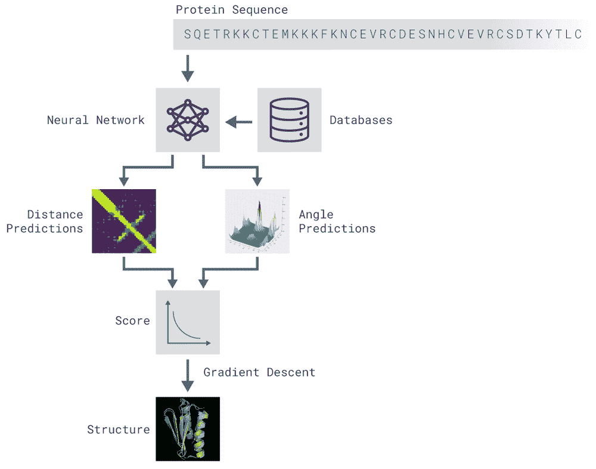
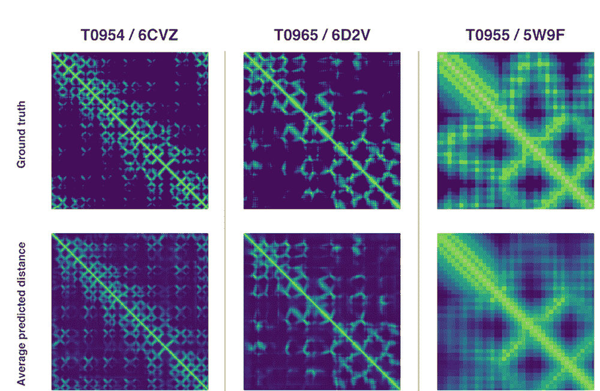
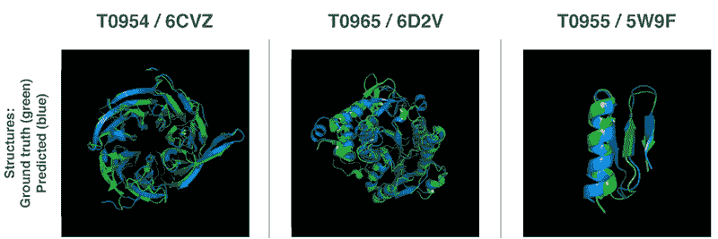

# DeepMind AI 在“蛋白质折叠问题”上取得突破

> 原文：<https://thenewstack.io/deepmind-ai-makes-breakthrough-with-protein-folding-problem/>

随着人工智能的不断发展，这种可能性似乎是无穷无尽的:迄今为止，它正在自动化制造工业、金融工业、建筑工业，甚至进入艺术、文学、音乐领域。但是最大的飞跃可能是在医学领域，人工智能已经在帮助医疗专业人员诊断疾病，识别危险的药物相互作用，甚至更准确地进行手术。

在两年一度的[结构预测批判评估](http://predictioncenter.org/casp13/index.cgi) (CASP)比赛中，谷歌附属的人工智能研究实验室 [DeepMind](https://deepmind.com/) 取得了惊人的胜利，表明人工智能有可能解开最大的谜团之一:预测蛋白质如何在三维空间中折叠自己。众所周知，DeepMind 的 alpha fold AI 创造了能够击败人类冠军的人工智能程序，如[国际象棋](https://thenewstack.io/new-google-ai-achieves-alien-superhuman-mastery-chess-shogi-go-mere-hours/)和[围棋](https://thenewstack.io/google-ai-beats-human-champion-complex-game-ever-invented/)，它击败了其他 97 名参赛者，正确预测了 43 个蛋白质中的 25 个如何在三维空间折叠。相比之下，第二名的获胜者只能解决 43 种蛋白质中的 3 种。

## 生命的基石

虽然这项成就看起来不算什么，但实际上非常重要，因为蛋白质是所有生命形式的基石。由于我们基因中编码的信息，人体能够制造成千上万种不同类型的蛋白质，每种蛋白质都控制着消化、免疫反应和肌肉收缩等多种功能。蛋白质的功能是由它折叠的方式决定的，而这种折叠的结构又由哪种[氨基酸](https://en.wikipedia.org/wiki/Amino_acid)连接起来形成蛋白质本身来定义。帕金森氏症和阿尔茨海默氏症等疾病可能部分是由某些蛋白质的错误折叠和故障引起的。毫不奇怪，鉴于有 21 种氨基酸以及它们组合的各种长度和方式，解决这个所谓的“蛋白质折叠问题”是一项艰巨的任务，可能需要科学家花费数年时间和大量的尝试和错误，以及大量的资金来解决。

这就是为什么引入人工智能来帮助计算这些复杂的交互是有意义的。在 AlphaFold 的情况下，该团队使用了深度神经网络，这些网络是根据数千种已知蛋白质折叠构型的数据进行训练的。这些训练数据最终使它能够预测一种新蛋白质的三维结构，以及氨基酸之间的距离和它们化学键的角度——只需知道组成氨基酸。然后，一个独立的神经网络使用来自这些距离的数据来得出一个分数，估计一个提议的结构可能有多精确。此外，尽管 AlphaFold 花了大约两周时间来预测其第一批蛋白质的结构，但它现在能够在几个小时内计算出结果。

  

“使用这些评分函数，我们能够搜索蛋白质景观，找到符合我们预测的结构，”该团队在一篇博客文章中写道。“我们的第一种方法建立在结构生物学中常用的技术基础上，用新的蛋白质片段反复替换蛋白质结构的片段。我们训练了一个生成性神经网络来发明新的片段，这些片段用于不断提高所提出的蛋白质结构的分数。”

为了进一步完善他们的结果，研究小组采用了另一种技术。“第二种方法通过[梯度下降](https://en.wikipedia.org/wiki/Gradient_descent)优化分数——一种在机器学习中常用的数学技术，用于进行小的增量改进——这导致了高度精确的结构，”该团队解释道。“这项技术应用于整个蛋白质链，而不是在组装前必须单独折叠的片段，从而降低了预测过程的复杂性。”

当然，可以理解的是，AlphaFold 的意外胜利引发了专家们的许多自我反思[讨论](https://moalquraishi.wordpress.com/2018/12/09/alphafold-casp13-what-just-happened/)。尽管如此，使用人工智能解决我们一些最大的科学问题还是有很多可说的:除了对推进医学领域有重大影响外，这种技术还可能对帮助修复我们退化的环境产生重大影响。例如，通过这种人工智能辅助的方法，科学家可能会设计出能够分解石油和塑料等污染物的化合物。目前，该团队正在撰写一篇论文，详细介绍他们在 AlphaFold 开发期间的发现，该论文将在不久的将来发表。

在 [DeepMind](https://deepmind.com/blog/alphafold/) 阅读更多内容。

图片:Folding@Home (CC BY-SA 3.0)，DeepMind

<svg xmlns:xlink="http://www.w3.org/1999/xlink" viewBox="0 0 68 31" version="1.1"><title>Group</title> <desc>Created with Sketch.</desc></svg>