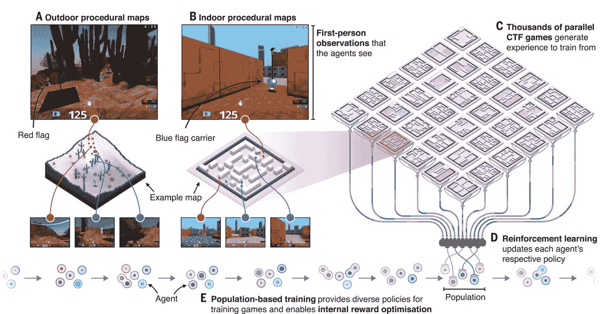

# DeepMind 的人工智能代理自学玩 3D 多人游戏

> 原文：<https://thenewstack.io/deepminds-ai-agents-teach-themselves-to-play-3d-multiplayer-game/>

我们已经看到了人工智能在战略双人游戏中的力量，如国际象棋和围棋——人工智能不仅能够在这些游戏中击败人类冠军，它还能够通过[在很短的时间内自学游戏来掌握它们。但是，尽管取得了这些巨大的成就，这些游戏并不一定是现实世界中需要合作和集体策略的最具代表性的情况。](https://thenewstack.io/new-google-ai-achieves-alien-superhuman-mastery-chess-shogi-go-mere-hours/)

这就是为什么让人工智能自主掌握更复杂的环境，如第一人称多人游戏中的环境，是下一个合乎逻辑的步骤。来自谷歌附属人工智能实验室 [DeepMind](https://deepmind.com/) 的最新工作揭示，使用无监督强化学习，让人工智能代理像人类一样自学如何合作和玩多人游戏确实是可能的。

正如 DeepMind 的团队在他们最近发表在 [*Science*](https://science.sciencemag.org/content/364/6443/859) 上的论文中概述的那样，这项研究涉及使用一个修改版的 [Quake III Arena](https://en.wikipedia.org/wiki/Quake_III_Arena) ，这是一个流行的第一人称多人游戏，让玩家在三维地图中导航。在这项研究中，由人类玩家和人工智能代理组成的团队以捕捉旗帜(CTF)模式玩游戏，合作以便在五分钟的时间内尽可能多地捕捉对手的旗帜。队伍从位于 3D 游戏地图两端的两个大本营开始，每场比赛的布局都在变化，以防止代理记住对他们有利的布局。

该团队让他们的人工代理使用卷积神经网络，以便像人类玩家一样看待这个世界:作为一个像素流，他们必须从中独立学习游戏的规则和目标，并以分散的方式操作。玩家配备了一种激光武器，可以通过射击来“标记”对手，使他们返回起点“重生”。如果他们被贴上标签时带着旗帜，他们必须放下旗帜返回基地。

数以千计的捕捉国旗(CTF)游戏并行进行，以便使用室内或室外的一组不同的 3D 地图生成训练数据。

[https://www.youtube.com/embed/OjVxXyp7Bxw?feature=oembed](https://www.youtube.com/embed/OjVxXyp7Bxw?feature=oembed)

视频

代理人开始超越随机行动，而不是被给予一个预先确定的目标。随着时间的推移，研究人员发现，通过相互之间以及与人类玩家一起玩，代理人能够学习他们自己的“内部奖励信号”，例如获得游戏积分。这种自我学习的内部奖励信号允许他们产生自己的内部目标——例如抓住对手的旗帜以获得更多的分数。双层优化过程用于增强代理的内部奖励信号，以获得越来越多的分数，其中[强化学习](/reinforcement-learning-ready-real-world/) (RL)方法用于进一步强化代理在选择行动时的策略，使其更接近实现其内部目标。

为了帮助他们评估和学习他们的进展，代理人配备了一个“带外部存储器的多时间尺度递归神经网络”，这有助于他们在游戏期间和游戏结束时跟踪分数。从本质上讲，代理人依赖于游戏的结果来继续进化和发展他们在未来会采取什么样的战术行动。

人工智能主体行为分析。

## 紧急行为

有趣的是，这种设置意味着每个代理都能够在没有任何监督的情况下制定自己的专门策略。例如，一些代理人能够在游戏中模仿人类的行为，例如跟随队友，监视敌人的基地，以及保护自己的基地免受对手的攻击。每 1000 场比赛后，系统通过比较每个代理人的政策来评估团队的表现如何；赢的不多的代理人会模仿表现更好的玩家。

“没有人告诉(人工智能)如何玩游戏——除非他们击败了对手，”论文主要作者 Max Jaderberg 在 [Venture Beat](https://venturebeat.com/2019/05/30/deepminds-ai-can-defeat-human-players-in-quake-iii-arenas-capture-the-flag-mode/) 上解释道。“使用这种方法的好处在于，你永远不知道代理学习时会出现什么样的行为。从研究的角度来看，真正令人兴奋的是算法方法的新颖性。我们训练[人工智能]的具体方式是如何扩大和实施一些经典进化思想的一个很好的例子。”

实验的结果是惊人的:即使代理人故意延迟反应时间，他们仍然在 88%的时间里击败了中级玩家，在 79%的时间里击败了高级玩家。虽然现在说这一步将把我们带到哪里还为时过早，但该团队的发现指出了利用强化学习帮助人工智能掌握新的未知情况的强大潜力，以及推进对混合系统的研究，这些系统让人类和机器合作，朝着同一目标努力。

图片:DeepMind

<svg xmlns:xlink="http://www.w3.org/1999/xlink" viewBox="0 0 68 31" version="1.1"><title>Group</title> <desc>Created with Sketch.</desc></svg>