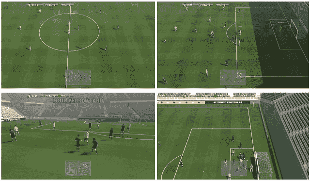
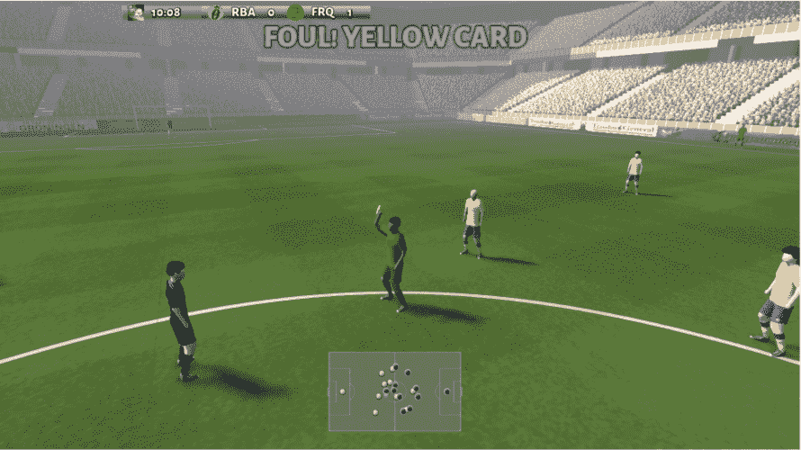

# DeepMind 的研究人员现在正在用足球训练他们的人工智能

> 原文：<https://thenewstack.io/deepminds-researchers-are-now-training-their-ai-by-using-soccer/>

有时候人工智能(AI)可能会失败——尤其是[和](https://thenewstack.io/can-technology-save-us-bad-drivers/)。有时是在人类生命受到威胁的情况下浏览 浏览修订——就像在[无人驾驶汽车](https://thenewstack.io/sxsw-googles-self-driving-car-current-limits-ai/)的情况下——这就是为什么确保人工智能得到充分训练以使其能够在复杂的现实世界场景中做出正确反应至关重要。

为了做到这一点，专家们经常使用模拟来测试他们的人工智能模型，让他们在虚拟环境中学习，这种环境或多或少地近似于现实世界中可能发生的事情。但是，设计一个合适的学习环境来训练人工智能并不像看起来那么容易——如果模拟环境过于简单和可预测，那么人工智能就不会学到很多东西；使它过于复杂，那么人工智能将需要大量的计算资源才能在这样的环境中运行。

那么，在为人工智能构建一个合适的虚拟学习环境时，什么能在简单性和复杂性之间取得适当的平衡呢？显然，它可以在足球中找到(或者在世界其他地方被称为足球)。至少，这是英国人工智能研究实验室 DeepMind 的专家们已经确定的。在开发了在传统游戏如 [Go](https://thenewstack.io/innovative-gaming-moves-googles-ai-becomes-go-grandmaster-three-days/) 和 [chess](https://thenewstack.io/new-google-ai-achieves-alien-superhuman-mastery-chess-shogi-go-mere-hours/) 中实现超人控制的人工智能，以及更直接的娱乐如 [Pong](https://venturebeat.com/2018/11/16/openai-and-deepmind-ai-system-achieves-superhuman-performance-in-pong-and-enduro/) 和更具战略性的实时多人游戏如 [Starcraft II](https://www.theverge.com/2019/1/24/18196135/google-deepmind-ai-starcraft-2-victory) 之后，这家谷歌子公司现在转向足球游戏模拟，作为在具有挑战性的[多人环境](https://thenewstack.io/deepminds-ai-agents-teach-themselves-to-play-3d-multiplayer-game/)中训练人工智能的一种方式，尽管如此，它仍具有一定程度的可预测性。观看人工智能游戏:

[https://www.youtube.com/embed/F8DcgFDT9sc?feature=oembed](https://www.youtube.com/embed/F8DcgFDT9sc?feature=oembed)

视频

正如他们在论文中概述的那样，该团队开发了他们自己的足球模拟，被称为“谷歌研究足球环境”特别是，该研究特别关注[强化学习](https://thenewstack.io/reinforcement-learning-ready-real-world/)(RL)——一种使用动态奖惩系统训练人工智能代理的机器学习技术。

“模仿流行的足球视频游戏，足球环境提供了一个基于物理的 3D 足球模拟，代理人控制他们队中的一个或所有足球运动员，学习如何在他们之间传球，并设法克服对手的防守以得分，”[团队写道](https://arxiv.org/pdf/1907.11180.pdf)。“足球环境提供了几个至关重要的组件:一个高度优化的游戏引擎，一套要求苛刻的研究问题，称为足球基准，以及足球学院，一套越来越难的 RL 场景。”

该团队的模拟提供了不同复杂性的场景，人工智能代理学习执行任务，如跑步、传球、射门和进球，以及处理典型的足球游戏规则，如犯规、犯规和点球，此外还设计了成功的团队策略。这种模拟的目的是让智能体既可以与自己对抗，也可以与其他机器或人类对抗。

该团队的目标是解决现有 RL 环境中的一些问题，其中一些问题很容易通过最先进的算法解决。例如，一些虚拟环境可能过于结构化和确定性，使人工智能代理太容易预测可能发生的事情，因此不够随机，无法反映现实世界中不断变化的动态。另一方面，更复杂的环境将需要比一般研究人员通常可用的更多的计算资源——因此，该团队特意设计了他们的系统，以在开源许可证下在现成的机器上运行。此外，模拟不是一个单一玩家环境，而是强调多个玩家和代理之间的交互，他们可以竞争或合作，从而产生更好地反映现实世界情况的挑战。

该团队的初步实验表明，在一个动态和相对复杂的学习环境中训练他们的人工智能代理时，足球环境可能会为研究人员提供很大的灵活性。如果之前在[国际象棋](/deepminds-new-milestones-on-the-road-to-artificial-general-intelligence/)或[围棋](/google-ai-beats-human-champion-complex-game-ever-invented/)中的指标有任何依据，那么人工智能很可能会提出创新的、前所未见的策略，让我们所有人都感到惊讶。

图片:Jannes Glas 在[Unsplash](https://unsplash.com/search/photos/soccer?utm_source=unsplash&utm_medium=referral&utm_content=creditCopyText)；谷歌 DeepMind。

<svg xmlns:xlink="http://www.w3.org/1999/xlink" viewBox="0 0 68 31" version="1.1"><title>Group</title> <desc>Created with Sketch.</desc></svg>