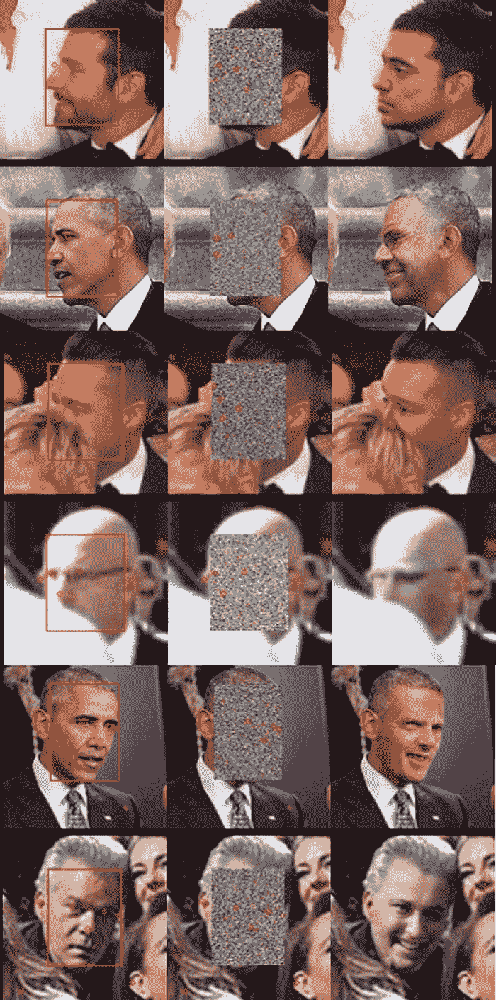
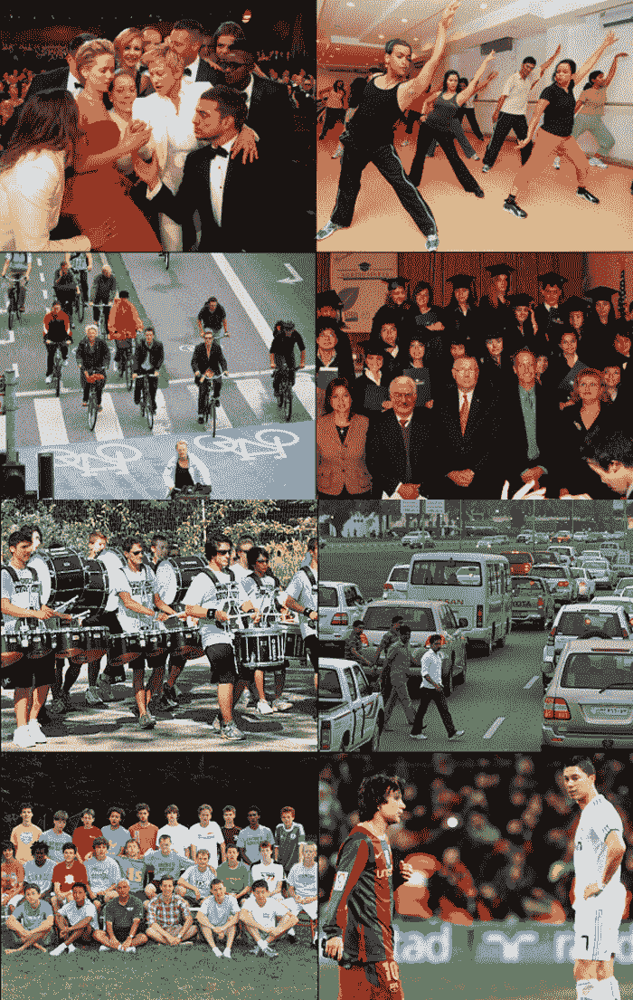

# DeepPrivacy AI 使用 Deepfake 技术来匿名化面部和保护隐私

> 原文：<https://thenewstack.io/deepprivacy-ai-uses-deepfake-tech-to-anonymize-faces-and-protect-privacy/>

人工智能的最新进展正在帮助我们加速医学和 T2 科学的新发现，此外还扩大了 T4 艺术、音乐和文学的创作可能性。但是像任何其他工具一样，人工智能可以被用于更邪恶的目的——例如生成伪造的图像或视频(被称为“deepfakes”和“T13”)，以及促进大规模监控——这种做法在像中国这样的威权国家正在兴起，甚至在自由民主国家也在兴起。在 deepfakes 的案例中，人工智能算法可以用来制作政客们令人毛骨悚然的令人信服的视频，而人工智能辅助的面部识别系统可以用来识别可能敢于公开反对专制政权的人。

但是，可以说，通过使用相同的技术来挫败面部识别算法，并生成一个深度伪造的外观来保护个人隐私，以毒攻毒是可能的。[挪威科技大学](https://www.ntnu.edu/)的研究人员开发了这样一项技术，它使用机器学习算法，从 147 万张图像的数据库中，无缝、自动地实时用各种匿名人脸替换一个人的脸。最近在[视觉计算国际研讨会](https://www.isvc.net/)上发表的，该团队的[论文](https://arxiv.org/abs/1909.04538)提出，这种“去识别”技术可以帮助保护那些在照片或在线直播视频中希望保持匿名的人的身份。

该系统被称为 [DeepPrivacy](https://github.com/hukkelas/DeepPrivacy) ，利用所谓的[生成对抗网络](https://en.wikipedia.org/wiki/Generative_adversarial_network) (GAN)将照片或视频中的原始人脸替换为不同的人脸，该人脸是从 Flickr 上超过 100 万张获得知识共享许可的面部图像数据库中合成的。虽然这个概念并不新鲜，但这部作品中有趣的是，面部替代几乎无缝地发生，GAN 动态地保留了原始“条件”，如主体的面部表情，现有的背景和主体身体的初始姿势。此外，作为额外的一层附加保护，DeepPrivacy 系统的设计不使用原始人脸中的任何隐私敏感信息；相反，它使用“关键点”来指示鼻子、嘴、眼睛等的位置，以模拟新的面孔。

第一栏:原始照片。第二列:显示需要匿名的模型的边界框。第三列:最终结果。

正如我们之前在试图欺骗人类和机器的[实验中看到的那样](https://thenewstack.io/google-develops-adversarial-example-images-that-fool-both-humans-and-computers/)，生成性对抗网络通过使两个神经网络相互对抗来发挥作用:一个是产生伪造图像的“生成性”网络，另一个是评估模拟图像真假的“鉴别器”网络。生成网络的目标是通过一次又一次地“愚弄”鉴别网络来增加鉴别网络的错误率，以便系统可以逐渐训练自己生成越来越有说服力的——但最终是伪造的——图像。

为了实现这一点，DeepPrivacy 系统首先在原始人脸上叠加一个边界框。相关的面部“关键点”,如眼睛、鼻子和肩膀的位置被记录下来。DeepPrivacy 模型随后利用了 Flickr 多样化面孔(FDF)，这是一个超过 100 万张面孔的开源数据集，从 Flickr 的超过 1 亿张 Creative Commons 图像的现有数据库中挑选出来，这些图像是根据其外观、面部表情、非常规姿势和背景的多样性选择的。FDF 数据集中的每一张人脸都预装了一个匿名的边界框和带注释的“关键点”——允许系统快速生成一个新的、唯一的人脸，有效地隐藏了主体的真实身份。

更多使用 DeepPrivacy 算法的照片示例。

正如我们所见，该方法对于静态图像中的人脸交换非常有效，而在面部信息不断逐帧变化的视频中(如团队上传的这张)，人脸仍然有点模糊，并包含一些残余的视觉伪像。尽管仍有一些改进的空间，但该系统仍提供了一些优于其他类似技术的有用优势:其设计允许完全匿名化人脸，即使在面临各种挑战时，如奇怪的姿势、部分覆盖的人脸和不同的背景时，仍能表现得相对较好。当然，为了跟上不断发展的技术，这种“去识别”工具有一天将不得不扩展到包括其他可能的生物识别信息，如衣服、头发或颅骨形状。

在 [Github](https://github.com/hukkelas/DeepPrivacy) 上查看 DeepPrivacy 代码。

<svg xmlns:xlink="http://www.w3.org/1999/xlink" viewBox="0 0 68 31" version="1.1"><title>Group</title> <desc>Created with Sketch.</desc></svg>