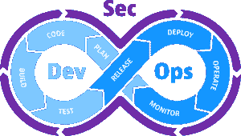
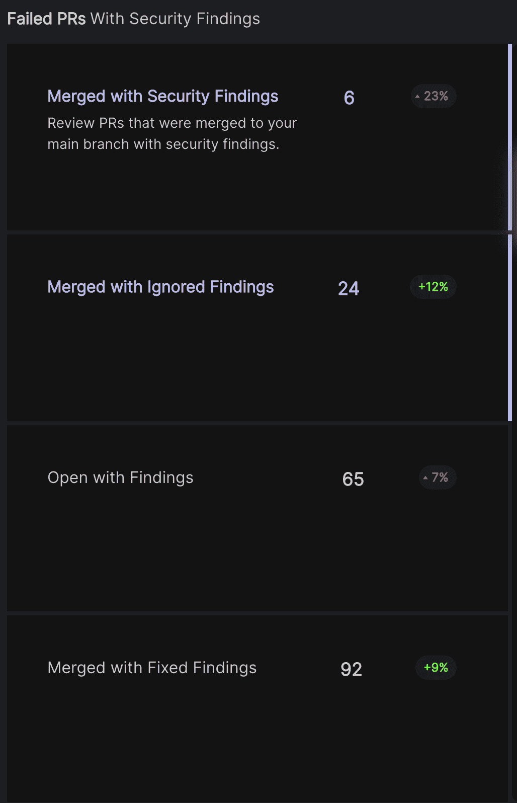

# 为安全工程定义类似 DORA 的度量

> 原文：<https://thenewstack.io/defining-dora-like-metrics-for-security-engineering/>

我们都见过这样的 DevSecOps 图。

图 1

但是如果我们仔细观察，在这个图表中真的没有任何地方谈到补救措施。有些人将此归入“操作”，但这只是部分正确的(并且主要只关注已经在生产中的问题)。

虽然安全试图找到进入该图的方法(在本例中，它显示为围绕流程的紫色箭头*)，但它从来就不是，而且可能永远也不会是一等公民，除非它完全嵌入工程流程本身。众所周知，它不可能是一个外部的、分离的过程，也不可能保持有效。*

当谈到遗留安全性时，事实是，实践几乎停止在补救上。传统的安全是发现问题，而不是解决问题，这是高速工程组织的悲剧。这就产生了摩擦，成为了使安全成为真正工程过程中的一等公民的障碍。

我们已经在[以前的帖子](https://thenewstack.io/continuous-security-the-next-evolution-of-developer-velocity/)中谈到过这一点，以及工程组织在涉及安全时如何需要以与他们在运营中同样的方式开发修复优先的思维模式。我想更大胆地假设，安全性将受益于今天在服务级别协议(SLA)和其他工程学科的操作状态方面可用的相同级别的透明度。

DevOps 不仅引入了文化和流程来实现我们今天拥有的自动化水平和速度，还通过 SLA 和服务级别目标(SLO)将重点转移到监控、可观察性和测量方面的彻底透明。今天，任何以其高可用性和精英工程能力为傲的 SaaS 或服务都有一个正常运行时间页面。他们想让你知道什么时候事情进展顺利，也想让你知道什么时候事情进展缓慢。

他们将分享事后分析，以确保用户知道他们明白哪里出了问题。而每个人都失败了，从 [Roblox](https://blog.roblox.com/2022/01/roblox-return-to-service-10-28-10-31-2021/) 到 [Meta](https://engineering.fb.com/2021/10/05/networking-traffic/outage-details/) 。他们会用数字来量化他们的服务中断的时间，并深入挖掘问题的本质。但重要的是时机——他们会在事后做所有这些事情。验尸。

DevSecOps 可以从 DevOps 世界中学到两个非常重要的知识。首先是恐惧的暂停。安全界有一个共识，就是不要把自己的漏洞和栈暴露给任何人。没有人能知道您的实时安全状况，即使是安全问题可能影响的客户。客户完全依赖公司来披露任何违规或安全漏洞，除非是第三方在他们不知情的情况下所为。

当然，这是有逻辑的。如果一个恶意的人发现您正在使用您的链中的某个服务或工具，该服务或工具具有公开的活动零日漏洞，他们可以利用这一点来利用您的系统。然而，这种同样隐秘的心态也适用于内部信息共享。安全指标几乎没有内部透明度。

等式的另一部分是基础架构工程师在停机时间或任何其他时间操作的实际方法。他们会立即着手解决问题，并在以后分析出了什么问题以便改进。这就是安全性可以从类似的方法中受益的地方。尽管当前的许多流程和文化侧重于发现，但他们需要转向解决问题的文化。

## 安全性方面可证明的可测量的改进

安全缺乏一个可衡量的安全改进过程，这将有利于工程以及安全所有者和最终用户。通过测量直接映射到像“ [Accelerate](https://itrevolution.com/product/accelerate/) ”这样的书籍已经固化的相同指标的地方，以确定精英工程——速度和安全——你可以有类似的 DORA-like 安全指标。迄今为止，安全性一直被认为是高速工程的障碍。

然而，另一方面，工程经理已经非常深刻地认识到安全性不能再被抛在后面，因此他们一直在想办法让笨重的工具工作。

> 安全对话需要从年度法规遵从性(这是一个很好的目标，而不是最终目标)转变为安全态势和 SLA 方面可持续衡量的改进流程。

此外，年度审计和其他时间点安全检查的传统安全实践已被证明对真正的安全保证毫无意义。工程的进展要快得多，在时间点评审结束后的那一分钟，它们基本上是不相关的。

安全对话需要从年度法规遵从性(这是一个很好的目标，而不是最终目标)转变为安全态势和 SLA 方面可持续衡量的改进流程。

现在，运营可用性基本上是公开可用的，以编程方式构建并公开共享，安全性也可以做同样的事情，并且它已经准备好作为一种实践和规程进行发展。

衡量安全性，重点关注:

1.  速度增加(是的，这是可能的)
2.  覆盖范围和正常运行时间

它将使安全性得到发展和提升，释放出类似的能力，自动化和可观察性，使工程成为可能。

### 速度增加

这听起来几乎像是支持提高工程速度的安全的对立面，但这将很快成为现实。如果在工程流程的早期就嵌入了安全性，并且有大量优秀的 DevSecOps 和开源安全工具可以实现这一点，那么就有可能在生产前早期修复问题，而不是在生产中发现问题时让整个工程团队陷入停顿，需要所有人都参与修复。

当您开始衡量生产中出现问题的速度以及补救问题的速度时，您也可以实现一种衡量安全性的编程方式。这是我们考虑的安全变更失败率(安全 CFR)以及平均修复时间(安全 MTTR)等。但是它可以变得比这更好。

### 覆盖范围和正常运行时间

安全 CFR 和 MTTR 谈到了我们在生产中引入安全问题并采取补救措施的频率，但真正的精英工程是在这些事件之间的差距中衡量的。它是以正常运行时间和覆盖率来衡量的，而不是以停机时间来衡量的。这种安全性本质上是量化速度的另外两个关键指标(部署频率和变更的交付时间)的促成因素。当您信任与您的工程流程完美集成的安全工程工具时，您可以在问题进入生产之前检测和修复问题，从而最大限度地减少运营和工程中断的需要。这是真正的甜蜜点。

> 通过使安全性像正常运行时间和性能 SLA 一样可编程演示，DevSecOps 所有者将能够吹嘘这种安全工程的卓越性。

我们将能够展示持续不断的安全改进，这种改进不会延迟软件交付周期，同时提供当今工程组织快速部署所需的安全保证，并且不会受到流程外安全审查的阻碍。通过使安全性像正常运行时间和性能 SLA 一样可编程演示，DevSecOps 所有者将能够在产品中、在脱口秀和日常工作中吹捧这种安全工程的卓越性。审计员不需要每年测试一次；他们将能够持续不断地了解安全覆盖范围和“正常运行时间”

## 可衡量安全性的具体例子

我想把这从高层次的理论变成实际的、实际的例子，这些例子需要成为衡量安全性的标准，以便工程提高安全性并将其嵌入到工程流程中。

### 逃逸率(又名拉请求)与安全发现相结合

我们在高速工程组织中经常看到的一件事是需要快速和经常地发布软件，这通常会以安全性为代价，即使它通过正确的工具被标记和记录。

如果我们积极地衡量将安全发现与拉请求(PRs)合并的频率和数量，那么我们就可以随着我们的安全态势和文化的发展，开始衡量短期、中期和长期的安全改进。我们希望在安全方面领先一步，在漏洞进入生产环境之前，将漏洞与明确的补救建议结合起来。

### 全面应用安全覆盖的时间

要检查的另一个重要指标是基于您的特定堆栈的“完全覆盖 AppSec 的时间”。今天，我们经常会看到，即使是有安全意识的工程组织，也可能需要几周、几个月甚至一年的时间来集成所有需要的工具，以实现完整的端到端工程堆栈(尤其是因为这是一个不断变化的目标，新技术正在不断引入)。

有了一个开放的可插拔的 DevSecOps 编排引擎，这变得非常容易。集成所需的工具并获得相关的覆盖面会带来更少的摩擦，并且可以更快地实现。希望集成 DevSecOps 工具变得像工程团队迅速采用的任何其他开发工具一样简单。

当您本机集成到 CI/CD 管道中时，这就成为可能。通过识别现有存储库和堆栈中使用的不同语言、技术甚至第三方，发现被嵌入到开发人员的工作流程中。一旦我们能够轻松地识别和理解他们当前的 AppSec 覆盖率，实施工具和流程以提供更大的覆盖率就是一个拉式请求了。

## 安全性符合我们的 CI/CD 系统和管道

这不是会不会发生的问题。安全必须经历这种转变并得到提升。我们的安全系统需要与我们的 CI/CD、管道和工程系统相匹配，并与所有相同的实践保持一致。

无论是在我们交付的产品中，还是在我们希望我们的工程团队使用的产品中，开发人员的体验都变得越来越重要，这种心态也需要融入到安全工程中。开发人员只会选择那些既能保证速度又能保证安全的产品。只有当我们知道如何通过安全性即代码和开发原生安全性来实现这一点，同时也衡量和共享这一知识时，我们才能作为一个行业发展。

<svg xmlns:xlink="http://www.w3.org/1999/xlink" viewBox="0 0 68 31" version="1.1"><title>Group</title> <desc>Created with Sketch.</desc></svg>