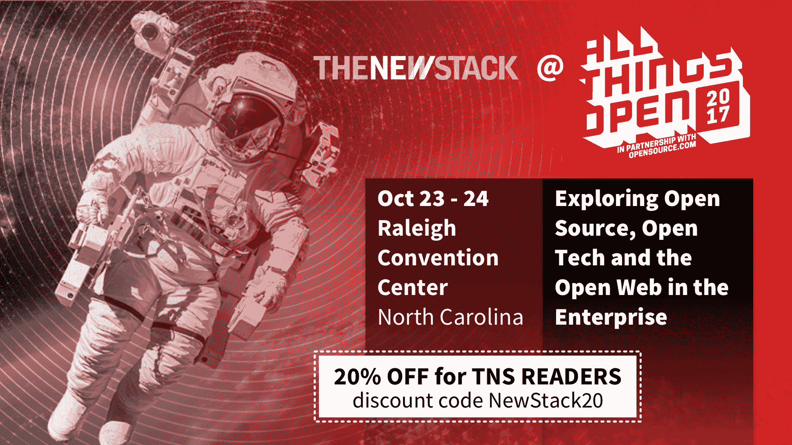

# 在 Azure 上定义易用性意味着向开发者妥协

> 原文：<https://thenewstack.io/defining-ease-use-azure-means-meeting-developers-half-way/>

几年前，关于联合云有这样一个愿景:云服务将无缝地协同工作。客户可以使用他们习惯使用的工具来使用他们想要的任何服务。这是一个希望，尤其是当 Docker 到来，真正的可移植性开始实现的时候。

[https://www.youtube.com/embed/0ZzwPeAnI3g](https://www.youtube.com/embed/0ZzwPeAnI3g)

视频

微软采取了一种方法，通过提供抽象来满足开发人员的需求，这样像 Jenkins 和 Terraform 这样的工具就可以使用第三方工具无缝地工作在混合的、多云的环境中。这听起来有点拗口，但它说明了联合的概念，以及抽象操作如何成为微软的一个重要哲学，因为它致力于帮助开发人员弥合长期以来无法逾越的鸿沟。将不同的组件粘合在一起的复杂操作要求一直困扰着客户。要缩小差距，就意味着要在开发人员所在的地方与他们见面。

微软 Azure 高级项目经理 [Arun Chandrasekhar](https://www.linkedin.com/in/arun-chandrasekhar-22a1533/) 在 9 月份的开源峰会上与我们进行了一次对话，他说:本质上，微软是在为开发者提供一个平台，让他们使用他们了解和喜爱的工具，而不是从头开始重建。

例如， [Terrafom](https://www.terraform.io/) 是 HashiCorp 的旗舰产品，正如我们[在今年早些时候](https://thenewstack.io/hashicorp-ceo-dave-mcjannet-going-cloud-native-fortune-2000-company/)报道的那样，它“用于跨公共云、私有云以及外部服务提供基础设施和应用资源”Terraform 对配置语言有独特的见解，他们支持 30 个提供商。其中包括 OpenStack、VMware、CloudFlare、PagerDuty 等三大云服务和平台。微软还与 Chef and Puppet 建立了合作关系。

“配置管理不会消失，”Chandrasekhar 说。“事情变得简单多了。”

[在 Azure 上定义易用性意味着满足开发者的一半需求](https://thenewstack.simplecast.com/episodes/defining-ease-of-use-on-azure-means-meeting-developers-halfway)

### 在这个版本中:

[1:13:](https://thenewstack.simplecast.com/episodes/defining-ease-of-use-on-azure-means-meeting-developers-halfway?t=1:13) 混合多云为什么会成为如此重要的概念？
[6:33:](https://thenewstack.simplecast.com/episodes/defining-ease-of-use-on-azure-means-meeting-developers-halfway?t=6:33) 微软喜欢 HashiCorp 的工具 Terraform 的哪些方面。
[10:08:](https://thenewstack.simplecast.com/episodes/defining-ease-of-use-on-azure-means-meeting-developers-halfway?t=10:08) 微软 Azure 如何在 Linux 上的应用服务中拥抱简单，以便开发人员可以专注于代码。
[11:30:](https://thenewstack.simplecast.com/episodes/defining-ease-of-use-on-azure-means-meeting-developers-halfway?t=11:30) Azure 容器实例，Jenkins，以及这些集成对于将开发人员引入云是如何必要的。
[12:59:](https://thenewstack.simplecast.com/episodes/defining-ease-of-use-on-azure-means-meeting-developers-halfway?t=12:59) 微软 Azure 中的配置管理。
[13:57:](https://thenewstack.simplecast.com/episodes/defining-ease-of-use-on-azure-means-meeting-developers-halfway?t=13:57) 如果开发者希望在微软 Azure 中尝试这些集成，他们应该做些什么。

微软赞助了这个播客。

<svg xmlns:xlink="http://www.w3.org/1999/xlink" viewBox="0 0 68 31" version="1.1"><title>Group</title> <desc>Created with Sketch.</desc></svg>