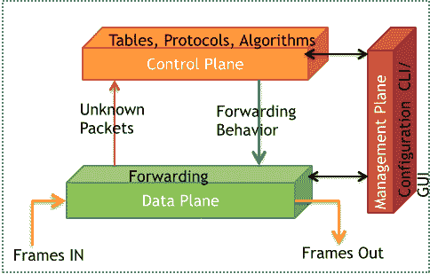
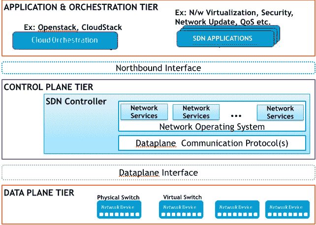

# SDN 系列第一部分:定义软件定义的网络

> 原文：<https://thenewstack.io/defining-software-defined-networking-part-1/>

编者按:这是关于软件定义的网络的多部分系列的第一部分。可以找到该系列的其他帖子

[here](https://thenewstack.io/?s=sdn)

.

托马斯·库恩(Thomas S. Kuhn)在其极具影响力的著作《科学革命的结构》(The Structure of Scientific Revolutions)中，将范式定义为“公认的科学成就，在一段时间内，为一群研究人员提供了模型问题和解决方案。据此，将软件定义的网络(SDN)归类为“新的网络模式”可能并不夸张。再次引用库恩的话，SDN 也是`充分开放的，将各种问题留给重新定义的从业者群体去解决。`

 `不同的研究者用不同的术语定义了 SDN，Brandon Heller [1]给出了一个更通用、更包容的定义，如下所示:

> “SDN 是关于网络设备和控制它们的软件之间关系的重构。”

术语网络设备用于包括:网关、路由器、网桥、交换机、集线器、协议转换器、代理服务器、防火墙、网络地址转换器、多路复用器、网络接口控制器、调制解调器、终端适配器、线路驱动器、无线接入点等。

每一个网络设备通常都要执行三种不同的活动，分别对应于网络的三个不同层面:数据、控制和管理，如图 1 所示。

数据平面负责处理传输流量，决定如何处理到达入口接口的数据包。它也被称为转发平面，因为它主要指的是转发表，以决定适当的出口接口。从分组的角度来看，数据平面通常处理终端站/用户生成的分组，这些分组总是由网络设备转发到其他终端站设备。

控制平面负责收集、处理和管理网络信息，以便决定转发行为。它通常包括各种表格和在这些表格上工作的协议套件。因此，控制平面处理网络设备生成/接收的分组，这些分组用于网络本身的创建和操作。运行在控制平面的典型协议有路由、接口状态管理、连接管理、相邻设备发现、拓扑或可达性信息交换和服务供应。

管理平面用于与设备进行交互或监控，以便管理网络。除了支持接口、网络(IP 子网)和控制平面协议的配置之外，管理平面还运行自己的一套协议(如 SNMP)。在传统网络设备中，数据平面活动由专用硬件(或“高速代码”)执行，而控制平面操作由设备 CPU 处理。

 *图 1 网元平面图*

考虑到以上对平面的描述，SDN 通过在网络控制平面和底层数据转发平面之间使用“基于标准的软件抽象”,消除了传统分布式网络架构的复杂和静态特性。

正如 Scott Shenker 所描述的那样: `SDN 是关于在网络控制平面上实现转发、状态分布和规范抽象的"[2]。从实现的角度来看，SDN 是任何能够让我们在实施设计轴上的点之间进行灵活选择的网络:集中式到分布式，微流到聚合流，反应式到主动式，虚拟到物理，以及完全一致到最终一致[1]。也就是说，SDN 增加了控制平面实施选择的灵活性。因此，网络设备仅执行分组转发(数据平面)，并且这些设备通过开放和标准接口(例如，OpenFlow [3])进行编程。`

 `> 总之，SDN 是关于网络设备的数据和控制平面的清晰分离，以及关于在控制平面具有足够的抽象以支持网络中新服务的提供。

## SDN 架构

图 2 描述了 SDN 架构。如图所示，有三个不同的层:

*   应用层:包含专注于网络服务扩展的解决方案。这些解决方案主要是与控制器通信的软件应用程序。
*   控制平面层:包括一个逻辑集中的 SDN 控制器，用于维护网络的全局视图。它还通过应用层明确定义的 API 接收请求，并通过标准协议对网络设备进行整合管理和监控。
*   基础设施或数据平面层:涉及物理网络设备，包括以太网交换机和路由器。提供符合行业标准的可编程高速硬件和软件。

 *图 2 SDN 架构*

在底层，物理网络由硬件转发设备组成，这些设备存储网络数据平面的转发信息库(FIB)状态(例如，TCAM 条目和配置的端口速度)，以及包括数据包、流和端口计数器在内的相关元数据。物理网络的设备可以被分组到一个或多个单独的控制器域中，其中每个域具有至少一个物理控制器。OpenFlow 平面接口或基于标准的协议(通常称为“南向协议”)定义了控制器平台和数据平面设备(如物理和虚拟交换机和路由器)之间的控制通信。有各种南向协议，如 OpenFlow、PCEP、SNMP、OVSDB 等。

控制平面层是 SDN 的核心，由每个域的控制器实现，这些控制器收集分布在每个控制域中的物理网络状态。该组件有时被称为“网络操作系统”(NOS)，因为它使 SDN 能够以全局网络视图的形式向控制应用(运行在应用层中)的实例呈现物理网络状态的抽象。

北向开放 API 指的是控制器的软件模块和 SDN 应用之间的软件接口。这些接口向客户、合作伙伴和开源社区发布和开放。应用和编排工具可以利用这些 API 与 SDN 控制器进行交互。

应用层包括一系列应用程序，以满足不同的客户需求，如网络自动化、灵活性和可编程性等。SDN 应用的一些领域包括流量工程、网络虚拟化、网络监控和分析、网络服务发现、访问控制等。每个应用实例的控制逻辑可以作为单独的进程直接在每个域内的控制器硬件上运行。

## SDN 控制器

在典型的 SDN 中，网络智能在逻辑上集中在控制器中(基于软件)，这使得控制逻辑能够在全局网络视图上设计和操作，作为集中式应用，而不是分布式系统[1]。运行在逻辑集中控制器上的程序通过配置底层网络设备中的数据包处理机制来直接管理网络。数据包处理规则安装在网络设备上，以实现管理网络的各种任务，从路由和流量监控到访问控制和服务器负载平衡。

控制层和数据层的分离是一个分离的系统，它被比作一个操作系统，在操作系统中，控制器为网络提供一个编程接口，可用于实施管理任务和提供新功能[4]。考虑图 2 中的架构，我们可以看到 SDN 控制器在南向和北向交互方面都是一个关键元素。市场上有各种开源和商业控制器。然而，我们在当前和未来文章中的重点将是开源控制器。一些开源控制器有 NOX [5]、Maestro [6]、Beacon [7]、SNAC [8]、Helios [9]和 Trema [10]、Jaxon [11]、泛光灯[12]、POX [13]、Ryu [14]、MUL [15]和 OpenDayLight [16]。在我们随后的文章中，我们将试图详细了解特雷马，Nox，泛光灯，RYU 和 ODL。

### **参考文献**

1.  D.莱文、a .旺萨姆、b .海勒、n .汉迪戈尔和 a .费尔德曼。逻辑上集权？:软件定义网络中的状态分布交易操作系统。《第一届软件定义网络热点专题研讨会论文集》，HotSDN '12，第 1-6 页，纽约，纽约州，美国，2012 年。ACM。
2.  B.Raghavan、M. Casado、T. Koponen、S. Ratnasamy、A. Ghodsi 和 S. Shenker。软件定义的互联网架构:从基础设施中分离架构。《第 11 届美国计算机学会网络热点专题研讨会论文集》，HotNets XI，第 43-48 页，纽约州，美国，2012 年。ACM。
3.  名词（noun 的缩写）McKeown、T. Anderson、H. Balakrishnan、G. Parulkar、L. Peterson、J. Rexford、S. Shenker 和 J. Turner。Openflow:支持校园网络创新。ACM SIGCOMM 计算机通信评论，38(2):69-74，2008。
4.  B.努内斯、马克·门东萨、阮宣南、K. Obraczka、Thierry Turletti，“软件定义网络调查:可编程网络的过去、现在和未来”，IEEE 通信调查和教程。
5.  名词（noun 的缩写）Gude、T. Koponen、J. Pettit、B. Pfa、M. Casado、N. McKeown 和 S. Shenker。面向网络的操作系统。ACM SIGCOMM 计算机通信评论，38(3):105-110，2008。
6.  Z.蔡，考克斯和唐。Maestro:一个可扩展的 openflow 控制系统。技术报告 TR10 08，莱斯大学，2010 年 12 月。
7.  灯塔。https://openflow.stanford.edu/display/Beacon/Home.
8.  简单网络访问控制(SNAC)。http://www.openflow.org/wp/snac/.
9.  泛光灯，开放式 SDN 控制器。http://floodlight.openflowhub.org/[。](http://floodlight.openflowhub.org/)
10.  nec 的 Helios。【http://www.nec.com/】T4。
11.  Trema openflow 控制器框架。[https://github.com/trema/trema](https://github.com/trema/trema)。
12.  Jaxon:基于 java 的 openflow 控制器。[http://jaxon.onuos.org/](http://jaxon.onuos.org/)。
13.  痘。http://www.noxrepo.org/pox/about_pox/
14.  龙。http://osrg.github.com/ryu/.
15.  马尔。[http://sourceforge.net/p/mul/wiki/Home/](http://sourceforge.net/p/mul/wiki/Home/)。
16.  开放日光:“开放日光网站”。[http://www.opendaylight.org](http://www.opendaylight.org)检索 2014-04-14

斯里达尔于 2007 年获得新加坡国立大学计算机科学博士学位，于 2000 年获得印度苏拉塔 KREC 计算机科学技术硕士学位，并于 1997 年 8 月获得印度班加罗尔大学 Tumkur instrument and electronics 学士学位。他曾在印度 SRM 研究所担任研究负责人，在意大利都灵理工大学微软创新中心担任博士后研究员，并在新加坡 Infocomm 研究院(I2R)担任研究员。他参与了各种涉及 ZigBee、WiFi 和 WiMax 的开发和部署项目。斯里达尔目前是 NEC Technologies India Limited 的集团技术专家。斯里达尔的研究兴趣主要集中在下一代有线和无线网络领域，例如 OpenFlow、软件定义的网络、认知网络的软件定义的基于无线电的系统、Hotspot 2.0 和物联网。

<svg xmlns:xlink="http://www.w3.org/1999/xlink" viewBox="0 0 68 31" version="1.1"><title>Group</title> <desc>Created with Sketch.</desc></svg>``