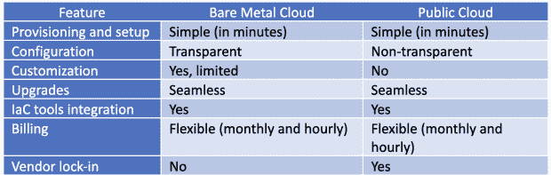

# 定义现代裸机云

> 原文：<https://thenewstack.io/defining-the-modern-bare-metal-cloud/>

这是十月份 KubeCon + CloudNativeCon 系列文章的第一篇。

裸机云通常被称为裸机即服务(BMaaS)，可以定义为具有云的完全自助多功能性的单租户环境。其受欢迎程度的激增促使提供商推动裸机云远远超出其原始功能，以满足现代工作负载和云原生组织的需求。到 2026 年，该平台预计将实现 38.5%的复合年增长率。

考虑到它现在处理的扩展的用例集，裸机云需要一个新的定义。

## 比金属更模糊，比云更坚实

要定义当今的裸机云，我们需要了解它的主要特征，包括:

*   专用资源
*   没有“吵闹的邻居”
*   易于扩展
*   API 供应
*   灵活计费

“坚实的”部分包括缺少虚拟机管理程序。它使用户能够访问服务器的物理组件，并让他们优化其 CPU、RAM 和存储资源。单一租户消除了共享虚拟化环境中常见的性能、安全性和资源争用问题。

裸机云中的“云”主要是指按小时或按月计费的选项和 API 驱动的配置。该平台支持部署期间和之后的自动化，允许开发人员使用 API 或 CLI 以编程方式设置、扩展和管理他们的基础架构。尽管如此，我们仍然只是触及了表面。

## 进入现代裸机云

到目前为止，我们定义的裸机云通常有以下缺点:

*   每个服务器实例的高成本
*   环境设置开销(操作系统、虚拟机管理程序、容器堆栈等。)
*   有限的服务器定制选项
*   有限数量的可用服务器实例
*   (然而，当今市场上的许多裸机云产品没有表现出上述缺点的迹象。)
*   启用定制

现代裸机云提供商提供预配置、工作负载优化的服务器，可以在几分钟内从全球任何地方进行部署。一些公司甚至提供特定于工作负载的硬件加速器，例如在系统上预先配置的永久内存。这使组织可以统包使用强大的技术来提高工作负载的性能和可靠性，同时降低总拥有成本。

为了进一步抽象基础设施设置开销，提供商已经采用开源软件解决方案，如 Canonical 的 MAAS，允许您使用预装的操作系统部署实例。通常，您可以在 Linux 发行版(如 Ubuntu、Debian 或 CentOS)和 Windows Server 或虚拟机管理程序解决方案(如 VMware ESXi)之间进行选择。为了进一步调整解决方案以满足您的确切需求，一些提供商甚至为您提供了安装自定义操作系统映像的选项。

虽然您无法亲自挑选单个堆栈组件，但从数十台采用最新硬件、软件和网络技术的服务器中进行选择，无疑有助于团队优化其 IT。

## 支持云原生

2021 年度调查显示，90%的 Kubernetes 用户使用云管理服务。自从 Kubernetes 与 cloud native 携手并进以来，它的主流地位已经推动裸机云进入有趣的集成。

您现在可以找到预装开源 K8s 管理平台(如 SUSE Rancher)的裸机云解决方案。利用这些，组织可以简化复杂容器环境的大规模部署和管理，并轻松访问裸机上托管的企业级 Kubernetes。

提供商也投入更多的时间和精力来交付定期更新的 GitHub 页面，为他们的解决方案提供 Kubernetes 控制器或 Docker 机器驱动程序。回购协议通常包括基础设施即代码(IaC)模块，通过 Terraform、Ansible 和 Pulumi 等流行工具简化基础设施供应和管理。

这种支持使 DevOps 团队能够将裸机服务器无缝集成到他们的工作流中，并直接从他们的首选环境中调配资源。

## 推动混合云

裸机云已经成为分布式工作负载和希望加快云采用速度的组织的首选解决方案。其专用资源和高性能硬件使其成为敏感、要求苛刻或传统工作负载的理想选择，这些工作负载通常与虚拟化环境不兼容。托管裸机云的数据中心通常提供对云入口或软件定义的网络的直接访问，使组织能够将其裸机托管的应用与他们最喜欢的超大规模云服务提供商互连。

这支持从云资源爆发到访问数 Pb 的分散存储的任何事情，允许团队轻松地在不同的生态系统中分配工作负载，并优化 IT 成本。

## 是给你的吗？

裸机云通常与高度灵活的公共云形成对比。
如果我们今天比较这两者，很明显区分它们的界限变得非常模糊:

如果您选择现代裸机云，您将获得大部分公共云功能，并增加了控制力、自由度、透明度和对硬件的直接访问。

在几分钟内，裸机云可以让您部署任何东西，从虚拟化或容器化应用程序的测试环境到 SUSE Rancher 管理的企业多节点 K8s 集群。该平台支持公共和定制 IP，甚至允许您安装定制操作系统或选择可用的 Linux、Windows 或 VMware 系统之一。

以下是可以从上述功能中受益的人:

*   **电子商务、金融科技、医疗保健和法律** —低延迟、增强的安全性和可扩展性有助于组织保持合规性，并确保高峰流量期间的最佳客户体验。
*   **数据驱动的组织** —最新的硬件技术支持复杂的框架，并加速数据密集型工作负载，如人工智能、机器学习数据库分析或高性能计算。
*   **DevOps 团队** — IaC 集成有助于开发人员将裸机云与其 CI/CD 管道保持一致，并自动调配物理、虚拟化或容器化环境。
*   **游戏服务器和渲染场** —全球可用的强大计算、存储和网络资源提供对最新高性能硬件的访问，并消除延迟。
*   **边缘和物联网应用** —该平台出现在边缘数据中心，使计算接近物联网，并提供对 5G 的访问，支持新一代应用和工作负载。

## 结论

考虑到所有因素，我们可以将裸机云定义为一个不断发展、多功能且强大的 IT 基础架构解决方案，支持快节奏的云原生组织。它不仅能让您直接访问其底层资源，还能让您直接访问简化和优化现代工作负载和工作流的最新软件和硬件技术。

<svg xmlns:xlink="http://www.w3.org/1999/xlink" viewBox="0 0 68 31" version="1.1"><title>Group</title> <desc>Created with Sketch.</desc></svg>