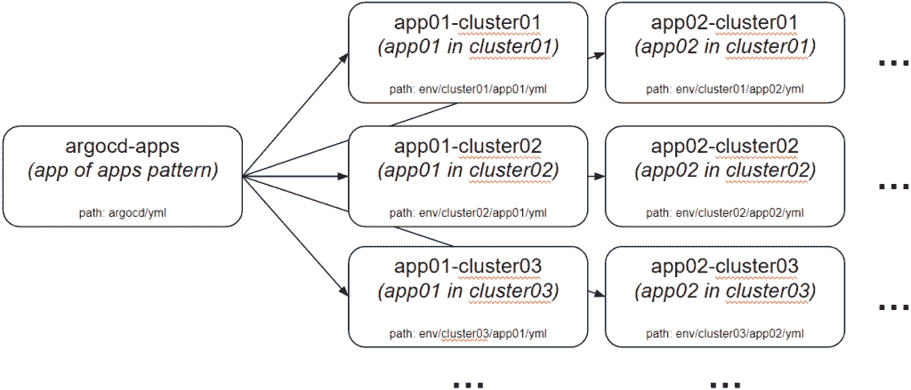
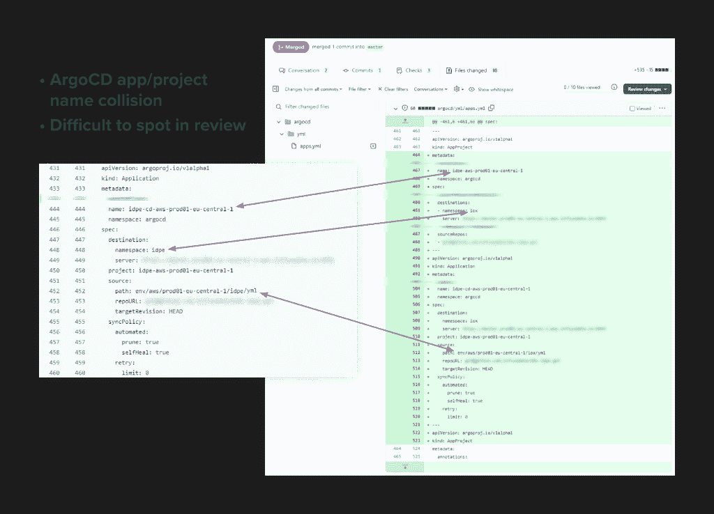

# 通过几个简单的步骤删除生产(以及如何修复)

> 原文：<https://thenewstack.io/deleting-production-in-a-few-easy-steps-and-how-to-fix-it/>

[Wojciech KOC Jan](https://www.linkedin.com/in/wkocjan)

[Wojciech 是 InfluxData 部署团队的工程师，专注于跨多个公共云和区域的 InfluxDB 云部署的自动化。他拥有十年使用多种公共云的经验，在此之前，他曾在开源领域担任开发人员、团队领导和架构师。他职业生涯的大部分时间都在创业公司工作，领导应用程序打包和部署的自动化。他也是克拉科夫云原住民团体的创始人之一，该团体是 CNCF 的一部分。](https://www.linkedin.com/in/wkocjan)

这是一种让开发人员冷汗直流的噩梦。想象一下，当你醒来时，你的团队发来一条消息，简单地说，“我们丢失了一个集群”，但这根本不是梦。

[InfluxDB Cloud](https://www.influxdata.com/products/influxdb-cloud/) 运行在 [Kubernetes](https://thenewstack.io/category/kubernetes/) 上，这是一个云应用编排平台。我们使用自动化的[连续交付](https://thenewstack.io/category/ci-cd/) (CD)系统来将代码和配置变更部署到生产中。在一个典型的工作日，工程团队交付 5-15 个不同的生产变更。

为了将这些代码和配置更改部署到 Kubernetes 集群，团队使用了一个名为 [ArgoCD](https://argoproj.github.io/cd/) 的工具。ArgoCD 读取 YAML 配置文件，并使用 Kubernetes API 使集群与 YAML 配置中指定的代码保持一致。

ArgoCD 使用 Kubernetes 中的定制资源(称为应用程序和 AppProjects)来管理作为代码库的源代码基础设施。ArgoCD 还管理这些存储库的文件路径以及特定 Kubernetes 集群和名称空间的部署目的地。

因为我们维护多个集群，所以我们还使用 ArgoCD 来监管自己，并管理所有不同 ArgoCD 应用程序和 AppProjects 的定义。这是一种常见的开发方法，通常被称为“应用中的应用”模式。

我们使用一种叫做 jsonnet 的语言来创建 YAML 配置的模板。CD 系统检测 jsonnet 中的变化，将 jsonnet 转换成 YAML，然后 Argo 应用这些变化。发生事故时，单个应用程序的所有资源都保存在单个 YAML 文件中。

对象名和目录结构遵循特定的命名约定:对象名使用*(应用程序名)*–*(集群名)*，保存其定义的存储库使用 env/ *(集群名)* / *(应用程序名)* /yml。例如，cluster01 中的 app01 被定义为 app01-cluster01，其定义保存在路径 env/cluster01/app01/yml 下。

我们将基础设施作为代码进行代码审查，包括检查生成的 YAML，并确保在应用更新之前它将按预期运行。

## 发生了什么

痛苦始于配置文件中的一行代码。团队中有人创建了一个 PR，向配置文件和渲染 YAML 文件添加了几个新对象。

在这种情况下，添加的对象之一是一个新的 ArgoCD 应用程序和 AppProject。由于自动化中的错误，对象的名称是错误的。它们本应被命名为 **app02** -cluster01，但却被命名为 **app01** -cluster01。代码审查忽略了 app01 和 app02 之间的差异，因此在呈现时，两个资源都出现在单个 YAML 配置文件中。

当我们将 PR 与错误命名的对象合并时，ArgoCD 读取整个生成的 YAML 文件，并按照文件中列出的顺序应用所有对象。结果，列出的最后一个对象“胜出”并得到应用，这就是所发生的情况。ArgoCD 用新实例替换了以前的实例 app1。问题是 ArgoCD 删除的 app1 实例是 InfluxDB Cloud 的核心工作负载。

此外，新对象产生了我们不想在该集群上启用的额外工作负载。简而言之，当 ArgoCD 替换 app01 的实例时，该过程触发了整个生产环境的立即删除。

显然，这对我们的用户来说并不好。当生产停止时，所有的 API 端点，包括所有的写和读，返回 404 个错误。在停机期间，没有人能够收集数据，任务无法运行，外部查询也不起作用。

## 灾难恢复—规划和初步尝试

我们立即着手解决这个问题，从审查合并后的 PR 中的代码开始。这个问题很难发现，因为它涉及到项目和应用程序名称之间的 ArgoCD 冲突。

我们的第一直觉是恢复变更，让事情恢复正常。不幸的是，这并不是有状态应用程序的工作方式。我们开始了恢复过程，但几乎立即停止了，因为恢复更改会导致 ArgoCD 创建我们应用程序的一个全新实例。这个新实例没有原始实例拥有的关于用户、仪表板和任务的元数据。重要的是，新实例没有最重要的东西——我们客户的数据。

此时，值得一提的是，我们将 InfluxDB 云集群中的所有数据存储在使用回收策略的卷中:Retain。这意味着即使我们管理的 Kubernetes 资源(如 StatefulSet 和/或 PersistentVolumeClaim (PVC ))被删除，底层的 PersistentVolumes 和云中的卷也不会被删除。

我们在制定恢复计划时考虑到了这一关键细节。我们必须手动重新创建所有底层的 Kubernetes 对象，比如 PVC。一旦新对象启动并运行，我们需要从备份系统中恢复任何丢失的数据，然后让 ArgoCD 重新创建应用程序的无状态部分。

## 灾难恢复—恢复状态和数据

InfluxDB Cloud 在其他微服务与之交互的一些系统组件中保存状态，包括:

*   **Etcd** :用于元数据，存在于独立于 Kubernetes 控制平面的专用集群上。
*   **卡夫卡和动物园管理员**:用于预写日志(wal)。
*   存储引擎:这包括永久虚电路和持久对象存储。

该团队从恢复 etcd 和我们的元数据开始。这可能是恢复过程中最简单的任务，因为 etcd 存储的数据集相对较小，所以我们能够快速启动和运行 etcd 集群。这对我们来说是轻而易举的胜利，让我们能够将所有注意力集中在更复杂的恢复任务上，如 Kafka 和存储。

我们识别并重新创建了任何丢失的 Kubernetes 对象，这使卷(特别是持久卷对象)重新联机，并使它们处于可用状态。一旦解决了卷的问题，我们就重新创建了 StatefulSet，这确保了所有的 pod 同步运行和集群。

下一步是恢复 Kafka，为此我们还必须让 Zookeeper 处于健康状态，它为 Kafka 集群保存元数据。动物园管理员卷也在事件中被删除。幸运的是，我们使用 Velero 每小时备份一次 Zookeeper，Zookeeper 的数据不会经常改变。我们成功地从最近的备份中恢复了 Zookeeper 卷，这足以让它正常运行。

为了恢复 Kafka，我们必须创建与 Kafka 的卷和状态相关的任何丢失的对象，然后一次一个 pod 地重新创建群集的状态集。我们决定禁用所有健康和就绪检查，以使 Kafka 集群处于健康状态。这是因为我们必须在 StatefulSet 中一次创建一个 pod，而 Kafka 直到集群领导者出现时才准备好。暂时禁用检查允许我们创建所有必要的 pod，包括集群领导，以便 Kafka 集群报告为健康。

因为 Kafka 和 etcd 是相互独立的，我们可以同时修复它们。但是，我们希望确保有正确的过程，所以我们选择一次恢复一个过程。

一旦 Kafka 和 etcd 重新上线，我们可以重新启用 InfluxDB Cloud 的部分功能，开始接受写入。因为我们使用 Kafka 作为我们的预写日志(WAL ),所以即使存储不能正常工作，我们也可以接受对系统的写入，并将它们添加到 WAL 中。一旦其他部分恢复在线，InfluxDB Cloud 就会处理这些写操作。

随着写入变得可用，我们开始担心我们的实例会被来自 [Telegraf](https://www.influxdata.com/time-series-platform/telegraf/) 和其他客户端的请求淹没，这些客户端在集群停机时写入缓冲的数据。为了防止这种情况，我们调整了处理写请求的组件的大小，增加了副本的数量，并增加了内存请求和限制。这有助于我们处理暂时的写入高峰，并将所有数据输入 Kafka。

为了修复存储组件，我们重新创建了所有存储单元。InfluxDB 还将所有时间序列数据备份到对象存储(例如，AWS S3、Azure Blob 存储和 Google 云存储)。当 pod 出现时，他们从对象存储中下载数据的副本，然后索引所有数据以允许高效读取。在这个过程完成后，每个存储单元联系 Kafka 并读取 WAL 中任何未处理的数据。

## 灾难恢复—最后阶段

一旦创建存储单元和索引现有数据的过程开始，灾难恢复团队就能够专注于修复系统的其他部分。

我们更改了存储集群的一些设置，减少了一些服务的副本数量，以使恢复在线的部分能够更快地启动。此时，我们重新启用了 ArgoCD，这样它就可以创建任何仍然缺失的 Kubernetes 对象。

在初始部署和存储引擎完全正常工作后，我们可以重新启用关键流程的功能，如查询数据和查看控制面板。随着这一过程的继续，我们开始为所有资源重新创建适当数量的副本，并重新启用任何剩余的功能。

最后，当所有组件都部署了预期数量的副本，并且一切都处于正常和就绪状态时，团队启用了计划的任务，并进行了最终的 QA 检查，以确保一切都正常运行。

总的来说，从 PR 被合并到我们恢复全部功能的时间不到六个小时。

## 我们学到了什么

事件发生后，我们进行了适当的事后分析，以分析哪些事情进展顺利，哪些事情我们可以针对未来的事件进行改进。

积极的一面是，我们能够在不丢失任何数据的情况下恢复系统。任何尝试向 InfluxDB 写入数据的工具在整个停机期间都会继续这样做，最终，这些数据会被写入 InfluxDB 云产品。例如， [T](https://www.influxdata.com/time-series-platform/telegraf/) [elegraf](https://www.influxdata.com/time-series-platform/telegraf/) ，我们的开源收集代理，默认执行重试。

最大的问题是我们的监控和警报系统没有立即发现这个问题。这就是为什么我们最初的反应是尝试回滚更改，而不是计划和执行深思熟虑的恢复过程。我们还缺少一本操作手册来应对 InfluxDB Cloud 的部分或整个实例的丢失。

作为这一事件的结果，InfluxData engineering 创建了侧重于恢复状态的运行手册。我们现在有了详细的说明，如果发生类似的情况，即 Kubernetes 对象(如持久卷声明)被删除，但底层磁盘和卷上的数据被保留，该如何继续。我们还确保所有环境中的所有卷都设置为保留数据，即使 PVC 对象被删除。

我们还改进了处理公共事件的流程。我们的目标是尽可能少发生事故，这将有助于我们解决平台将来可能面临的公共问题。

在技术方面，我们意识到我们的系统应该阻止 PR 被合并，我们采取了多种措施来解决这个问题。我们改变了 InfluxDB 存储生成的 YAML 文件的方式，转而采用一个文件一个对象的方法。例如 v1。Service-(namespace).etcd.yaml 用于 etcd 服务。将来，类似的 PR 将清楚地显示为对现有对象的覆盖，而不会被误认为是添加了新对象。

我们还改进了工具，以便在生成 YAML 文件时检测重复项。现在，系统会在提交变更以供审核之前警告每个人有重复项。此外，由于 Kubernetes 的工作方式，检测逻辑不仅仅关注文件名。例如，apiVersion 包括组名和版本—具有 apiVersion networking.k8s.io/v1beta1 和 networking.k8s.io/v1 以及相同命名空间和名称的对象应被视为相同的对象，尽管 API version 字符串不同。

这件事对我们配置 CD 是一个宝贵的教训。ArgoCD 允许添加特定的注释，以防止删除某些资源。给我们所有的有状态资源添加一个 Prune=false 注释可以确保 ArgoCD 在出现错误配置问题时保持这些资源完好无损。我们还将注释添加到由 ArgoCD 管理的名称空间对象，否则，ArgoCD 将离开 StatefulSet，但仍可能删除它所在的名称空间，从而导致级联删除所有对象。

我们还为 ArgoCD 应用程序对象添加了 FailOnSharedResource=true 选项。这使得 ArgoCD 在尝试将任何更改应用到由另一个 ArgoCD 应用程序管理或以前管理的对象之前会失败。这确保了类似的错误，或者将 ArgoCD 指向错误的集群或名称空间，将阻止它对现有对象进行任何更改。

## 最后一点

虽然这些都是我们已经想做的改变，但这一事件促使我们实施这些改变，以改善我们所有的自动化和流程。希望这种对我们经验的深入探究能够帮助您制定有效的灾难恢复计划。

<svg xmlns:xlink="http://www.w3.org/1999/xlink" viewBox="0 0 68 31" version="1.1"><title>Group</title> <desc>Created with Sketch.</desc></svg>