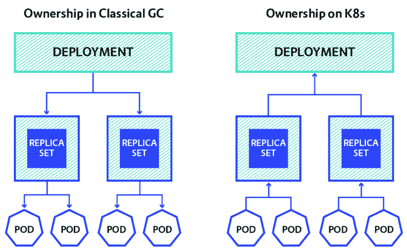

# Kubernetes 对象的删除和垃圾收集

> 原文：<https://thenewstack.io/deletion-garbage-collection-kubernetes-objects/>

[](https://github.com/moretea)

 [马尔滕·胡根多尔恩

马尔滕是集装箱解决方案公司的一名工程师，在那里他帮助客户处理集装箱、建造系统、编制人员和 CI/CD 管道。Maarten 喜欢用 Rust 编程，喜欢用 Nix 以声明方式构建/部署软件。他还组织了阿姆斯特丹 Nix 和 Rust 会议。](https://github.com/moretea) [](https://github.com/moretea)

有了 [Kubernetes](/category/kubernetes/) 容器编排引擎，概念和对象建立在彼此之上。我们之前描述的一个例子是[部署如何构建在副本集](https://thenewstack.io/kubernetes-deployments-work/)之上以确保可用性，副本集如何构建在 pod 之上以免费获得调度。

当我们删除一个部署时，到底会发生什么？我们不仅希望删除部署本身，还希望删除由部署管理的副本集和 pod。

垃圾收集(GC)解决了这个问题。在 Kubernetes 1.8 中引入 GC 之前，这是由客户端处理和/或硬编码在特定资源的控制器中的。显然，在删除部署及其组件的过程中，客户端可能会中途失败，使系统处于不稳定状态，之后必须手动清理。对于不要求操作员可靠工作的系统来说并不理想。

所以，回到垃圾收集。关于编程语言，你可能已经听说过了。

垃圾收集的经典算法[标记并清除](https://en.wikipedia.org/wiki/Tracing_garbage_collection#Na.C3.AFve_mark-and-sweep)假设

1.  每个分配/对象知道它“拥有”哪些子对象
2.  当程序暂停时，我们可以检查“根集”(例如，哪些变量在范围内)。

然后，收集过程通过以下方式进行:

1.  1.  暂停程序执行，
    2.  从根集开始，将当前位置的所有可达引用标记为“活动的”，
    3.  遍历所有分配，
        1.  释放那些死去的人，
        2.  将幸存者标记为“死亡”，为下一轮 GC 做准备。

下面的动画展示了这是如何工作的。

## Kubernetes 的所有权

Kubernetes 也有一个垃圾收集系统，但它的工作方式正好相反！在经典的 GC 中，每个对象都知道它拥有哪些其他对象(下图左边)，但是在 Kubernetes 中，被拥有的对象包含对其所有者的 OwnerReference。



让我们看看这些引用在实践中是什么样子的。

通过 [kubectl](https://kubernetes.io/docs/reference/kubectl/overview/) run 创建一个部署，如下所示。这将导致部署控制器创建一个带有一个副本的副本集(这意味着它将只启动一个 pod)。

```
$  kubectl run my-nginx  --image=nginx

deployment  "my-nginx"  created

```

现在让我们检查复制集的所有者引用。(如果你想知道部署、副本集和 pod 之间的关系，[查看我们之前的帖子](https://thenewstack.io/kubernetes-deployments-work/)。)

```
$  kubectl get replicaset  -l"run=my-nginx"  -o  json  |  jq  ".items[0].metadata.name, .items[0].metadata.ownerReferences"

"my-nginx-85584476c8"

[
   {
     "apiVersion":  "extensions/v1beta1",
     "blockOwnerDeletion":  true,
     "controller":  true,
     "kind":  "Deployment",
     "name":  "my-nginx",
     "uid":  "6e047451-cdca-11e7-83b5-080027d7dd6b"
   }
]

```

**注意**:我们在这里使用了非常方便的 [jq 实用程序](https://stedolan.github.io/jq/download/)来获得我们想要的输出。我们得到了 ReplicaSet 对象的 metadata.name 和 metadata.ownerReferences。

是的，我们可以看到副本集对象设置了 metadata.ownerReferences，并且所有者是名为“my-nginx”的部署。

现在，对于与部署相关联的 pod:

```
$  kubectl get pod  -l"run=my-nginx"  -o  json  |  jq  ".items[0].metadata.ownerReferences"
[
{
"apiVersion":  "extensions/v1beta1",
"blockOwnerDeletion":  true,
"controller":  true,
"kind":  "ReplicaSet",
"name":  "my-nginx-85584476c8",
"uid":  "6e04f916-cdca-11e7-83b5-080027d7dd6b"
}
]

```

我们确实看到所有者是名为“my-nginx-85584476c8”的副本集

## 删除对象:三种变体

通过将删除请求的传播策略设置为下列选项之一，有三种不同的方法可以删除 Kubernetes 对象:

*   **前台:**在删除其拥有的所有对象之前，不能删除对象本身。
*   **后台**:对象本身被删除，之后 GC 删除其拥有的对象。
*   **孤立**:对象本身被删除。拥有的对象是“孤立的”删除对所有者的提及。

让我们看看如何调用它们！不幸的是，kubectl 目前不支持设置传播策略。我们需要直接访问 Kubernetes 的 API 服务器来设置传播策略。

访问 API 服务器的一个简单的解决方案是通过 kubectl 代理命令，它将处理所有请求的认证。

启动 kubectl 代理，并在执行 curl 请求时保持其运行:

### 前台策略

要使用前台传播策略删除对象，请运行以下 curl 命令:

```
'{"kind":"DeleteOptions","apiVersion":"v1",<strong>"propagationPolicy":"Foreground"</strong>}'  -H  "Content-Type: application/json"

```

它会以类似于下面的输出(我删除了一些不相关的输出)来响应

```
{
"kind":  "Deployment",
"apiVersion":  "extensions/v1beta1",
"metadata":  {
"name":  "my-nginx",
"creationTimestamp":  "2017-11-20T08:35:51Z",
"<strong>deletionTimestamp":  "2017-11-20T08:36:04Z"</strong>,
"finalizers":  [
<strong>"foregroundDeletion"</strong>
]
},

"spec":  {  …  }
"status":  {
"observedGeneration":  1,
"replicas":  1,
"updatedReplicas":  1,
"readyReplicas":  1,
"availableReplicas":  1,
"conditions":  [
{
"type":  "Available",
"status":  "True",
"lastUpdateTime":  "2017-11-20T08:35:51Z",
"lastTransitionTime":  "2017-11-20T08:35:51Z",
"reason":  "MinimumReplicasAvailable",
"message":  "Deployment has minimum availability."
}
]
}
}

```

如您所见，现在有一个 deletionTimestamp，它将对象标记为对用户只读。此外，还添加了终结器列表。Kubernetes 可以应用于对象的唯一操作是删除终结器并更新其状态。foregroundDeletion 终结器由垃圾收集系统处理，该系统将在移除部署之前首先删除副本集。一旦移除了所有终结器，对象本身也将从 Kubernetes 中移除。

### 背景政策

背景删除要简单得多。

```
curl  -X  DELETE localhost:8080/apis/extensions/v1beta1/namespaces/default/deployments/my-nginx  -d  '{"kind":"DeleteOptions","apiVersion":"v1",<strong>"propagationPolicy":"Background"</strong>}'  -H  "Content-Type: application/json"
{
"kind":  "Status",
"apiVersion":  "v1",
"metadata":  {  },
"status":  "Success",
"details":  {
"name":  "my-nginx",
"group":  "extensions",
"kind":  "deployments",
"uid":  "665086e3-cdcd-11e7-83b5-080027d7dd6b"
}
}

```

它只是删除部署本身，之后 GC 系统必须指出副本集的所有者被删除了。然后，副本集被垃圾收集。

### 孤儿政策

删除对象的最后一个选项是使用孤立传播。这将从副本集中删除 ownerReferences，并删除部署。

```
curl  -X  DELETE localhost:8080/apis/extensions/v1beta1/namespaces/default/deployments/my-nginx  -d  '{"kind":"DeleteOptions","apiVersion":"v1",<strong>"propagationPolicy":"Orphan"</strong>}'  -H  "Content-Type: application/json"
{
"kind":  "Deployment",
"apiVersion":  "extensions/v1beta1",
"metadata":  {
"name":  "my-nginx",
"creationTimestamp":  "2017-11-20T08:55:07Z",
<strong>"deletionTimestamp":  "2017-11-20T08:55:34Z"</strong>,
"finalizers":  [
<strong> "orphan"</strong>
]
},

"spec":  {  ...   },
"status":  {
"observedGeneration":  1,
"replicas":  1,
"updatedReplicas":  1,
"readyReplicas":  1,
"availableReplicas":  1,
"conditions":  [
{
"type":  "Available",
"status":  "True",
"lastUpdateTime":  "2017-11-20T08:55:07Z",
"lastTransitionTime":  "2017-11-20T08:55:07Z",
"reason":  "MinimumReplicasAvailable",
"message":  "Deployment has minimum availability."
}
]
}
}

```

我们现在检查所有部署、副本集和容器。在输出中，我们只看到副本集和 pod，没有部署:

```
$  kubectl get deploy,rs,pod

NAME                      DESIRED    CURRENT    READY      AGE

rs/my-nginx-85584476c8    1          1          1          1m

```

```
NAME                            READY      STATUS     RESTARTS    AGE

po/my-nginx-85584476c8-gphf8    1/1        Running    0           1m

```

事实上，所有者引用已经从副本集中删除……

```
$  kubectl get rs  -o  json  |  jq  ".items[0].metadata.ownerReferences"

null

```

想了解更多？查看 Kubernetes 参考手册中关于垃圾收集的章节。

<svg xmlns:xlink="http://www.w3.org/1999/xlink" viewBox="0 0 68 31" version="1.1"><title>Group</title> <desc>Created with Sketch.</desc></svg>