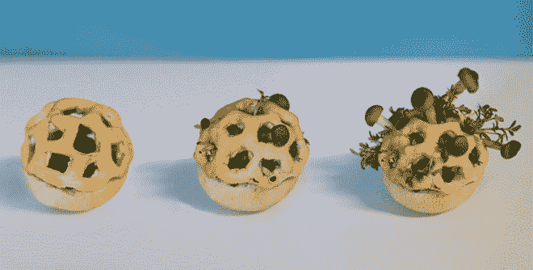
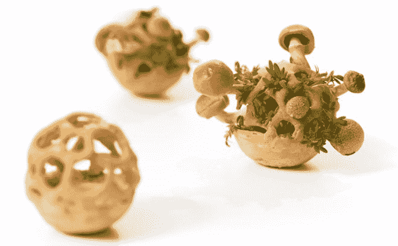
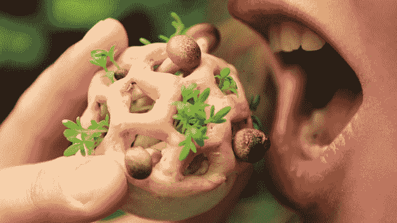
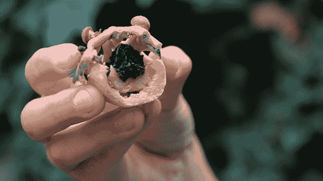

# 美味营养的 3D 打印食品代表了一种新的饮食方式

> 原文：<https://thenewstack.io/delicious-and-nutritious-3d-printed-food-represents-a-new-way-of-eating/>

这些不是典型的数字化制作的披萨和墨西哥卷饼，而是 3D 打印的活食物，通过发酵和光合作用自然成熟为美味的食物。3D 打印食物的想法通常不会让人联想到健康有益的食物；相反，我们更可能想到比萨饼、墨西哥卷饼和巧克力。但是，这项已经有望改变[医疗假肢](https://thenewstack.io/robo-prosthetics-for-the-masses-is-a-future-ready-to-happen/)和[建筑行业](https://thenewstack.io/emerging-objects-3d-printing-pioneers-will-build-houses-salt/)的技术，是否也能改变我们所知的食品行业，同时提供每个人所需的营养？

这是设计师 Chloé Rutzerveld 的希望，她刚刚从[埃因霍温理工大学](http://www.tue.nl/)毕业。她与来自该大学和[荷兰应用科学研究组织](https://www.tno.nl/en/)的增材制造专家、生物技术专家和科学家合作，开发了可食用生长，这是一种“未来食品”概念，用于数字化制造她所谓的“健康和可持续食品”，使用真菌和豆芽等活体生物进行 3D 打印。这个概念是打印一个可食用的基础，也作为蘑菇和美味植物食物的生长介质，最终生长成健康美味的一口大小的食物。

## 为更健康的食物打印活的有机体层

这些小小的烹饪美食是如何创造出来的:可食用的种子、孢子和酵母层根据口味定制，然后数字化打印。五天之内，植物和孢子成熟，酵母也成熟，将固体内部发酵成液体。在食用之前，根据消费者所需的风味强度，允许小块自然发展。

这里对自然过程的依赖要多得多，如发酵和光合作用，这使得可食用的生长成为一种有趣的垃圾食品，我们已经看到了由披萨打印原型机器提供的垃圾食品，如 Foodini 和墨西哥卷饼，它们在形式和颜色上比真正的营养价值更具新奇吸引力。这就是为什么食用增长项目引人注目——它解决了 3D 打印行业目前缺乏营养食品的问题，提出了一些狂热的健康食品爱好者甚至可能会热衷的东西。因为你不能用比萨饼养活世界，这种方法最终可能成为[解决世界饥饿](http://www.huffingtonpost.com/2013/05/22/3d-food-hunger_n_3319696.html)的一种方式，并以有限的资源可持续地养活不断增长的人口。

不仅有更好的整体营养价值的潜力，还有彻底改革和缩短食品工业供应链的潜力。这种食品是按需印刷的，所需原材料的精确数量可以在无菌、可回收的包装中获得。这消除了对大量耕地、预包装、防腐剂、配送和储存的需求，几乎没有食物浪费。在温度受控的无菌环境中，通过在可重复使用的包装内印刷食品，将任何污染风险降至最低。

 

## 技术与美食的未来融合

除了彻底改革低效和浪费的食品系统的可能性，这些蘑菇和豆瓣菜的生活珍馐也有一点美食的声望，因为技术与生活食品的结合是我们以前从未见过的。Rutzerveld 的可食用食品从不知情的测试者和厨师那里获得了很多关于味道和外观的积极评价，她认为这种技术与美食的融合可以开辟烹饪表达和欣赏的新途径。

“我非常确信，我们可以用全新的生产方法创造出全新的产品，这些方法是全新的、令人惊讶的，但完全是天然的、健康的，不含添加剂，只需利用和结合不同学科的人们(厨师、微生物学家、食品技术专家、设计师)多年来积累的大量知识。”

> 然后，我们使用新技术作为工具来促进或增强自然。

Rutzerveld 指出，由于许多人越来越意识到他们吃什么以及如何生产——对“纯净、自然和健康的食品”的需求越来越大——像可食用生长这样的产品将在对食品和健康的看法不断演变的过程中流行起来。

> 因为产品在消费者家中成熟，人们可以在喜欢的阶段收获自己的产品，他们变得更加投入，更加注意自己吃的食物。

新的生产方法可以制造不同的质地、结构和分子组成，这可能需要新的饮食方式。

由于时间和资金的限制，可食用的生长概念仍在研究和开发中，因此还没有真正的打印机来打印这些在家中生长并成熟为成熟健康食品的活体食物。该团队的大部分测试涉及可行的种子，可食用的繁殖地，发酵过程和蘑菇来完善这一过程。但这个想法引起了那些相信 3D 打印技术有一天会改变我们生产和食用食物的方式的人的共鸣——希望是更健康的方式。在 Chloé Rutzerveld 了解更多信息。

所有图片通过 chloéRutzerveld[。](http://www.chloerutzerveld.com/)

<svg xmlns:xlink="http://www.w3.org/1999/xlink" viewBox="0 0 68 31" version="1.1"><title>Group</title> <desc>Created with Sketch.</desc></svg>