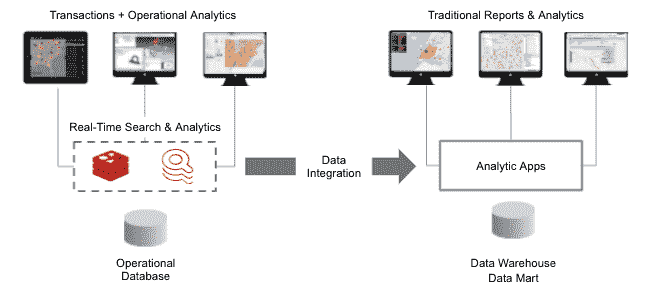

# 以交易的速度提供搜索和分析

> 原文：<https://thenewstack.io/deliver-search-and-analytics-at-the-speed-of-transactions/>

 [阿希什·萨胡

阿希什是 Redis 的产品和解决方案营销主管。他在推出内存数据库、大数据、分析和人工智能产品方面拥有丰富的经验。](https://www.linkedin.com/in/ashishksahu/) 

颠覆性的力量正在改变商业的速度。数据驱动型文化、客户期望和数字颠覆者的结合正迫使企业加快步伐，变得更加敏捷，否则将面临失去客户的风险。光玩追赶是不够的。公司需要超越数字颠覆者。

与此同时，数字化、物联网、社交媒体和移动设备正在实时产生大量数据。而且越来越大。 [IDC](https://www.forbes.com/sites/tomcoughlin/2018/11/27/175-zettabytes-by-2025/#5755f2a05459) 估计，到 2025 年将有 175 zettabytes 的数据，并且所有创建的数据中有近 30%将是实时的(相比之下，2017 年为 15%)。

不幸的是，这些数据大多被锁定在速度缓慢、基于磁盘的数据库中，不支持实时的消费级体验。他们的交易系统是最适合订单输入、金融交易、CRM 和零售销售的数据库，但不适合搜索和分析。到目前为止，数据仓库一直是首选的解决方案，但它们往往太慢，因为它们需要成批准备、加载和分析新数据。太多的时间和金钱被投入到数据建模和复制数据中。在此期间，您需要数据来回答的问题将会发生变化，数据和 ETL 将不支持新的问题。您需要一个集成的视图来打破这些孤岛，同时包括消费者生成的数据和移动数据。

## **为搜索和分析构建新的数据堆栈**

今天，捕获流数据的技术使得捕获和存储事件数据变得容易，但处理是一个完全不同的挑战。现代搜索和分析系统可以更好地处理流数据，而不是传统的仓库。

大多数企业有数百个应用程序，其中大多数是关键业务和客户数据的来源。为了支持性能和可伸缩性，这些事务系统与分析系统是分开的。您必须在缓慢的及时分析和运营洞察之间做出选择，或者升级到全新的 translytical/hybrid transactions analytics(HTAP)堆栈。但是，您能在不破坏现有数据基础架构的情况下添加运营分析吗？通过使用缓存原理重新构建您的数据堆栈，现在可以采用低中断或无中断的现代化方法，借助内存架构将您的数据保存在单独的系统中。

实现这一点的一个方法是利用像我们自己的 [RediSearch](https://oss.redis.com/redisearch/index.html) 这样的产品，它将 [Redis](https://redis.io/) 转变为一个强大的内存搜索和分析平台。它允许您快速创建数据索引，并使用增量索引方法来快速创建和删除索引。索引可以让你以闪电般的速度查询数据，执行复杂的聚合，并根据属性、数值范围和地理距离进行过滤。

RediSearch 支持多种语言的全文索引和基于词干的查询扩展。它提供了一种丰富的查询语言，可以执行文本搜索以及复杂的结构化查询。此外，您可以通过使用“模糊”搜索实现自动完成建议来丰富搜索体验。

对于分析而言，最重要的是，这些功能使 RediSearch 能够支持对业务时刻的实时响应。这可以让使用这种架构的企业保持最新的客户行为、竞争对手的价格、出货量或其他快速变化的数据，以便进行实时分析。所有这些场景的关键在于，数据没有被用于事后洞察。相反，新数据会立即得到处理，并由实时应用程序使用以采取行动。

## **新的实时架构**

为了利用这种架构，开发人员可以从一小组可用于关键业务洞察的事务性数据源开始。您可以使用直写或后写策略来维护搜索和分析层的一致性。此外，使用驱逐策略，如最近最少使用(LRU)、最少使用(LFU)或生存时间(TTL)，以控制数据的大小。这种搜索和分析与操作数据库的分离不仅可以卸载生产系统，还允许您扩展和分发搜索索引，从而从根本上提高性能。

## **用例**

上述方法是用于实时和接近实时数据的理想解决方案，通过搜索结构化和非结构化数据(全文搜索)来发现不明显的见解，从而做出时间敏感的运营决策。然而，它的高性能搜索和分析也可以提高非实时战术和客户体验场景的质量。主要使用案例包括:

*   **分秒必争的实时应用**，如股票交易、欺诈检测或患者健康监测。
*   **需要快速交互的移动应用**。移动应用需要来自多个堆栈的实时数据，以提供客户、产品、员工或业务的 360 度视图。
*   **集成业务数据至关重要的微服务和互联数据应用**。ETL 不能交付实时的变化，但是这个架构可以通过交付关键业务数据的实时、可信的视图来克服这个问题，确保信息来源的准确性。

在电信、金融服务、零售和医疗保健等行业，由于数字化、移动应用程序、物联网和其他因素的总体趋势，组织必须承受的工作负载正在呈爆炸式增长。这些业务的极端竞争性质要求在超大规模计算核心的低成本、基于商用硬件的设置之上支持超高端需求。

## **总结**

参与全球级数字业务计划的应用领导者应战略性地采用超大规模架构，用于公共云和私有云部署的大规模、高性能和高可用性应用。

今天的企业是一系列实时事件。但是区分优秀和伟大的是他们如何捕捉和操作这些数据。随着时间的推移，优秀的企业会利用数据做出明智的决策。伟大的企业运营数据以实时自动采取行动。

<svg xmlns:xlink="http://www.w3.org/1999/xlink" viewBox="0 0 68 31" version="1.1"><title>Group</title> <desc>Created with Sketch.</desc></svg>