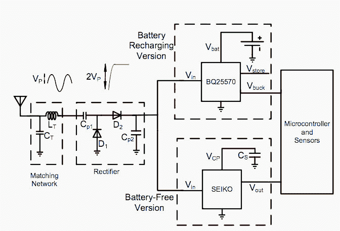
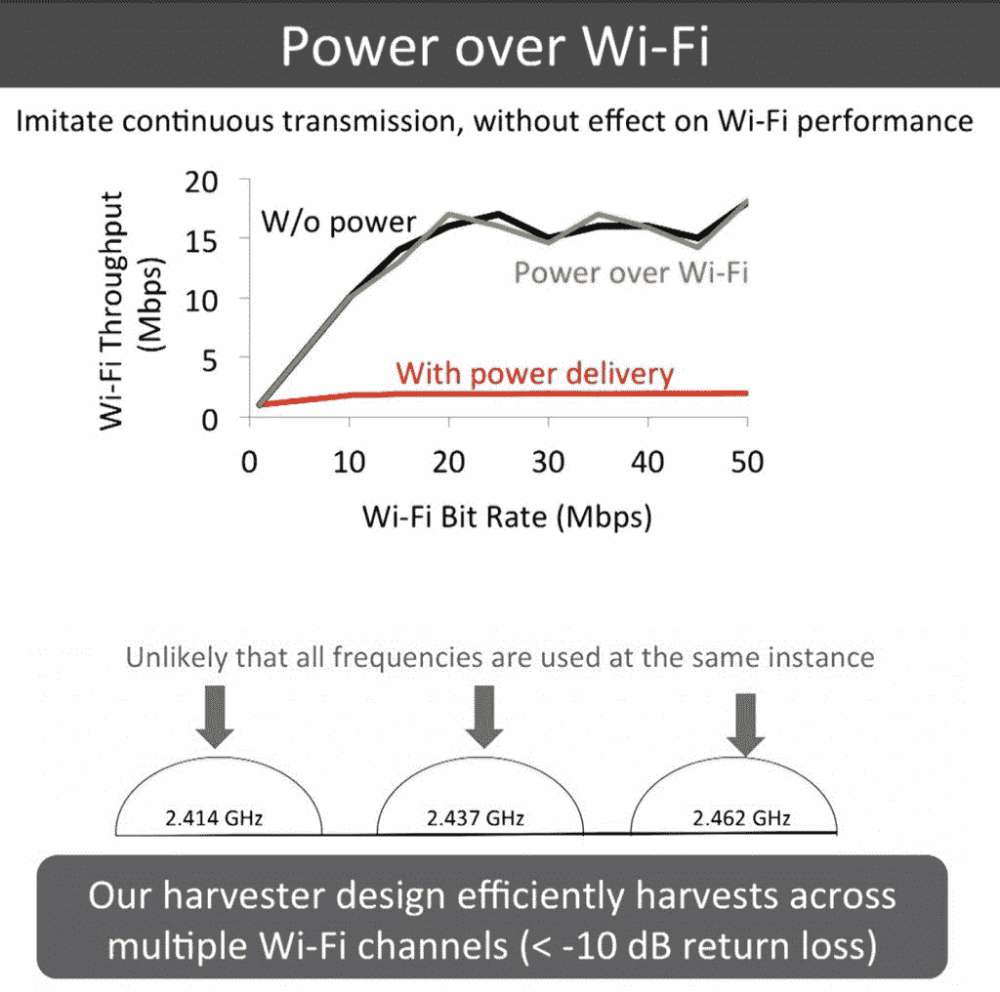
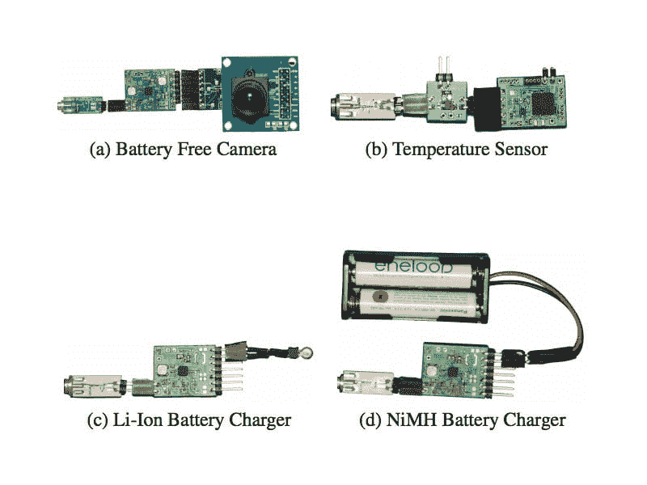
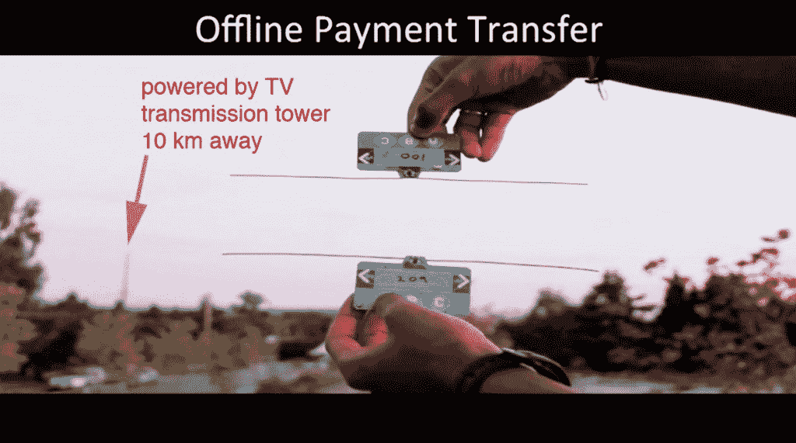
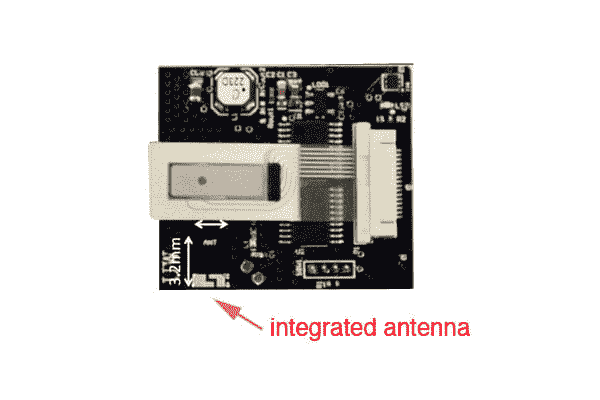

# 通过 Wi-Fi 信号为下十亿台设备供电，无需电池

> 原文：<https://thenewstack.io/delivering-power-with-wi-fi-signals-to-the-next-billion-devices-no-batteries-required/>

“WiFi 供电”:研究人员发现了一种方法，可以利用 Wi-Fi 信号中的能量为设备供电，同时传输数据，而这一切都不需要电池。

我们许多人认为收音机、智能手机和其他形式的无线通信是理所当然的。[无线计算机网络](https://en.wikipedia.org/wiki/Wi-Fi)——也称为 WLAN(无线局域网)和 Wi-Fi——是另一项普及的无线技术，我们现在可以毫不犹豫地走进图书馆或咖啡馆，连接到互联网。

但是根据华盛顿大学的一组研究人员的说法，Wi-Fi 有朝一日也可能成为一种广泛使用的电源，他们已经开发出无需电池就能运行的电子设备，只使用 Wi-Fi 信号的[环境反向散射](https://en.wikipedia.org/wiki/Ambient_backscatter)来运行它们。

## Wi-Fi:电源和通信媒介

这个概念被称为“PoWiFi”，是“Wi-Fi 供电”的缩写这个想法是收集现有的无线信号，并将它们转换成直流电压，为无电池设备供电，甚至在不需要插入式充电器的情况下为电池充电——所有这些都不会影响通信性能。该团队的发现发表在题为“[用 Wi-Fi 为下一个十亿设备提供动力](http://arxiv.org/pdf/1505.06815v1.pdf)的论文中，正如计算机科学与工程助理教授 Shyamnath Gollakota 在最近的 [EmTech Digital talk](http://www.technologyreview.com/emtech/digital/15/video/watch/shyam-gollakota-power-unplugged/) 中解释的那样:

> 我们的想法是利用现有的无线信号。我们不断受到广播、电视、手机和无线信号的轰炸。我们的研究表明，我们可以从这些信号中获取少量的能量，几十微瓦的能量。我们的研究表明，这个数量足以进行计算和感知。

RFID(射频识别)技术和其他 Wi-Fi 供电项目已经在探索类似的领域，但华盛顿大学的团队率先研究了无电池设备如何同时通过 Wi-Fi 供电和通信。该团队选择 Wi-Fi 作为电源，而不是电视信号，因为它更强，在室内几乎无处不在，而且鉴于 Wi-Fi 的规模经济，它更便宜。

“我们已经有了一个巨大的 Wi-Fi 基础设施，”[团队成员瓦姆西·塔拉(Vamsi Talla)说，他是华盛顿大学的博士生。“如果我们能够将现有基础设施重新用于电力传输，那么我们就可以在家庭和办公室中实现无线电力传输。”](http://www.popsci.com/your-wireless-internet-could-power-your-future-devices)

在他们的实验中，研究小组修改了现有的 Wi-Fi 芯片组——旨在从无线信号中获取信息——以收集这些信号中的能量。这种经过改进的“收割机”可以在多个 Wi-Fi 信道上高效地收集能量，同时最小化[回波损耗](https://en.wikipedia.org/wiki/Return_loss)。然后使用[整流器](https://en.wikipedia.org/wiki/Rectifier)将其转换为直流电压，并使用[直流-DC 转换器](https://en.wikipedia.org/wiki/DC-to-DC_converter)进行升压，以满足设备的电源需求。

PoWiFi 收割机示意图

## Wi-Fi 供电，不影响网络性能

然后解决了这些无电池原型机和现有 Wi-Fi 设备之间的无线通信问题。这就是“环境反向散射”再次派上用场的地方，因为这些额外的传输可以“搭载”在已经被设备反射或吸收的现有 Wi-Fi 数据包上。研究小组发现，这种“Wi-Fi 反向散射”交换只使用了 9 微瓦的功率，而不是消耗 Wi-Fi 通信通常所需的数百微瓦。

但研究人员也发现了一个权衡:更高的功率传输意味着更低的 Wi-Fi 性能，因为路由器通常在单个频道上突发广播。一旦广播停止，电压就会下降。因此，问题是如何在不影响网络性能的情况下同时提供稳定的电源。答案是“欺骗”路由器在多个通道上发出连续的“噪声”传输，为设备提供连续的电源，同时仍然允许它进行通信，并且显然不会对数据速率产生明显的干扰。正如研究员布莱斯·凯洛格[解释](http://bgr.com/2015/06/08/iphone-wireless-charging-PoWiFi-wi-fi-router/) :

如果我们想尽可能多地释放能量，那将会切断你的无线网络，因为你会一直在频道上通电。我们优化了路由器，以便我们可以向传感器提供看似恒定的功率，而不会对您的 Wi-Fi 造成太大影响。我们不是在您的一个 Wi-Fi 频道上持续供电，而是在您的三个不重叠的 Wi-Fi 频道之间进行分配。这使我们能够提供大约相同的功率，而不会对任何一个通道产生太大影响。

【T2

到目前为止，该团队已经能够为传感器摄像头和温度传感器供电，此外还可以为小型锂离子硬币电池和镍金属氢化物电池充电，电流范围可达距离路由器 28 英尺的距离。

在另一项实验中，该团队能够在两张原型支付卡之间转移离线支付，使用 10 公里外的电视发射塔为交易提供动力。

由于他们之前的实验使用了一个相当笨重的 2dBi Wi-Fi 天线，他们现在正致力于创建一个更小的天线(下面的原型图像)，它将被集成到手机的微控制器中。

## 超越“免费”的权力和交流

虽然该团队承认 PoWi-Fi 还不能满足今天智能手机的当前功率要求，但设计师可以将环境反向散射的使用纳入未来的无电池设备。至少可以说，无论如何，这种技术的意义是惊人的。环境反向散射技术将使用现有的广泛的 Wi-Fi 基础设施实现“免费”供电和通信，无疑将是发展中国家的一大福音，因为在这些国家，可靠的电网电力可能是一个问题。

它可能超越移动设备，有朝一日用于家具和电器:PoWiFi 可以提供运行所需的能量，并处理来自综合物联网的数据，传感器不再依赖电池供电或发送信息。有了特别设计的“Wi-Fi 反向散射”标签，某些医疗检测设备和程序可能会变得无接触和更便宜。

但是和 [RFID 技术](https://en.wikipedia.org/wiki/Radio-frequency_identification#Problems_and_concerns)一样，PoWiFi 可以打开一系列安全和隐私问题的大门，从潜在的侵入性数据收集、[秘密监视](https://www.aclu.org/blog/newest-school-rfid-scheme-reminder-technologys-surveillance-potential)，到无法控制的[洪水](https://student.societyforscience.org/article/data-flood)数据耗尽。尽管有这些可能的缺点，但未来所有设备的供电和连接都是无线的，这可能是非常积极的，使所谓的“[免费能源](https://rt.com/news/170468-tesla-tower-rebuild-project/)的难以实现的梦想成为现实。请阅读“[用 Wi-Fi 为下十亿台设备供电](http://arxiv.org/pdf/1505.06815v1.pdf)”了解更多信息，并观看 [EmTech Digital talk](http://www.technologyreview.com/emtech/digital/15/video/watch/shyam-gollakota-power-unplugged/) 。

<svg xmlns:xlink="http://www.w3.org/1999/xlink" viewBox="0 0 68 31" version="1.1"><title>Group</title> <desc>Created with Sketch.</desc></svg>