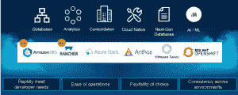

# 戴尔缓解开发人员在多云中面临的存储挑战

> 原文：<https://thenewstack.io/dell-eases-developer-storage-challenges-in-multiclouds/>

戴尔技术公司更加关注开发人员和开发人员，这是本周其 [Apex 即服务](https://www.delltechnologies.com/en-us/apex/index.htm)产品组合更大规模扩展的一部分，旨在为管理和保护数据提供更强大的[多云](https://thenewstack.io/the-4-definitions-of-multicloud-part-1-data-portability/)功能。

多云环境的快速增长为企业带来了挑战，包括当他们利用多个公共云时管理、保护和访问数据，这可能导致更多的数据孤岛和更高的成本。与此同时，开发人员发现自己被无数的编程工具和手动任务淹没，占用了他们实际编写代码的时间。

“我们都知道这是一个多云的世界，”戴尔产品管理副总裁[凯特琳·戈登](https://www.linkedin.com/in/caitlinmgordon/)告诉新堆栈。“这是我们的现实。…一个没有被谈论的群体是开发人员，[这]显然是任何云战略对话的一个重要部分。我们发现——我们在内部也看到了这一点——没有正确结构的开发人员无法高效工作，也无法获得他们需要的速度。如果您的开发人员没有速度，您的整个数字化转型和业务转型计划可能会不幸受阻。”

## **多云采用**

拥抱多云环境是许多此类数字化转型工作的核心部分。根据戴尔委托的 Forrester Research 报告，83%的组织已经采用或计划在未来 12 个月内采用这种方法。这与类似报告中的发现相吻合。RightScale 的 [2021 年云状态](https://info.flexera.com/CM-REPORT-State-of-the-Cloud?lead_source=Website%20Visitor&id=Flexera.com-PR)报告发现，92%的调查受访者表示他们有多云战略；80%的受访者表示他们正在采用混合云方法。

Gordon 说，多云的趋势给开发人员带来了复杂性，他们只花了大约 16%的时间编写代码。一个关键问题是，没有一个自动化的管道可供他们使用一套独特的工具和服务来完成整个 DevOps 周期。

她说:“如果没有这些东西，他们就会花时间去做手工作业。“他们在寻找服务并解决它，甚至是一个简单的过程，比如发现一个 bug 并重写代码。如果您必须手动操作，则需要额外的周期来进入该站点并找到它，然后进入该站点。真的是那个手动任务。这些都不是廉价资源。”

## **选择过多**

戈登说，在多云世界中，企业面临的挑战是“理解他们为开发人员提供的工具和服务的过多选择，并能够简化这种环境”。

戴尔已经有了一系列以开发人员为中心的产品，本周还在扩展这些产品。该供应商提供 DevOps 就绪平台，这些平台已经可以在 [Microsoft Azure](https://thenewstack.io/azure-arc-is-developing-into-a-full-hybrid-infrastructure-system/) Stack HCI、 [VMware 的 Tanzu Kubernetes 产品组合](https://thenewstack.io/vmware-extends-tanzu-support-for-nvidia-ai-enterprise/)和戴尔的 VxRail 超融合基础架构(HCI)上找到。戈登说，戴尔还与[红帽及其 OpenShift 技术](https://thenewstack.io/what-red-hats-purchase-of-stackrox-means-for-openshift-security-and-observability/)合作。

现在，戴尔通过在戴尔的 PowerStore 全闪存存储和 PowerFlex 软件定义的存储产品中提供亚马逊 EKS 随处部署选项，增加了对这些选项的支持。EKS Anywhere 使企业能够使用 VMware 的 vSphere 在内部创建和运行 Kubernetes 集群，并连接回[亚马逊 Web 服务(AWS)云](https://thenewstack.io/aws-pushes-forward-its-custom-chip-efforts-with-graviton3/)。VxRail 上已经支持了。

此外，戴尔现在支持 VxRail 上的 SUSE Rancher 2.6，为在微软的 [Azure Kubernetes 服务](https://thenewstack.io/microsoft-azure-stop-and-start-kubernetes-clusters-like-pausing-a-video/) (AKS)、[谷歌 Kubernetes 引擎](https://thenewstack.io/google-launches-confidential-vms-gke-nodes-to-encrypt-data-in-use/) (GKE)和 EKS Anywhere 中运行的集群提供完整的生命周期管理支持，这将使组织能够在任何这些环境中混合和匹配容器解决方案。

戴尔技术专家副总裁 [Itzik Reich](https://www.linkedin.com/in/itzikreich/) 在[博客文章](https://www.delltechnologies.com/en-us/blog/empower-devops-with-on-premises-automation-for-multi-cloud-world/)中写道:“凭借在单个戴尔 DevOps-ready 平台上运行多个容器平台的灵活性，客户可以实现与公共云的无缝连接，并最终实现在 IT 流程和治理参数范围内轻松采用多云容器编排部署。”。

## **开发工具的一站式商店**

 Gordon 还表示，戴尔正在使其 API 和自动化框架产品组合更易于开发人员使用。戴尔提供其开发人员门户，作为开发人员、开发运维工程师、站点可靠性工程师和其他人员自动化基础架构部署和管理的单一平台。它还将包括戴尔的所有 API、文档和教程，“不仅使技术存在，而且使您有一个单一的地方，您知道您可以去，并能够在我们的支持下以代码的形式构建这个基础架构，”她说。

“我们已经在这个游戏中很多年了，但还没有谈论太多，”戈登说。“现在我们谈论得更多了，投资也更多了，我们的客户对我们的要求也越来越高。当我们看 DevOps 和开发人员时，我们真正关心的是如何让我们的核心客户的 it 部门真正成为支持他们的开发人员的 ITOps？"

## **简化数据管理**

在存储方面，戴尔的目标是简化多云环境中的数据管理。该供应商在 2020 年底推出了 Apex，这是一项基本上开始提供其整个产品组合即服务的计划。这是 It 行业更大趋势的一部分，在这一趋势中，成熟的供应商正在推动为组织的内部环境提供类似云的感觉，即更多的按需功能和按需付费的消费模式，并将其范围从内部数据中心扩展到云。

惠普企业公司(Hewlett Packard Enterprise)正在通过其绿湖项目做类似的事情，还有[、联想(与 TruScale)](https://thenewstack.io/lenovo-brings-the-cloud-on-prem-to-the-edge/) 、思科系统(Cisco+)和纯存储(纯即服务)。这是一个不断增长的空间，Statista 分析师预测，基础设施即服务市场的全球收入将从去年的 871 亿美元跃升至 2026 年的超过 2655 亿美元。

戴尔正在推出 Apex 多云数据服务，其中它将提供数据块、文件和对象存储服务以及数据保护服务，同时访问所有主要云。这是一项完全托管的服务，毗邻公共云，由 Equinix 等数据中心提供商合作伙伴通过低延迟连接进行部署。

通过该服务，企业可以选择他们想要的戴尔存储服务类型、要支付的带宽以及他们想要同时以任何组合连接到的公共云。

“你希望能够将数据保存在一个地方，但你希望利用不同的公共云服务，”她说。“我可能想在谷歌云中使用分析，我可能想在其他方面使用 AWS。您不必将数据放在两个地方，而是可以将数据放在一个地方，同时直接连接到两个云。”

## **备份服务和高山项目**

此外，戴尔还提供 Apex 备份服务，可提供简化的数据保护，以及对软件即服务(SaaS)应用程序、终端和混合工作负载的集中监控和管理。它可以按需扩展，并通过即时检测、快速响应和加速恢复来防范网络攻击。

戴尔还推出了 Project Alpine，这是存储产品组合的一个扩展，将使戴尔的块和文件存储软件平台在公共云中可用，使企业能够使用现有的云信用购买软件作为托管服务，从而为企业提供一致的内部和云中存储环境，使他们能够在这些环境中共享数据并降低总体成本。

<svg xmlns:xlink="http://www.w3.org/1999/xlink" viewBox="0 0 68 31" version="1.1"><title>Group</title> <desc>Created with Sketch.</desc></svg>