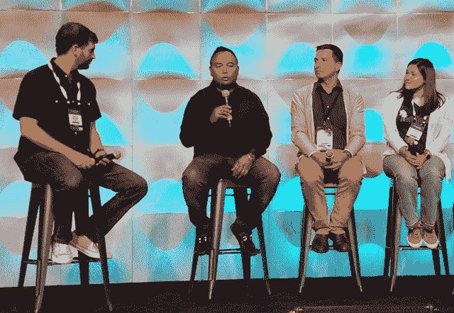

# 借助 REX-Ray，戴尔支持容器存储接口规范

> 原文：<https://thenewstack.io/dells-amazing-scheme-bridge-containers-persistent-volumes/>

“没有无状态架构这种东西，”一张演示幻灯片宣称，毫无疑问，无状态架构的大多数支持者都看过这张幻灯片。这是去年 5 月举行的戴尔 EMC World 会议的[背景，它为戴尔技术如何在集装箱化的开源世界和其](https://www.slideshare.net/codedellemc/deep-dive-on-rexray-libstorage-and-the-container-storage-interface-clinton-kitson-dell-emc-world-2017) [Isilon 横向扩展](https://www.dellemc.com/en-us/storage/isilon/index.htm#collapse=)网络连接存储和 [ScaleIO](https://www.dellemc.com/en-us/storage/scaleio/index.htm#collapse=) 软件定义的数据块存储的专有世界之间搭建桥梁设定了主题。

现在，戴尔新的 [{code}](http://web.archive.org/web/20180220231349/https://thecodeteam.com/) 开源部门(用花括号括起来)完成了一个关键阶段的工作，这个项目可能会成为企业容器化持续成功的一个至关重要的项目，将容器带出无状态的领域。

名为 [REX-Ray](https://github.com/rexray/rexray) ，它已经发展成为开源[容器存储接口](https://github.com/container-storage-interface/spec) (CSI)的第一个稳定的工作模型，这是一个定义行业存储标准的努力，它将使存储供应商能够[开发一个插件，并让它跨多个容器编排系统](https://github.com/container-storage-interface/spec/blob/master/spec.md)工作。实际上，CSI 将是“一个独立于供应商的存储协调引擎”虽然它的目标是将 Kubernetes、Mesos 和 Docker Swarm 与世界上主要的存储平台结合起来，但完全实现这一目标——根据其设计师的说法——将意味着 REX-Ray 将完全退出画面并不复存在。

这是集装箱存储的媒人。如果这场婚姻最终是天作之合，那么企业会在意它是否违反了[臭名昭著的 12 个因素](https://thenewstack.io/12-factor-app-streamlines-application-development/)中的一个或多个吗？

## 这种持续的需求

企业 IT 经理在过去四年中一直在问的问题，今天仍然在问:如果容器化应该是取代自包含、虚拟机管理程序驱动的虚拟机的这种引人注目的新架构，那么他们为什么没有解决对持久存储的普遍支持问题？

有一个答案，而且是一个架构问题:虚拟机很少或根本没有解决存储卷的问题，因为它们安装的应用程序是由完整的操作系统执行的。在那里，使存储卷可由物理服务器寻址的驱动程序在虚拟环境中运行得非常好。怀疑论者引用的许多表明容器化不成熟的组织问题，只有在虚拟机领域才能“解决”,因为虚拟机是物理服务器的快照。

根据设计，分布式应用程序不能是运行在单个处理器上的程序的快照。这是容器化最初出现的一个重要原因:虚拟机不可扩展。但是，随着主流企业采用者要求兼容性和与数据库的永久链接，被认为是容器流行的设计伦理——无状态、可移植、12 因素模型——已经退居次要位置，或者可能已经爬进了主干。他们通常不知道现在这叫做“有状态”，但这仍然是他们所要求的。

“我认为这是一个很大的市场领域，它阻碍了容器的广泛采用，”戴尔技术公司的技术副总裁 Joshua Bernstein 说，他今年早些时候在洛杉矶的开源峰会上与 TNS 进行了交谈。

“还记得我们说，‘哦，12 个因素，微服务，我们要做所有这些！“存储，我们要做无状态应用吗？”事实是，绝大多数真正的应用程序需要存储状态。我想在容器中运行 MySQL，或者在容器中运行 Cassandra，我想做这些事情。所以我必须解决这个问题。"

在洛杉矶开源峰会期间，Bernstein 主持了一个 Mesos 用户小组，其中包括金融服务巨头摩根大通的首席技术官 [Michael Aguiling](https://www.linkedin.com/in/michaelaguiling/) 。Aguiling 从他的公司的角度解释了这个问题，描述了其当前的应用程序如何接收和处理来自 Spark 的数据和来自 Kafka 的消息——这是新兴的" [SMACK 栈](https://thenewstack.io/the-smack-stack-on-mesospheres-dcos-gives-retailers-a-path-to-leave-amazon/)中的两个主要组件。

戴尔技术副总裁 Josh Bernstein[左]与摩根大通首席技术官 Michael Aguiling 一起主持小组讨论[发言]；奥迪分析主管斯特凡·鲍尔(Stefan Bauer)；和 Cathy Daw，中间层的工程主管。

“这些有状态的数据服务仍然需要从某个地方获得数据，”Aguiling 说。“我们在 Hadoop 领域拥有高度安全的大型数据存储库。在大规模建立这种联系后，我们现在正朝着具有 GPU 能力的机器学习迈进。所有这些功能，在这个事情的发展过程中，需要时间，确保我们在所有这些功能中分层。

“在很长一段时间里，数据的生命周期都是未知的，”CTO 继续说道。“数据总是附属于数据库；它总是附加在应用程序上。但是，如果我可以在*中心*的适当位置获得数据，并且应用程序来来去去，那该怎么办呢？时而流，时而实时，时而批处理；但现在，数据成为核心焦点，应用程序和功能现在只是功能。”

## 日益严峻的挑战

从一开始，新的堆栈就涵盖了[容器网络接口](https://thenewstack.io/container-networking-landscape-cni-coreos-cnm-docker/) (CNI)的开发:容器被普遍认为是动态网络的组成部分的一种方式。同样，CSI 也是一种连接集装箱和存储平台的通用方法。

然而，CNI 和《犯罪现场调查》所攀登的山峰有很大的不同。物理和虚拟存储本身都是市场。回到桌面操作系统很重要的时候，Windows 有一项管理和维护无数存储驱动程序的令人羡慕的任务——通常是专有工具，有时由存储设备制造商提供，但通常由微软自己用胶带和打包线组装。

包含在容器映像中的最小化 Linux 内核没有这种令人生畏的责任。容器编制者(戴尔称之为“COs”)忙于维护自己的集群，无暇顾及大品牌设备。

“在虚拟机时代，虚拟机封装数据或文件系统，”Bernstein 解释道。“当虚拟机启动时，它可能会执行 NFS[*网络文件系统*]装载。对于容器来说，由于名称空间、安全性、隔离和其他类型的问题，情况可能不一定如此。此外，如果名称空间或端点发生变化，或者存储在不同类型的提供商之间——Amazon、on-prem、NFS 等——都必须进行抽象。你不希望容器说，‘现在我在 Google 上运行，所以现在我必须调用 Google API。’雷克斯-雷就是这么做的。"

艺术家雷克斯·雷的纸质拼贴作品出现在新墨西哥州圣达菲的特纳·卡罗尔画廊。[照片由迈克尔·卡罗尔拍摄，在知识共享 3.0 下发布]

以…命名

[a paper collage artist](http://www.rexraystudio.com/)

REX-Ray 于 2015 年去世，它源于戴尔将其 EMC Isilon 和 ScaleIO 平台与容器配对的需求，后来成为 CSI 的测试平台。在

[MesosCon Europe](http://events17.linuxfoundation.org/events/archive/2016/mesoscon-europe)

去年 10 月，{code}的战略开源合作伙伴工程师，

[Steve Wong](https://github.com/cantbewong)

，解释了项目的发展:

“我们有许多独立发展的容器编排器，它们有自己独立的存储接口实现。当他们实现这一点时，他们通常甚至集成到自己版本的存储插件中，这些插件位于容器编制器的源代码树中。这也有点不好，因为对于许多这样的编排器，它们处于相当耗时的发布周期，而底层存储提供商……也处于自己的发布周期。

“如果你遇到一个场景，”Wong 继续说，“你已经得到了一个安全补丁或者一个错误修复，它来自底层存储的提供者，你可能不得不等待把它放到容器编制器的源代码树中。这是一件坏事。”

至少现在*是坏事*。当操作系统的生命周期决定了整个系统的节奏时，用户已经接受了无论如何都要等上几年的事实。但是持续集成至少意味着比两年一次更细粒度的东西。

## 消失的解决方案

“在理想的情况下，容器编排器应该有一个公共接口与存储提供商对话，”Bernstein 说，“存储提供商应该对外提供一个公共接口。我们对 NFS 也是这样做的。一个 NFS 服务器和一个 NFS 客户端可以互相对话。

CSI 致力于设计一个所有容器编排器都可以实现的规范，然后所有存储提供商也可以实现，这样就没有人再需要 REX-Ray 了。"

在伯恩斯坦看来，REX-Ray 是一个权宜之计，提供了 Swarm、Kubernetes 和 Mesos(以及 DC/OS)天生缺乏的无处不在的连通性。它最终以他认为容器编排者应该做的方式实现了 CSI。但是为了使这种可能性更接近现在，需要有更多的使用案例，在生产中使用完全接口的、持久的存储设备和容器。除非更多的企业将集装箱化作为指导原则，否则这种情况不会发生；除非有更多可行的用例，否则他们不会这么做。

在 CSI 或类似的东西被移植到 COs 之前，开发人员将需要一个可以测试的参考实现。伯恩斯坦说，这直接暗示了这种参考实现不会在开源社区的淘汰中神奇地出现，戴尔采取了主动，有效地捐赠了自己的孵化器来解决鸡和蛋的问题。

“雷克斯-雷不在数据路径上，”伯恩斯坦告诉我们。“这是一项无状态服务。它可以根据您想要的节点数量进行扩展。”因此，它能够为一个命名空间提供对存储提供商本身允许的尽可能多的卷的访问，例如，如果 Amazon AWS 服务对每个命名空间有 128 个卷的本机限制，那么 REX-Ray 在这种情况下的限制将是 128 个卷。

通过驱动程序，REX-Ray 现在支持亚马逊的 EBS、EFS 和 S3 文件系统，以及数字海洋块存储、谷歌 GCE 持久磁盘和最近的微软 Azure 非托管磁盘。当然，除了 OpenStack Cinder 和越来越多的其他平台之外，还有通用的 NFS 支持。

据 Bernstein 称，威瑞森和花旗是{code} group 最早实施 REX-Ray 的公司之一。“对我们来说，”他说，“未来看起来像是容器编排者和存储提供商之间的天然联系。”

[{code}](http://web.archive.org/web/20180220231349/https://thecodeteam.com/) 是新栈的赞助商。

<svg xmlns:xlink="http://www.w3.org/1999/xlink" viewBox="0 0 68 31" version="1.1"><title>Group</title> <desc>Created with Sketch.</desc></svg>