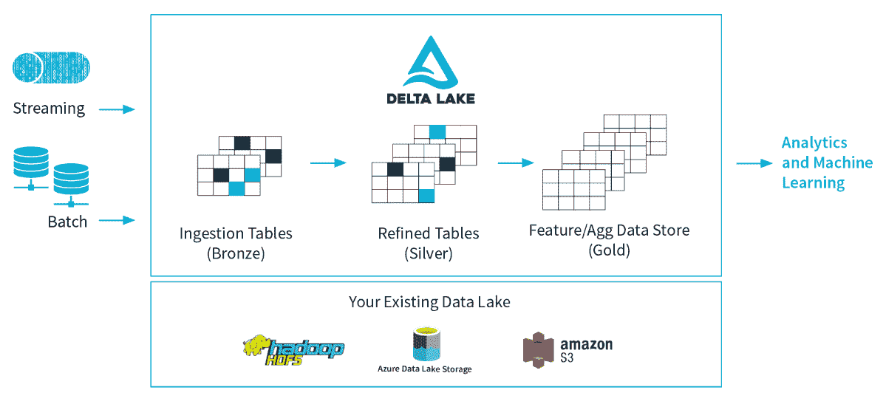

# 三角洲湖:保证数据质量的一层

> 原文：<https://thenewstack.io/delta-lake-a-layer-to-ensure-data-quality/>

Linux 基金会的最新项目之一，名为 [Delta Lake](https://delta.io/) ，旨在确保大规模数据湖中数据的可靠性。这些大数据系统最常用于机器学习和数据科学，但也用于商业智能、可视化和报告。

当多人同时处理数据湖中的数据时，不完整的事务或多个同时更新等问题很容易使数据质量受到质疑。

阿帕奇 Spark 在 [Databricks](https://databricks.com/) 的创造者也建造了三角洲湖。虽然最初是建立在 [Apache Spark](https://spark.apache.org/) 之上，但现在它也支持其他开源大数据系统。

“Delta Lake 使您能够在现有数据湖的基础上添加一个事务层。现在，在它的上面有了事务性的事务，您可以确保您有可靠的、高质量的数据，并且您可以在其上进行各种计算。事实上，您可以混合批处理和流。…因为数据是可靠的，所以当有人在批量读取数据时，有人在流式传输数据是可以的，”[data bricks 的联合创始人兼首席执行官 Ali Ghodsi](https://databricks.com/speaker/ali-ghodsi) 在 [Spark+AI Summit Europe](https://www.youtube.com/watch?v=7t4lhzTWM5I) 上解释道。

Delta Lake 提供了 ACID 事务、快照隔离、数据版本控制和回滚，以及模式实施，以更好地处理模式更改和数据类型更改。

### 交易支持

4 月，Databricks 在 Apache 2.0 许可下开源了这项技术。

在生产中使用它的公司，如 Viacom、Edmunds、Riot Games 和 McGraw Hill。阿里巴巴；Booz Allen Hamilton、Intel 和 Starburst Data 与 Databricks 合作，也为 [Apache Hive](https://hive.apache.org/) 、 [Apache NiFi](https://thenewstack.io/apache-streaming-projects-exploratory-guide/) 和 [Presto](https://thenewstack.io/facebooks-presto-big-data-query-engine-moves-to-the-linux-foundation/) 提供支持。

还有其他方法可以向数据湖添加事务支持。Cloudera 的[项目臭氧](https://hadoop.apache.org/ozone/)采取了类似的策略，并且有一个基于 HDFS 的存储蜂巢。

本质上，它不是一个存储系统，而是位于现有存储之上，如 HDFS 和云存储，如 S3 或 Azure blob 存储。它在内部和云存储系统之间架起了一座桥梁。

它可以从任何支持 Apache Spark 数据源的存储系统中读取数据，也可以向 Delta Lake 写入数据，Delta Lake 以 [Apache Parquet](https://parquet.apache.org/) 格式存储数据。Delta Lake 表上的所有事务都直接存储在磁盘上。

Delta Lake 的核心是事务日志，这是一个跟踪用户所做的所有更改的中央存储库。它以一个 JSON 文件的形式记录下每一个修改的顺序。如果有人做了更改，但随后又删除了它，仍然会有一个记录来简化审计。

它提供原子性，只记录完全执行的事务，以确保数据的可信度。

### 乐观协议

正如多人可以通过处理不同的领域来处理拼图游戏一样，Delta Lake 旨在使多人能够同时处理数据，而不会踩到彼此的脚趾。

当处理数 Pb 的数据时，这些用户很可能会处理数据的不同部分。例如，如果两个变化同时发生，它依靠[乐观并发控制](https://en.wikipedia.org/wiki/Optimistic_concurrency_control)，一种数据保持解锁的协议来解决问题。

它还提供了“时间旅行”或数据版本化功能，使用户能够专注于特定的时间点。在 10 次提交事务日志之后，Delta Lake 以 Parquet 格式保存一个检查点文件。这些文件使 Spark 能够跳到最近的检查点文件，该文件反映了表在该点的状态。

Delta Lake 支持两种[隔离级别](https://docs.databricks.com/delta/optimizations/isolation-level.html) : Serializable 和 WriteSerializable。WriteSerializable 比 [Snapshot](https://en.wikipedia.org/wiki/Snapshot_isolation) 隔离更强，它提供了可用性和性能的最佳组合，并且是默认的。最强级别 Serializable 确保串行序列与表的历史记录中显示的序列完全匹配。

Linux 基金会是新堆栈的赞助商。

图片来自 Pixabay 的 DreamyArt。

<svg xmlns:xlink="http://www.w3.org/1999/xlink" viewBox="0 0 68 31" version="1.1"><title>Group</title> <desc>Created with Sketch.</desc></svg>