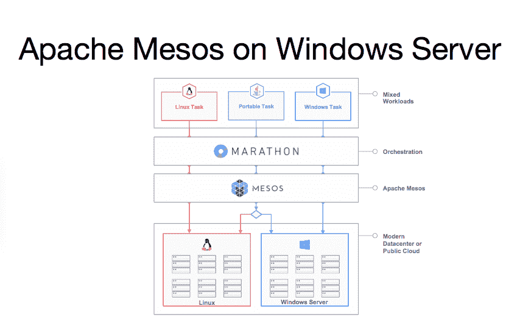

# 演示:运行 Linux 和 Windows 机器的单个集群的 Mesos

> 原文：<https://thenewstack.io/demo-mesos-running-a-single-cluster-of-linux-and-windows-machines/>

八月中旬， [Mesosphere 和微软合作将 Mesos 引入 Windows](https://azure.microsoft.com/blog/2015/08/20/microsoft-and-mesosphere-partner-to-bring-mesos-container-orchestration-across-windows-and-linux-worlds/) 。这将允许在 Linux 和 Windows 服务器之间混合使用应用程序的组织分配资源池，并使用相同的界面和相同的部署技术来管理它们。移植到 Windows 服务器的 Mesos 带来了曾经仅限于 Linux 和 Microsoft Azure 的容器编排水平。

作为背景，Apache Mesos 池化基础设施，根据需求和策略自动分配资源和调度任务。Mesos 的商业提供商 Mesosphere 提供了 [DCOS](https://mesosphere.com/product) ，这是一个软件层，它将数据中心的物理机和虚拟机结合在一起，将它们汇集成一个大的计算环境。

Mesos-Windows 集成如何工作是 Mesosphere 在 MesosCon 上展示的一个短片的主题。它展示了运行由 Linux 和 Windows 机器组成的单个集群的 Mesos。来自中尺度的视频现已上线。

https://www.youtube.com/watch?v=dC2vitIh84M

该视频展示了如何在 Windows 机器和 Linux 机器上启动 Mesos，然后作为 Java 任务在 Linux 和 Windows 机器上运行。这些任务能够在单个集群上运行，减少了在每个机器上运行任务所需的系统资源量。

在启动 Windows 任务之前，Windows 机器有一个打开的 web 浏览器，没有前端显示。在演示中，启动前端的任务是在 Windows box 上从命令行使用[马拉松](https://github.com/mesosphere/marathon)启动的，这是一个用于长时间运行应用程序的 Apache Mesos 框架。任务被安排，然后它显示在马拉松用户界面，运行和健康。回到之前，Mesos UI 显示了在 Windows 框中运行的任务。当导航回 Windows 机器上的 web 浏览器时，它显示 404 错误，因为 Linux 机器没有连接。然后 Linux 机器连接上，显示 Windows 在 Linux 机器上工作。

启动 Linux 盒子启用后端 UI。在刷新 Windows box 上的网页时，它会显示消息:“你好，中尺度系统！”一旦两个机器的前端和后端组件启动并运行，就会通过 Marathon 启动一对 Java 任务，一个在 Linux 上，另一个在 Windows 上。用户可以指定分配给 Java 任务的 CPU 数量，这些任务可以在几秒钟内启动。然后，两者都在 Mesos UI 中正常运行。

通过使用 Mesos 和 Marathon，开发人员可以同时运行 Windows 和 Linux 来简化他们的工作流程，同时允许最少的资源分配。Marathon 允许在其 UI 中进行系统监控，显示任务或实例的状态，使团队能够快速停止、暂停或重启应用程序。马拉松还可以确保产生一致故障的 bugged 或 sandbox 应用程序不会用这些来填满 Mesos 从属硬盘。用户还可以通过 Marathon CLI 轻松扩展应用，从而改善集群管理。

当启动一个任务(如视频中的 Java 示例)时，Marathon 的健康检查将确定任务是否正常运行。这包括 HTTP 检查，确保任务在超时前的指定时间内启动。如果一个任务始终未能通过 HTTP 检查，它将被终止，然后启动新的实例。在本例中，如果 Windows Java 任务没有通过 HTTP 检查，Marathon 的调度程序将在达到最大连续失败次数时启动更多实例。启动任务时，在马拉松中有额外的健康检查选项。其中包括为运行状况检查失败、协议、端口索引和超时长度设置宽限期的能力。

## 跨平台开发人员生活质量的提高

Windows 上的 Mesos 意味着在 Linux 和 Windows 平台之间工作的开发人员和组织可以使用他们自己的工具，而不需要大量的资源管理。集群管理可以通过 Docker、Marathon 或 Kubernetes 等工具来处理，允许实时扩展调试和管理单个集群，而不会牺牲安全性或性能。

Mesosphere 为运营团队提供了从中央工作区运行 Linux 和 Windows 机器的能力，为那些习惯于管理 Docker 容器的人提供了工作流。Linux 开发人员可以大规模管理他们的 Windows 服务器，而不必运行可能影响系统性能的单个虚拟机。在本地测试或调试时，运行单个虚拟机管理程序的虚拟机可能会严重限制系统性能，而如果虚拟机群集在运行时过载，则可能会影响页面加载或请求处理。

当一个人跨 Windows 和 Linux 工作时，支持高峰流量工作负载可能是一项艰巨的任务，通常充满了对资源的微观管理，或者下载无法在 Windows 环境中运行的所需 Linux 依赖项的解决方案。Mesos 为 Windows Server 用户提供了在每个平台上使用适合他们的工具构建应用程序的能力，在宏观层面上只需要较少的活动时间投资。

## 中间层的数据中心操作系统

自 2015 年 7 月向公众提供以来，Mesosphere 的 Mesos 数据中心操作系统(DCOS)代表了数据中心管理领域的潜在游戏规则改变者。威瑞森已经采用 Mesosphere 的 DCOS 作为其数据系统的全国平台，并将于 2015 年晚些时候开始使用这项服务。那些在 Windows 上运行 Mesos 的用户也可以将 Mesosphere 的 DCOS 与核心的 Windows Server Mesos 平台结合使用。Mesosphere 为开发人员提供了令人兴奋的可能性，通过将 Windows 和 Linux 在不同的 VM 环境中分开的资源集中起来，开发人员可以利用他们的 DCOS 的能力。

Mesosphere DCOS 可以从单个集群启动 Docker 容器、管理应用程序和处理大型高要求任务，允许应用程序可伸缩性来处理企业级数据中心需求。DCOS 允许用户管理数百、数千或数万个节点，所有这些都通过 CLI 进行管理。DCOS 还为用户提供安装数据库管理系统库、文件系统如和数据处理工具如 [Spark](http://spark.apache.org/) 的能力。

Windows 上的 Mesos 允许开发人员跨平台工作，将更多时间用于创建新的应用程序，而不是调试它们或处理依赖性问题。随着企业级的业务已经接受容器技术，这导致较小的业务也采用基于容器的工作流。随之而来的是对标准化、跨平台容器管理、部署和编排的需求。

<svg xmlns:xlink="http://www.w3.org/1999/xlink" viewBox="0 0 68 31" version="1.1"><title>Group</title> <desc>Created with Sketch.</desc></svg>