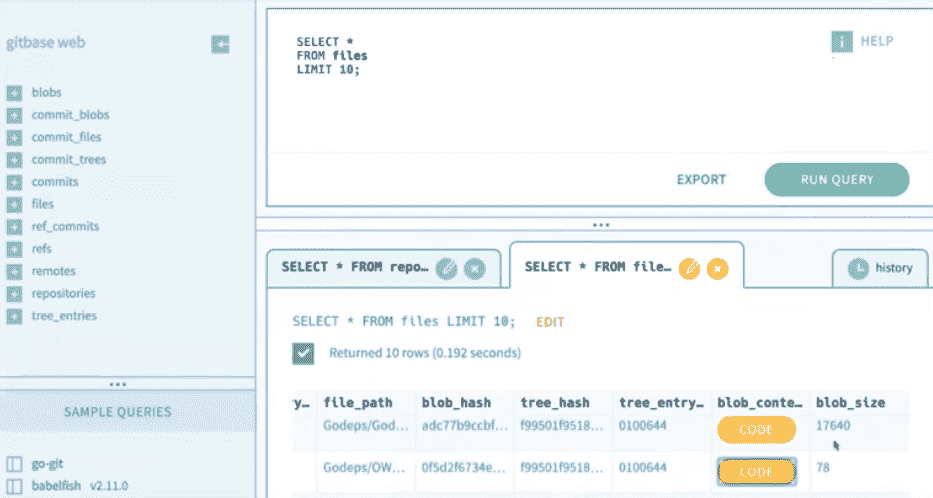

# 演示:Source{d}显示源代码可以揭示什么

> 原文：<https://thenewstack.io/demo-sourced-shows-what-source-code-can-reveal/>

在任何应用程序的开始，都有代码。正如 source{d}负责开发者关系的副总裁 Francesc Campoy 所说:源代码可以告诉你很多东西——特别是在寻求扩展涉及复杂平台(如 Kubernetes)的众多 DevOps 团队成员的应用程序时。

在新堆栈的 source(d)引擎软件演示中，Campoy 描述了源代码数据可以揭示什么。可以发现的例子包括您的组织是否有筒仓，模式，例如谁是最有生产力的操作员或程序员，或者您如何帮助您的开发团队更有生产力。

[https://www.youtube.com/embed/ftfEbCViEzw?feature=oembed](https://www.youtube.com/embed/ftfEbCViEzw?feature=oembed)

视频

Campoy 说:“这里的想法是，我们相信源代码不仅是你为了创建软件而需要的东西，而且也可以是你的组织和所有[工程过程]的非常丰富的信息来源。”。

Campoy 说,“代码作为数据的解决方案”的概念是关于“连接两种技术”。“一方面，你有存储源代码的通用技术，也就是 Git，”Campoy 说。“因此，一方面我们有 Git 存储库，另一方面，我们有最常用的接口来分析数据，这就是 SQL。”

在提供的特性集中，Campoy 展示了 source{d}如何允许您直接汇集和解析 Git 存储库。这样做时，您不必重新定位它们来处理或分析它们，以便不仅了解最近的存储库的历史，还了解在此之前创建的存储库的历史。对于 SQL，也存在用于代码分析的自定义函数。

例如，在演示演练期间，Campoy 访问了 [Go 代码](https://golang.org/)，并使用通用抽象语法树(UAST)展示了如何将“任何编程语言”的所有代码映射到我们可以分析的树中。“与此同时，”有趣的是，右边的树的格式是通用的，”Campoy 说。

“不管你在解析什么编程语言，我们都使用相同的格式，”Campoy 说。

在内部，Campoy 描述了 source{d}的机器学习团队如何使用 Git，但他们不是专家，而基础设施团队使用 Git，“他们真的很擅长，但他们不一定知道 SQL，所以我们可以将这两种不同的配置文件结合在一起，这就是为什么我们有这种工具，”Campoy 说。

“这个想法是，你将能够让数据分析师分析你的源代码，而不必了解 Git 是如何工作的，”Campoy 说。

<svg xmlns:xlink="http://www.w3.org/1999/xlink" viewBox="0 0 68 31" version="1.1"><title>Group</title> <desc>Created with Sketch.</desc></svg>