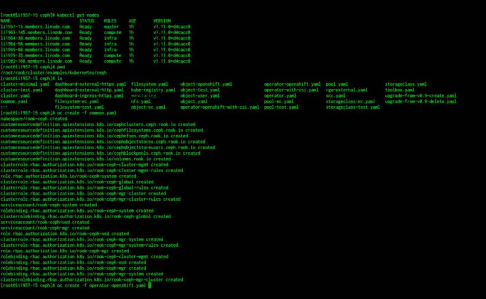

# 演示:Rook 的云原生存储可以为 Kubernetes 提供什么

> 原文：<https://thenewstack.io/demo-what-rooks-cloud-native-storage-can-offer-for-kubernetes/>

[https://www.youtube.com/embed/JnTyZm5oOEw?feature=oembed](https://www.youtube.com/embed/JnTyZm5oOEw?feature=oembed)

视频

在这个演示中， [Red Hat](https://www.redhat.com/en) 的软件工程师和 Ceph 分布式文件系统的项目团队负责人 [Patrick Donnelly](https://twitter.com/pjdbatrick?lang=en) 演示了[Cloud Native Computing Foundation](https://www.cncf.io/)的[Rook Cloud Native storage orchestrator](https://rook.io/)如何在 Kubernetes 架构中作为操作员使用。他还展示了如何使用它来编排 Kubernetes 集群的存储。

我们还决定在这个演示中做一些不同的事情:[CNCF 生态系统总监 Cheryl Hung](https://www.linkedin.com/in/cheryljhung/?originalSubdomain=uk) 参与进来，就观察到的问题提出探索性的问题，最重要的是，Rook 与开发人员社区的相关性。

从存储管理员的角度来看，Hung 问为什么负责集群管理和存储的人会对 Rook 感兴趣。Donnelly 的回答是展示 Rook 如何简化 Kubernetes 集群的存储交钥匙。例如，它简化了分布式存储系统的设置过程。“这一切都由 Rook 提供的逻辑来处理……从可用性的角度来看，配置自集群并不是最容易的事情，”Donnelly 说。“很容易在某些方面搞砸。”唐纳利说，例如，如果没有 Rook，这个过程需要升级子集群，这通常需要非常详细的步骤来完成这个过程，并对运营商进行仔细的管理。

Donnelly 还展示了 Rook 如何充当存储操作员，并在可用于可用存储的集群和设备中找到存储。当给定由集群操作员通过 YAML 描述的集群期望状态设置的某些配置时，Donnelly 展示了 Rook 操作员如何在 Kubernetes 基础设施上设置集群，以便 Ceph 可以用于 Kubernetes。

同时，Rook 也将经历更多的发展。“我认为到目前为止的努力实际上已经开始奏效。但现在，他们有点转向让它变得可用，让运营商可以轻松设置它，而不用那么大惊小怪，然后也能够轻松[知道]何时出现问题，”唐纳利说。

Alex Williams 是 New Stack 的创始人兼主编，主持了这个播客，它是今年早些时候在上海举行的 KubeCon + CloudNativeCon +开源峰会中国期间现场录制的。

云计算原生计算基金会是新堆栈的赞助商。

<svg xmlns:xlink="http://www.w3.org/1999/xlink" viewBox="0 0 68 31" version="1.1"><title>Group</title> <desc>Created with Sketch.</desc></svg>