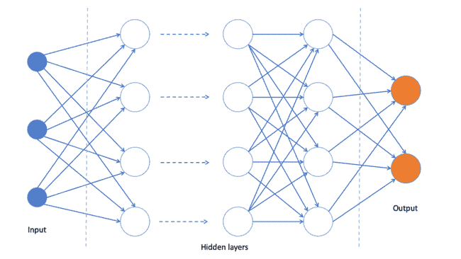
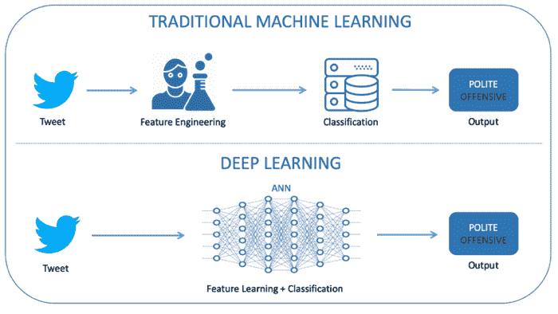
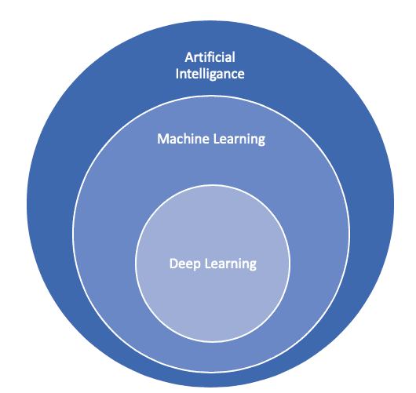

# 揭秘深度学习和人工智能

> 原文：<https://thenewstack.io/demystifying-deep-learning-and-artificial-intelligence/>

*This post is part of a series by [Levon Paradzhanyan](https://www.linkedin.com/in/lparajanoff/) that demystifies data science, machine learning, deep learning, and artificial intelligence down while explaining how they all tie into one another. Read [Part 1](https://thenewstack.io/primer-demystifying-data-science/), [Part 2](https://thenewstack.io/demystifying-machine-learning-how-ml-discovers-new-information/).*

[Levon Paradzhanyan](https://www.linkedin.com/in/lparajanoff/)

[Levon 是 EastBanc Technologies 的一名软件工程师和架构师，他在软件开发领域已经工作了 14 年多。最近，他越来越多地参与数据科学和人工智能项目。Levon 对当前的技术发展感到兴奋，并热衷于将他们的力量传播给更广泛的商业和 IT 社区。](https://www.linkedin.com/in/lparajanoff/)

在本系列的第二部分中，我们[探索了计算机如何使用机器学习(ML)](https://thenewstack.io/demystifying-machine-learning-how-ml-discovers-new-information/) 从数据中学习——无需显式编程或指导学习过程的流程和逻辑。我们还解释了计算机如何从任何数据中发现和学习模式和相关性——不管它来自哪里或关于什么。

在本系列的最后一篇文章中，我们将重点关注深度学习(DL)、人工智能(AI)，并探索计算机如何利用人脑结构来执行自然语言处理、图像识别等更多功能，在某些情况下甚至超过了人类专家的基准！此外，我们将了解现代人工智能的能力和局限性。

在高层次上，DL 是机器学习中方法的子集。这是实现 ML 的另一种算法方法，它让我们更接近理解 AI。

深度学习基于人工神经网络(ANN)和特征学习。为了更好地理解 DL，理解它的核心是什么很重要。

## 深度学习的核心:ANN

人工神经网络的灵感来自人类大脑的结构和我们目前对大脑如何通过神经元之间的相互连接处理数据的理解。与人脑相比，人工神经网络的当前实现具有更简化的结构，具有离散的层和定义数量的连接以及数据可以流入的方向。像其他 ML 模型一样，ANN 可以在有老师或没有老师的情况下进行训练(有老师指导、无老师指导或半老师指导)。

例如，您可以将一幅图像分解成一个可消费数据矩阵，作为第一层人工神经网络的输入数据。从那里，第一层的每个神经元将数据传递到第二层，以此类推，直到它到达产生最终输出的最后一层。例如，输出可能暗示图像中有一只猫。对于人工神经网络消耗的每一幅图像，每一层的每一个神经元分配或调整其输入的权重，该权重指示其相对于任务的正确或不正确程度。权重的总和将决定结果。

人工神经网络背后的科学并不新鲜，它已经发展了 70 多年。你可能会猜测 ANN 需要强大的计算资源，事实上，当硬件进步如此之大，以至于重新激发了对这个领域的兴趣时，DL 发生了革命。英伟达在深度学习的所谓“大爆炸”中发挥了巨大作用，因为人工神经网络模型是用英伟达 GPU(图形处理单元)训练的。

## 深度神经网络的作用

深度学习是一组不同架构的人工神经网络，称为深度神经网络(DNN)，如递归神经网络，深度前馈，深度玻尔兹曼机器等等。每个 DNN 都有其独特的优势和最适合的应用领域。它还使用我们在前面的机器学习部分描述的特征学习方法。

深度学习已被应用于语音识别、自然语言处理、社交网络过滤、图像分析和更多领域，产生了与人类专家相当甚至有时超过人类专家的结果。

## 深度学习与机器学习

深度学习是 ML 的一个子集，但它给 ML 领域带来的新能力将它带到了一个全新的水平。

*   例如，深度学习不需要你研究、开发和使用新功能。相反，神经网络学习如何选择最关键的特征。DL 的训练时间也更长，因为它需要大量的训练数据。此外，对于 DL，解释结果更加困难。你可以找出哪个神经元被激活了，但是很难解释神经元集体在做什么。
*   与 ML 不同，DL 可以提供接近人类的性能，并且在某些情况下超过人类的性能。机器学习仍然需要数据科学家的一些指导，例如手动识别和创建新特征。然而，在大多数算法中，ML 提供了一组清晰的规则，可以用来解释结果。

## 深度学习与数据科学

数据科学和 DL 在以下方面有所不同:

*   数据科学是一个跨学科领域，涉及收集、清理、分析、可视化数据以及开发预测性或规范性模型来解决特定任务或问题的许多过程。
*   深度学习(及其更广泛的 ML 领域)技术通常用于数据科学中，以处理大量数据，从数据中发现关键模式和新特征，并创建预测/描述模型进行分析。

## 人工智能

你可能至少看过一次关于人工智能的科幻电影。这是最热门的技术话题之一。人工智能有许多味道，并被媒体和娱乐业大量推广——有时接近现实，有时高度夸张。

AI 是任何设备或软件(代理)显示类似人类智能的能力。人工智能代理具有认知功能，允许他们自主地观察、学习、采取行动和解决问题或任务。

然而，今天的 AI 与我们在电影中看到的类人机器人有很大不同，这些类人机器人可以像人类一样甚至更好地走路、说话、思考和行动。虽然这只是科幻小说，但人工智能的巨大进步让我们更加期待这可能很快成为现实。

以下是一些受欢迎的人工智能设备和服务的例子:

*   个人语音助理，如 Siri 或 Alexa，使用复杂的语音识别来翻译、解释和回应客户的问题或请求。
*   特斯拉创造的自动驾驶汽车正在将从 12 个集成摄像头接收的数据转换到一个矢量空间，以识别物体、路况和特定情况，使它们能够自动驾驶并在紧急情况下启动安全措施。
*   电子商务平台通过分析过去的购买和我们在他们网站上的行为，在预测我们有兴趣购买什么方面变得越来越智能。
*   Nest 是一款智能恒温器，它可以学习您的加热和冷却偏好，自动调节您家中的温度。
*   机器人，如 Neato 真空吸尘器，使用激光绘制平面图，以便更智能地导航和避开途中的障碍。

## 人工智能 vs .机器学习 vs .深度学习

AI、ML 和 DL 共同提供强大的数据和预测分析能力。总之，人工智能是任何需要认知决策和解决问题的任务的自动化的一般领域。

ML 是 AI 的子集，但并不是所有的 AI 都是用 ML 创造的。相反，ML 是一套算法和方法，使 AI 能够处理、学习和分析数据；从环境中感知(图像、语音、视频流等来源)；并解决特定的问题或任务。人工智能大量使用 ML 和 DL 技术来自主处理和学习数据，识别关键模式和特征，并做出决策或分类。

我们比以往任何时候都更接近创造类似人类的人工智能，但仍有许多未知。技术、计算能力的进步，以及对人脑工作方式的不断理解，都在推动人工智能的指数级增长。

许多人认为，未来的人工智能是对人类的威胁，因为它有压倒性地超越地球上最聪明的头脑的潜力。我们相信人工智能的进步是不可阻挡的，但尽管很难预测未来，我们将继续为未来更好、更智能、更安全的人工智能做出贡献。

通过 Pixabay 的特征图像。

<svg xmlns:xlink="http://www.w3.org/1999/xlink" viewBox="0 0 68 31" version="1.1"><title>Group</title> <desc>Created with Sketch.</desc></svg>