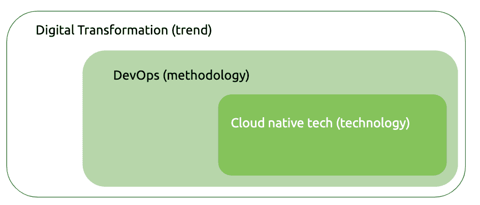

# 揭开 DevOps 的神秘面纱——数字转型帷幕背后的一瞥

> 原文：<https://thenewstack.io/demystifying-devops-a-peek-behind-the-digital-transformation-curtain/>

编者按:这篇文章是

[ongoing series](https://thenewstack.io/author/catherine-paganini/)

来自凯瑟琳帕格尼尼，专注于为商业领袖解释 IT 概念。阅读之前的帖子

[here](/primer-understanding-the-cloud-native-impact-on-architecture/)

.

 [凯瑟琳·帕格尼尼

凯瑟琳·帕格尼尼在 Kublr 领导营销工作。从战略到战术，Catherine 帮助 Kublr 宣传云原生技术的无限力量，塑造品牌，并与增长保持同步。在加入这家科技初创公司之前，凯瑟琳曾在博思艾伦汉密尔顿(Booz Allen Hamilton)和华盛顿邮报(Washington Post)等知名机构推广 B2B 服务。](https://www.linkedin.com/in/catherinepaganini/en/) 

商业世界无法停止谈论数字化转型，预计到 2020 年，所有行业的数字化计划都将快速扩展。然而，当谈到 DevOps(通常与数字化转型的概念交织在一起)时，企业领导人仍然抓耳挠腮。DevOps 对他们的业务、技术投资和团队真正意味着什么，似乎很难理解。然而，两者都是一枚硬币的两面。在本文中，我们将了解数字化转型和开发运维之间的关系，以及实施开发运维方法需要什么。

数字化转型是由客户、合作伙伴和供应商的互动推动的，这些互动越来越多地进入数字化领域。客户被网飞、优步或 Monzo(一家云诞生的英国银行)等云创新者提供的快速可靠的交互宠坏了，现在他们要求更传统的企业提供同样水平的便利。如今，软件已经成为一个关键的战略业务区分因素，其快速、可靠和便捷的交付是数字化转型的核心。

简而言之，DevOps 是实现这种快速、频繁和不间断的服务交付的方法，而云原生技术使这种方法成为可能。

实施 DevOps 方法需要在技术、流程和文化方面进行彻底的转变——这当然不容易。然而，正如每年的“[加速 DevOps 2019](https://services.google.com/fh/files/misc/state-of-devops-2019.pdf) 状态”所体现的那样，好处是惊人的:“DevOps 精英执行者”的部署频率是低水平执行者或使用更传统方法的人的 208 倍，速度是 106 倍。他们从事件中恢复的速度加快了 2，604 次，更改失败率降低了七倍。

虽然这些统计数据看起来好得令人难以置信，但它们每年都得到验证。因此，如果你曾经认为 DevOps 的成本效益比不值得你付出努力，请三思。

## DevOps 是如何形成的

受 20 世纪 80 年代制造业精益运动的启发，DevOps 被视为敏捷(2000 年代)的逻辑延续。尽管 DevOps 概念很棒，但是，如果没有云带给我们的技术创新，它们是不可能实现的。云第一次让开发者能够按需创建环境。按需云服务还为开发人员提供了所需的工具，只需点击一下按钮。结果是:前所未有的开发人员生产力，一个互联的世界，一个新的 IT 时代的开始。

这种新发现的生产力催生了一种全新的技术:所谓的云原生堆栈。与云托管服务类似，云原生技术提供存储、消息传递或服务发现等服务，只需点击一个按钮即可实现。*与*云托管服务不同，它们独立于基础设施，可配置，并且在某些情况下更加安全。

术语云原生可能有点误导。虽然是为云开发的，但它们不受云的限制。事实上，我们越来越多地看到企业在内部部署这些技术。

## 它在 DevOps 之前

要了解 DevOps 的优势，我们必须了解它的传统运作方式。在具有紧密耦合的整体式应用程序的复杂组织中(基本上是任何具有遗留应用程序的传统企业)，工作通常分散在多个团队中。这导致许多移交和很长的交付时间。每次一个棋子准备好了，它就会被放入下一个队伍的队列中。此外，个人一次只做一个小项目，导致缺乏所有权。他们的目标是将工作交给下一个团队，而不是将正确的功能交付给客户——这显然是优先级的错位，但在系统中根深蒂固。此外，在传统 IT 中，只有少数几个集成测试环境。在这些环境中，开发人员可以测试他们的代码是否与所有依赖项(如数据库或外部服务)一起工作。确保早期的顺利集成是降低风险的关键。

当代码最终投入生产时，它经过了如此多的开发人员，在如此多的队列中等待，如果代码不工作，就很难追踪问题的根源。几个月过去了，从事这项工作的人几乎不记得他们做了什么。识别和解决问题既困难又耗费资源。

如果这听起来像是一场噩梦，那显然感觉就是一场。对于负责平稳部署的运营团队来说尤其如此。服务中断对任何企业都有巨大的影响。想象一下成百上千的顾客在社交媒体上抱怨——一场潜在的公关灾难——或者，根据案件和业务，甚至可能成为晚间新闻。您愿意负责按下部署按钮吗？

## DevOps，一万英尺的视野

DevOps 的主要目标是创建一个从左到右的工作流，尽可能少的交接和快速的反馈循环。那是什么意思？在我们的案例代码中，工作应该向前移动(从左到右),而不是向后移动。应该在问题出现的时间和地点识别和解决问题。为了实现这一点，开发者需要快速的反馈循环。反馈是通过快速的自动化测试来提供的，这些测试将在代码进入下一个阶段之前验证代码是否正常工作。

为了减少移交和增加所有权感，小组将致力于较小的功能(相对于整个特性)并拥有整个过程:创建请求、提交、QA 和部署—从开发到运营或开发运维。重点是快速推出小块代码。投入生产的变更越小，诊断、修复和补救就越容易。

结果是最大限度地减少了交付，降低了部署到生产中的风险，更好的代码质量，因为团队还负责代码在生产中的表现，并且由于更多的自主权和所有权而提高了员工的满意度。

要实现这一点，你需要合适的技术，但你也必须重组你的整个 IT 部门。拥有整个过程的小团队意味着开发人员将不得不拓宽他们的技能并彻底改变他们的工作方式。经验表明，DevOps 带来的文化变革比采用新技术要困难得多。

DevOps 本身是关于文化变革的:小团队从始至终致力于小项目，同时关注全球目标，这些目标总是优先于个人/团队目标。DevOps 工具用于强化这种文化，并加速期望的行为。

## DevOps 的关键技术开发

DevOps 似乎主要是关于组织结构，上面提到的一切听起来都像是常识。那么，为什么我们首先要将工作分割开来，创造出难以诊断和管理的巨大整体呢？虽然较小的代码批次和自始至终负责的团队本身不是技术决定，但是技术已经使这些团队结构成为可能。以下是使这一转变成为可能的一些关键进展:

*   用于“打包”和“运输”代码的容器(Containers)，比虚拟机(VMs)要轻量得多，而虚拟机是以前唯一能做到这一点的方式(我们在[我们的 Kubernetes 初级读本](https://thenewstack.io/primer-how-kubernetes-came-to-be-what-it-is-and-why-you-should-care/)中介绍了容器和虚拟机)。消耗大量资源，在虚拟机中交付小批量代码没有经济意义，因为成本太高。另一方面，容器消耗很少的资源，使开发人员能够处理和发送甚至只有几行代码。
*   **随需应变环境**允许开发者在需要时构建新的开发或 QA 环境。传统上，开发人员必须向运营团队请求一个环境——这个请求将首先进入一个(长)队列。然后，运营部不得不手动调配资源。等待几周，有时甚至几个月来获得一个环境是完全正常的。然后，云引入了按需环境，这在当时是一场革命。通过用户界面、命令行界面(CLI)或应用程序编程界面(API)，开发人员可以指定他们需要什么(例如，多少个虚拟机、RAM、CPU、存储),只需点击几下鼠标即可调配环境。
*   自动化测试使开发人员能够自己运行 QA 测试。代码一完成，他们就运行测试，有时甚至是并行运行，并获得即时反馈。然后他们可以修复它并再次运行测试。在记忆犹新的时候获得及时的反馈是至关重要的。传统上，测试是由 QA 团队执行的，但不是在代码排队等候之前。测试是手工的，容易出错，反馈是在开发人员编写代码几周或几个月后才得到的。在这种情况下，识别潜在的误差源显然要困难得多。
*   **自动化部署**允许开发者自己部署代码。部署前测试确保代码在自动投入生产之前可以运行。如果没有这些自动化测试，会有更多的未知因素，每个部署都代表着巨大的风险。这就是为什么只允许操作团队进行部署，而且他们会以非常有计划的方式进行部署，每次都为潜在的中断做好准备。
*   **基于容器的更松散耦合的架构**。容器带来的另一个好处是，所有的代码依赖都捆绑在容器中，使其完全独立于环境。这导致了一个模块化的体系结构，其中隔离在一个容器中的每个部分都可以在任何时候被移除、更新或交换，而不会影响其他部分。这使得开发人员可以安全地进行更改，并有更多的自主权来提高开发人员的工作效率。另一方面，在一个紧密耦合的系统中，变化可能会产生意想不到的后果，引入一定程度的风险，鼓励更少而不是更多的部署。

当这些技术结合在一起时，即连续交付、微服务、服务网格、呼叫跟踪和云原生监控和日志收集等。—高级软件交付场景成为可能。

**例如，Canary deployment** 是一种众所周知的交付技术，它迭代地将新代码投入生产。首先，对于一个小的细分市场，比方说 1%的用户群，然后，随着一切顺利进行，逐渐扩大到其余的用户群。旧代码仍然存在，因为首次展示是通过逐步重新路由执行的。新代码的行为会不断地被监控，如果它没有增加错误率，部署就会继续。否则，它会被回滚以供检查和修复错误。这与上述情景相去甚远。

## **与时俱进——风险与回报**

技术正在消除众多瓶颈，使 DevOps 方法变得可行。以前，IT 部门尽最大努力利用现有资源。然而，如今传统的 IT 结构已经不可持续。世界发展越来越快，如果跟不上，你的公司很可能会落后。这就是为什么我们看到每个人都在迅速加入数字化转型的行列。然而，匆忙采用这些新技术可能[导致次优架构](/primer-understanding-the-cloud-native-impact-on-architecture/)在不久的将来不得不再次重新架构。遵循最佳实践和避免捷径是很重要的，尽管这看起来很诱人。

在本文的第二部分，我们会更深入地探讨。我们讨论了开发人员如何获得代码质量的快速反馈，面向 DevOps 的团队和架构是什么样子，以及遥测和安全的作用。简而言之，您将更好地理解实现企业范围的 DevOps 方法需要什么。

*像往常一样，非常感谢 [Oleg Chunikhin](https://www.linkedin.com/in/olegch/) 对他的支持。*

### 来源:

<svg xmlns:xlink="http://www.w3.org/1999/xlink" viewBox="0 0 68 31" version="1.1"><title>Group</title> <desc>Created with Sketch.</desc></svg>